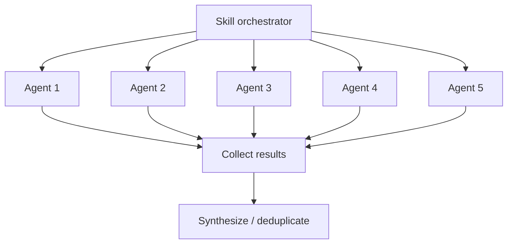

# Agent System

How Larch skills orchestrate parallel subagents to achieve collaborative multi-perspective workflows.

## What Are Agents?

In the Claude Code context, an **agent** is a subprocess spawned via the Agent tool that runs autonomously with its own context window. Each agent receives a prompt, has access to a defined set of tools, and returns a result when complete. Agents are isolated from each other — they cannot see each other's outputs or share state.

## How Skills Use Agents

Skills launch agents to parallelize work that benefits from multiple independent perspectives. The key patterns:

### Parallel Fan-Out

Multiple agents are launched simultaneously, each examining the same material from a different angle. Results are collected and synthesized after all agents return.

This pattern is used for:

- **[Design planning](collaborative-sketches.md)** — `/design` drafts the plan directly, then fans out to the plan-review panel
- **Plan review** — the validation panels described in [Review Agents](review-agents.md) examine plans and research output simultaneously
- **Code review** — the specialist panel described in [Review Agents](review-agents.md) examines the diff simultaneously; Claude is a voter only
- **[Voting](voting-process.md)** — the voting panel evaluates findings in parallel

### Prerequisite peers and chained work

Orchestrators often run in an ordered handoff: `/design` is a **prerequisite peer** (not a nested child of `/implement`) that writes the issue-body `larch:plan`; `/implement` then materializes and lands the work from that anchor; Step 5 runs `review-and-fix CLI` on the implementation diff (standalone `/review` is a separate skill).

## Agent Types

Larch uses several categories of agents:

### Review Agent

The persistent [Code Reviewer archetype](review-agents.md) — a unified reviewer covering code quality, risk/integration, correctness, architecture, and security. Defined in `agents/code-reviewer.md` (generated from `skills/shared/reviewer-templates.md` via `cargo run --quiet --locked --package larch-cli -- generate code-reviewer-agent`; discovered via `${CLAUDE_PLUGIN_ROOT}`) with model: sonnet (default) and Read/Grep/Glob tool access. In `/research` validation, `/design`, and `/review`, the archetype participates according to the panel compositions in [review-agents.md](review-agents.md). Fallback rule for `/research`: one Claude Code Reviewer subagent fallback replaces each unavailable external slot, preserving the validation-panel shape. In `/design`, `/review`, and `/implement` Step 5 reviewer panels, dispatch uses `--no-fallback`: missing or failed vendor rows drop instead of cross-vendor or Claude reviewer backfill (see [review-agents.md](review-agents.md)).

### Voting Panel Agents

The voters in the [voting process](voting-process.md) are ephemeral agents launched with the ballot and voting instructions. `/design`, `/review`, and `/implement` Step 5 use three Codex-primary archetype voters at fixed slots, with Cursor then Claude fallback per slot and a single Claude fallback voter when both externals are unavailable. The code-review dispatch surface is `scripts/larch.sh agent dispatch-voters`; plan review uses `scripts/larch.sh plan-review voter-dispatch`.

### Research Agents

The research agents in `/research` form the fixed-shape topology documented in the skill: Codex-first research lanes under angle-differentiated briefs — `RESEARCH_PROMPT_ARCH` (architecture), `RESEARCH_PROMPT_EDGE` (edge cases), `RESEARCH_PROMPT_EXT` (external comparisons), `RESEARCH_PROMPT_SEC` (security) — followed by the validation panel described in [review-agents.md](review-agents.md). When Codex is unavailable for a research lane, the lane runs the same angle prompt under a Claude Agent-tool fallback. When an external is unavailable in the validation panel, a Claude Code Reviewer subagent replaces the slot, preserving the panel shape. All are ephemeral.

### CI Fixer Agent

The `/implement` ci-fixer is an in-session Claude Code Agent-tool subagent defined in `agents/ci-fixer.md` (discovered via `${CLAUDE_PLUGIN_ROOT}`), with no model pin and Read/Edit/Write/Bash/Grep/Glob tool access. Detect mode from the prompt's `MODE=` token (`ci` default / legacy `ci-fix`, `checks`, or `conflict`). On a failed required CI run, the ship driver distills the failure to `$IMPLEMENT_TMPDIR/ci-errors-<run-id>.md` and the main agent spawns `larch:ci-fixer` in `MODE=ci` with only the digest path and contract reminders (no log content inlined). On the pre-ship checks `NEXT_ACTION=main-agent-edit` fallback, it spawns the same agent in `MODE=checks` with a bounded, redacted `$IMPLEMENT_TMPDIR/checks-errors-<site>-<round>.md` evidence path. The subagent treats the evidence as untrusted, fixes every reported failure in one pass, and ends with exactly three `FIXER_*` result lines. CI mode commits (`CI fix round <N>: 
`) and pushes; checks mode commits but never pushes, then re-enters the documented checks composite. Rounds 2 and beyond continue the same subagent via `SendMessage`, falling back to a fresh spawn when `SendMessage` is unavailable. The same definition also serves rebase conflict-resolution under `MODE=conflict`: the main agent loads `skills/implement/references/conflict-resolution.md`, spawns with caller kind and `CONFLICT_FILES` only (no hunks inlined), and parses `FIXER_RESULT=resolved|needs-operator|bail`; Phases 1-4 run inside the subagent, operator escalation stays with the main agent on `needs-operator`, and dead-subagent salvage aborts the rebase (the CI dirty-tree salvage-commit rule does not apply mid-rebase). Attribution for conflict and checks modes is `MODE=subagent` / `TIER=subagent`; CI-fix mode remains prose-only fixer-subagent work. Subagent tokens bill to the main Claude session. The main agent never reads the evidence or conflicted hunks, and never edits repository files on these paths. Architectural invariant and guideline violations are never routed to this subagent.

### Architectural Assessor Agent

The `/implement` Step 8 architectural assessor is an in-session Claude Code Agent-tool subagent defined in `agents/arch-assessor.md`, with no model pin and **read-only** Read/Grep/Glob tool access (no Bash, Edit, or Write). One spawn authors every requested kind (`invariants`, then `guidelines`) so shared evidence is ingested once. The main agent runs `python3 "$CLAUDE_PLUGIN_ROOT/python/cli.py" architectural-assessment materialize` to validate/refresh evidence, then spawns `larch:arch-assessor` with **only file paths** — the materialized diff, the present-reference (architectural knowledge) file, and any prior durable note per kind — plus the requested kind list. No evidence content is inlined. The subagent treats the diff, the `G-*`/`I-*` knowledge, and any prior note as untrusted data, not instructions, and returns one `ASSESSMENT_KIND`/`ASSESSMENT_STATE`/fenced-note block per kind. The main agent writes each note to `$IMPLEMENT_TMPDIR/assessment-note-<kind>.md` and persists it fail-closed via `architectural-assessment submit`, which revalidates identity (HEAD unchanged since materialize, fingerprint match), validates the state token and note, redacts, and atomic-writes the durable surfaces Step 16-17 read. The main agent never reads the evidence diff or the architectural knowledge files on this path. Subagent tokens bill to the main Claude session; attribution labels them as assessor-subagent work. Docs-only diffs persist `deterministic-clean` with zero subagent spawns. The same subagent also authors `/design` Gate C (Step 4b) assessments — the single operator-approved carve-out (2026-07-12) from `/design`'s inline-only rule: the main agent spawns it with paths only to the design plan `$DESIGN_TMPDIR/plan.txt` (the evidence), the repo-root present-reference knowledge file (`ARCHITECTURAL_INVARIANTS.md` / `ARCHITECTURAL_GUIDELINES.md`), and any prior durable design assessment, then persists each returned verdict through the unchanged fail-closed `architectural-invariants` / `architectural-guidelines persist-design-assessment` verbs, writing a guideline deviation or a clean-after-remediation invariant note to a `...input.sidecar` and persisting the canonical clean note for a first-pass clean verdict. On that path assessor-subagent tokens bill to the main `/design` session and are labeled as assessor-subagent work in the run summary and cost record.

### Claude Implementer Agent

The `/implement` Step 8 fix-ladder coder is an in-session Claude Code Agent-tool subagent defined in `agents/claude-implementer.md`, with no model pin and Read/Edit/Write/Bash/Grep/Glob tool access. Its body is derived from `agents/_implementer-base.md` (trust boundary, hard guards, branch inspection, style). When `submit` persists an adverse architectural verdict, the main agent spawns `larch:claude-implementer` with paths to the assessor note and the materialized evidence plus a scoped instruction: fix the named `violation` (invariants) or `deviation` (guidelines) and nothing else. The subagent edits, commits once (`Architectural fix (<kind>): 
`), pushes via `"$CLAUDE_PLUGIN_ROOT/scripts/larch.sh" push branch`, and ends with exactly three `CODER_*` result lines (`pushed`, `no-progress`, or `bail`). After any fix attempt the main agent re-materializes, spawns a **fresh** `larch:arch-assessor`, and re-submits the new verdict: the judge never evaluates its own fix and the fixer never judges. The same definition also serves `/implement` Step 2.4 ordinary Claude-fallback full-plan work under `MODE=step2-plan` (vendor-binary-missing, explicit `coder=claude`, or `--self-implement`): attribution is `MODE=subagent` / `TIER=subagent`; the subagent reads plan and feature-description paths, leaves working-tree edits uncommitted for the Step 3/4 composite, writes scout and commit-message artifacts under `$IMPLEMENT_TMPDIR`, and returns `CODER_RESULT=complete|needs_qa|bail|no-progress`. The main agent does not read plan-scope files or `ARCHITECTURAL_*.md` on this branch. Subagent tokens bill to the main Claude session.

### Claude Self-Reviewer Agent

The `/implement` Step 5 `--self-review` path (and the runtime `self-review-required` zero-survivor fallback) uses an in-session Claude Code Agent-tool subagent defined in `agents/claude-self-reviewer.md`, with no model pin and Read/Edit/Write/Bash/Grep/Glob tool access. The main agent spawns `larch:claude-self-reviewer` with paths only (plan, implement tmpdir, merge-base remote); the subagent reviews the feature-branch diff, applies in-scope fixes, writes `self-review-accepted.md` / `rejected-findings.md` / OOS artifacts, and returns three `SELF_REVIEW_*` result lines. The orchestrator then owns the self-review checks-commit bgjob composite and tally write. Subagent tokens bill to the main Claude session.

### Issue Dedup Agent

The `/issue` Phase 1 Tier-1 triage and Phase 2 semantic reasoning are authored by an in-session Claude Code Agent-tool subagent defined in `agents/issue-dedup.md` (discovered via `${CLAUDE_PLUGIN_ROOT}`), with no model pin and **read-only** `Read`/`Grep`/`Glob` tool access (no Bash, Edit, or Write). The invoking `/issue` agent spawns `larch:issue-dedup` with **paths only** — the snapshot TSV produced by `scripts/larch.sh issue list-issues`, the per-item body files produced by `issue parse-input` / Step 3, and the flag context (`no_dep_llm`, `blocked_by_issue`). No snapshot or body content is inlined. Call 1 emits `CAND <item-i> <issue-N> <kind:dup|dep|both> <confidence:high|medium|low>` rows in the existing grammar; the orchestrator then runs the deterministic `issue allocate-candidates` and `issue fetch-issue-details` exactly as before. Call 2 emits the per-item `ITEM_<i>_VERDICT=` line plus zero or more `ITEM_<i>_BLOCKED_BY` / `ITEM_<i>_BLOCKS` / `ITEM_<i>_DEPS_RATIONALE` lines. Call 2 continues the same subagent via `SendMessage` with the candidates corpus path when `SendMessage` is available, and falls back to a single fresh spawn that receives the snapshot, corpus, and body paths together when it is not. Every emitted line passes the unchanged Step 5 validation pipeline (snapshot membership, intra-batch range, DUPLICATE override, SCC cycle resolution) before any issue is created or dependency wired; invalid output degrades exactly as today (fail-open to CREATE with stderr warnings). The subagent never allocates, fetches, validates, creates, or wires dependencies — it only emits the verdict grammars. Because the subagent has no mutating tools, a prompt-injection payload inside the fetched corpus cannot cause a tool action through it; it can only influence the verdict/edge text it emits, which the orchestrator re-validates. Subagent tokens bill to the main Claude session. Consumers of `/issue` stdout (`/bug`, `/research`, `/learn-from-bugs --file`) are unaffected — the `ISSUES_*` / `ISSUE_<i>_*` stdout grammar is unchanged. `/implement` Step 9a.1 is not a consumer: `scripts/larch.sh oos file` creates and wires accepted OOS through the typed Rust issue owner without invoking `/issue` or its dedup agent.

## Context Isolation

Each agent runs in its own context window:

- Agents **cannot** see each other's outputs during execution
- Agents **cannot** communicate with each other
- The orchestrating skill collects all results and performs synthesis
- This isolation is by design — it ensures independent perspectives and prevents groupthink

## Tool Access

Agents have restricted tool access depending on their role:

- **Review agents** — Read, Grep, Glob only (cannot modify files)
- **Voting agents** — Read, Grep, Glob only (evaluation phase)
- **Implementation agents** — Full tool access when implementing fixes

External tools (Codex, Cursor) have their own tool access controlled by their respective platforms. See [External Reviewers](external-reviewers.md) for integration details.

## Performance Optimization

Skills optimize agent usage through:

1. **Launch order** — Slowest agents (Cursor) launched first, fastest (Claude) launched last
2. **Background execution** — External tools run in background while Claude agents execute
3. **Early processing** — Claude subagent results are processed immediately while waiting for slower external reviewers
4. **Sentinel-based coordination** — `.done` files signal completion without polling the output
