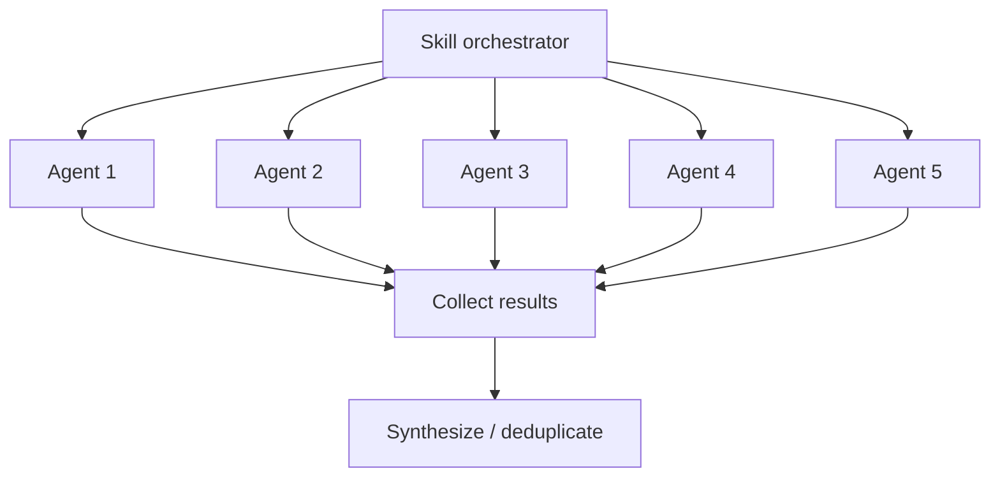

# Agent System

How Larch skills orchestrate parallel subagents to achieve collaborative multi-perspective workflows.

## What Are Agents?

In the Claude Code context, an **agent** is a subprocess spawned via the Agent tool that runs autonomously with its own context window. Each agent receives a prompt, has access to a defined set of tools, and returns a result when complete. Agents are isolated from each other — they cannot see each other's outputs or share state.

## How Skills Use Agents

Skills launch agents to parallelize work that benefits from multiple independent perspectives. The key patterns:

### Parallel Fan-Out

Multiple agents are launched simultaneously, each examining the same material from a different angle. Results are collected and synthesized after all agents return.

This pattern is used for:

- **[Design planning](collaborative-sketches.md)** — `/design` drafts the plan directly, then fans out to the plan-review panel
- **Plan review** — the validation panels described in [Review Agents](review-agents.md) examine plans and research output simultaneously
- **Code review** — the specialist panel described in [Review Agents](review-agents.md) examines the diff simultaneously; Claude is a voter only
- **[Voting](voting-process.md)** — the voting panel evaluates findings in parallel

### Prerequisite peers and chained work

Orchestrators often run in an ordered handoff: `/design` is a **prerequisite peer** (not a nested child of `/implement`) that writes the issue-body `larch:plan`; `/implement` then materializes and lands the work from that anchor; Step 5 runs `review-and-fix CLI` on the implementation diff (standalone `/review` is a separate skill).

## Agent Types

Larch uses several categories of agents:

### Review Agent

The persistent [Code Reviewer archetype](review-agents.md) — a unified reviewer covering code quality, risk/integration, correctness, architecture, and security. Defined in `agents/code-reviewer.md` (generated from `skills/shared/reviewer-templates.md` via `python3 python/cli.py generate code-reviewer-agent`; discovered via `${CLAUDE_PLUGIN_ROOT}`) with model: sonnet (default) and Read/Grep/Glob tool access. In `/research` validation, `/design`, and `/review`, the archetype participates according to the panel compositions in [review-agents.md](review-agents.md). Fallback rule for `/research`: one Claude Code Reviewer subagent fallback replaces each unavailable external slot, preserving the validation-panel shape. In `/design`, `/review`, and `/implement` Step 5 reviewer panels, dispatch uses `--no-fallback`: missing or failed vendor rows drop instead of cross-vendor or Claude reviewer backfill (see [review-agents.md](review-agents.md)).

### Voting Panel Agents

The voters in the [voting process](voting-process.md) are ephemeral agents launched with the ballot and voting instructions. `/design` plan review uses Claude + Codex + Cursor. `/review` and `/implement` Step 5 code review use three Cursor archetype voters at fixed slots, with a single Claude fallback voter when Cursor is unavailable. Codex does not vote in the code-review panel. The dispatch surface is `python/cli.py agent dispatch-voters`.

### Research Agents

The research agents in `/research` form the fixed-shape topology documented in the skill: Codex-first research lanes under angle-differentiated briefs — `RESEARCH_PROMPT_ARCH` (architecture), `RESEARCH_PROMPT_EDGE` (edge cases), `RESEARCH_PROMPT_EXT` (external comparisons), `RESEARCH_PROMPT_SEC` (security) — followed by the validation panel described in [review-agents.md](review-agents.md). When Codex is unavailable for a research lane, the lane runs the same angle prompt under a Claude Agent-tool fallback. When an external is unavailable in the validation panel, a Claude Code Reviewer subagent replaces the slot, preserving the panel shape. All are ephemeral.

## Context Isolation

Each agent runs in its own context window:

- Agents **cannot** see each other's outputs during execution
- Agents **cannot** communicate with each other
- The orchestrating skill collects all results and performs synthesis
- This isolation is by design — it ensures independent perspectives and prevents groupthink

## Tool Access

Agents have restricted tool access depending on their role:

- **Review agents** — Read, Grep, Glob only (cannot modify files)
- **Voting agents** — Read, Grep, Glob only (evaluation phase)
- **Implementation agents** — Full tool access when implementing fixes

External tools (Codex, Cursor) have their own tool access controlled by their respective platforms. See [External Reviewers](external-reviewers.md) for integration details.

## Performance Optimization

Skills optimize agent usage through:

1. **Launch order** — Slowest agents (Cursor) launched first, fastest (Claude) launched last
2. **Background execution** — External tools run in background while Claude agents execute
3. **Early processing** — Claude subagent results are processed immediately while waiting for slower external reviewers
4. **Sentinel-based coordination** — `.done` files signal completion without polling the output
