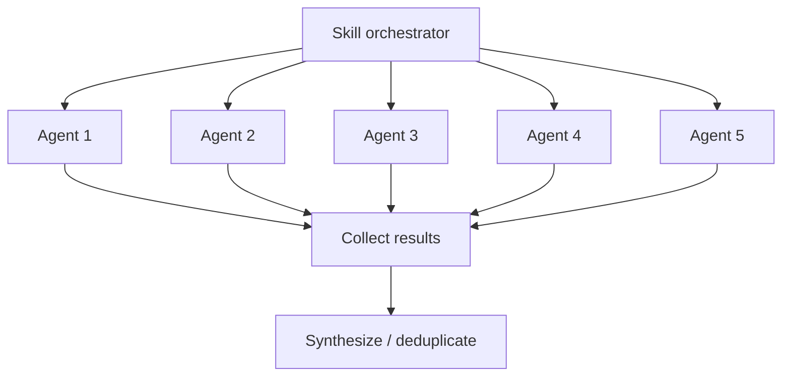

# Agent System

How Larch skills orchestrate parallel subagents to achieve collaborative multi-perspective workflows.

## What Are Agents?

In the Claude Code context, an **agent** is a subprocess spawned via the Agent tool that runs autonomously with its own context window. Each agent receives a prompt, has access to a defined set of tools, and returns a result when complete. Agents are isolated from each other — they cannot see each other's outputs or share state.

## How Skills Use Agents

Skills launch agents to parallelize work that benefits from multiple independent perspectives. The key patterns:

### Parallel Fan-Out

Multiple agents are launched simultaneously, each examining the same material from a different angle. Results are collected and synthesized after all agents return.

This pattern is used for:

- **[Collaborative sketches](collaborative-sketches.md)** — the mode-specific sketch topology fans out across Claude, Cursor, and Codex
- **Plan review** — the validation panels described in [Review Agents](review-agents.md) examine plans and research output simultaneously
- **Code review** — the specialist panel described in [Review Agents](review-agents.md) examines the diff simultaneously; Claude is a voter only
- **[Voting](voting-process.md)** — the voting panel evaluates findings in parallel

### Prerequisite peers and chained work

Orchestrators often run in an ordered handoff: `/design` is a **prerequisite peer** (not a nested child of `/implement`) that writes the issue-body `larch:plan`; `/implement` then materializes and lands the work from that anchor; Step 5 runs `review-and-fix.sh` on the implementation diff (standalone `/review` is a separate skill).

## Agent Types

Larch uses several categories of agents:

### Review Agent

The persistent [Code Reviewer archetype](review-agents.md) — a unified reviewer covering code quality, risk/integration, correctness, architecture, and security. Defined in `agents/code-reviewer.md` (generated from `skills/shared/reviewer-templates.md` via `scripts/generate-code-reviewer-agent.sh`; discovered via `${CLAUDE_PLUGIN_ROOT}`) with model: sonnet (default) and Read/Grep/Glob tool access. In `/research` validation, `/design`, and `/review`, the archetype participates according to the panel compositions in [review-agents.md](review-agents.md). Fallback rule for `/research`: one Claude Code Reviewer subagent fallback replaces each unavailable external slot, preserving the validation-panel shape. In `/design`, each Cursor archetype slot falls back to Codex (same archetype), then Claude; each Codex archetype slot falls back to Cursor (same archetype), then Claude, preserving the configured reviewer panel.

### Sketch Agents

The agents in the [collaborative sketch phase](collaborative-sketches.md) follow the regular or quick topology listed in that document. When an external tool is unavailable, the affected slot is **skipped** (issue #3207) — the phase runs with fewer sketches rather than substituting a Claude subagent. Launched slots are ephemeral — inline prompts, not persistent agent definitions.

### Dialectic Debaters

Used by `/design` Step 2a.5 to resolve contested design decisions surfaced by the sketch phase. Up to `min(5, |contested-decisions|)` decisions are selected (priority order). For each capped decision index `N`, **thesis and antithesis use different externals by default**: odd `N` → thesis **Cursor**, antithesis **Codex**; even `N` → thesis **Codex**, antithesis **Cursor**. **Degraded mode** (exactly one of Cursor/Codex dialectic-available at launch) runs **both** sides on that sole external. **Per-side waterfall retries** (Cursor ↔ Codex, then a **Claude Agent-tool 2nd retry** only after both externals fail for that side) recover quorum before falling back to synthesis; full matrices, filenames, and collector discipline live in `skills/design/references/dialectic-execution.md` and `skills/shared/dialectic-protocol.md`.

**Primary path is externals-only; Claude is not a drop-in substitute for a missing primary tool.** If a **required side** cannot launch because its assigned external is unavailable at **original** launch time, that decision is **bucket-skipped** (`Disposition: bucket-skipped`) — same trust rationale as the protocol: adversarial debaters must not silently become a single-tool or Claude-primary path. The **GH#98 exception** permits Claude **only** as the **final (2nd) retry** for a side that already failed structurally on both Cursor and Codex attempts — never as the initial debater or 1st retry. This is narrower than review/voting/sketch replacement-first patterns.

Debaters produce tagged structured output (`<steelman>`, `<claim>`, `<evidence>`, `<strongest_concession>`, `<counter_to_opposition>`, `<risk_if_wrong>`, terminal `RECOMMEND:` line). A **six-tag** eligibility gate filters outputs that miss any required tag, carry the wrong RECOMMEND token, or fail role-vs-RECOMMEND consistency — failed sides enter the waterfall; exhausted sides yield `Disposition: fallback-to-synthesis` with a trace rather than poisoning the judge panel. These agents are ephemeral.

### Dialectic Judges

After debate, the judge panel reads an attribution-stripped ballot (Defense A / Defense B labels per decision, deterministic position-order rotation across decisions to cancel position bias) and casts one binary `THESIS` / `ANTI_THESIS` vote per decision. The panel composition is Cursor + Codex + Claude Code Reviewer subagent, with **replacement-first** fallbacks — when Cursor or Codex is unhealthy, a Claude Code Reviewer subagent replaces that slot so the panel shape remains intact.

**Replacement-first applies to judges, not primary debaters**: judges merely adjudicate between pre-authored defenses, so stylistic attribution leak is not a concern for the judge role; the **no-Claude-primary-debater** rule applies to **initial** and **1st-retry** debater slots only — not to the **2nd-retry** Claude tier and not to judging. A dialectic-local health re-probe runs immediately before judge launch so a debate-time Cursor/Codex timeout does not lock that tool out of judging. Judge-panel flags (`judge_codex_available`, `judge_cursor_available`) are judge-phase-local and never mutate orchestrator-wide availability. See `skills/shared/dialectic-protocol.md` for the ballot format, judge prompt template, threshold rules, and resolution schema.

### Voting Panel Agents

The voters in the [voting process](voting-process.md) (Claude Code Reviewer subagent + Codex + Cursor). These are ephemeral agents launched with the ballot and voting instructions. For `/review` code-review, Codex and Cursor participate on every round alongside Claude; unavailable externals waterfall to Claude replacements while preserving the three-slot panel shape.

### Research Agents

The research agents in `/research` form the fixed-shape topology documented in the skill: Codex-first research lanes under angle-differentiated briefs — `RESEARCH_PROMPT_ARCH` (architecture), `RESEARCH_PROMPT_EDGE` (edge cases), `RESEARCH_PROMPT_EXT` (external comparisons), `RESEARCH_PROMPT_SEC` (security) — followed by the validation panel described in [review-agents.md](review-agents.md). When Codex is unavailable for a research lane, the lane runs the same angle prompt under a Claude Agent-tool fallback. When an external is unavailable in the validation panel, a Claude Code Reviewer subagent replaces the slot, preserving the panel shape. All are ephemeral.

## Context Isolation

Each agent runs in its own context window:

- Agents **cannot** see each other's outputs during execution
- Agents **cannot** communicate with each other
- The orchestrating skill collects all results and performs synthesis
- This isolation is by design — it ensures independent perspectives and prevents groupthink

## Tool Access

Agents have restricted tool access depending on their role:

- **Review agents** — Read, Grep, Glob only (cannot modify files)
- **Sketch agents** — Read, Grep, Glob only (research phase)
- **Voting agents** — Read, Grep, Glob only (evaluation phase)
- **Implementation agents** — Full tool access when implementing fixes

External tools (Codex, Cursor) have their own tool access controlled by their respective platforms. See [External Reviewers](external-reviewers.md) for integration details.

## Performance Optimization

Skills optimize agent usage through:

1. **Launch order** — Slowest agents (Cursor) launched first, fastest (Claude) launched last
2. **Background execution** — External tools run in background while Claude agents execute
3. **Early processing** — Claude subagent results are processed immediately while waiting for slower external reviewers
4. **Sentinel-based coordination** — `.done` files signal completion without polling the output
