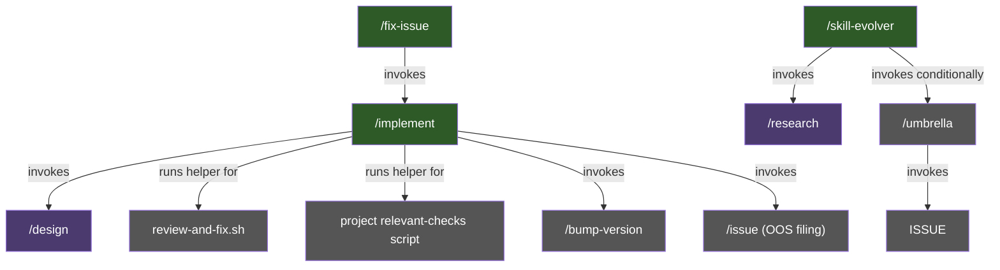
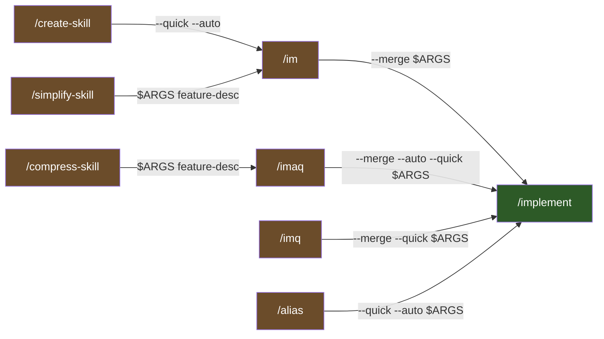
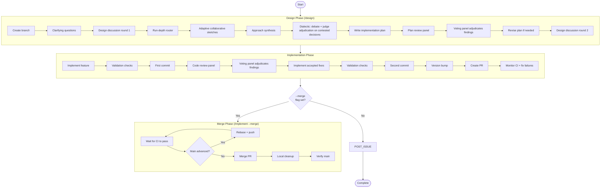

# Workflow Lifecycle

How skills compose to form the end-to-end development workflow in Larch.

## Skill Orchestration Hierarchy

Skills are not invoked in a flat sequence. They form a hierarchical call graph where higher-level **stateful orchestrators** invoke lower-level skills and continue execution based on their side effects. The diagram below shows only true orchestrators and their direct sub-skills; pure forwarders (`/im`, `/imaq`, `/imq`, `/block-issue`, `/create-skill`, `/show-skill`, `/simplify-skill`, `/compress-skill`) are covered separately in the [Delegation Topology](#delegation-topology) subsection below because they run no post-delegation logic. `/alias` is a hybrid (validate → delegate → verify) — it also appears in the Delegation Topology subsection.

- **`/implement`** — top-level orchestrator. Runs the full design → code → review → PR workflow by default; Step 5 runs `review-and-fix.sh`, which wraps the shared review core one round at a time. With the `--merge` flag, also runs the CI+rebase+merge loop and local cleanup after PR creation. With `--design-only`, runs design, publishes plan/review/diagram/OOS artifacts to `larch-logs/implement/<RUN_ID>/`, updates marker-keyed tracking-issue summaries, marks the issue `[DONE]`, and stops before implementation or PR creation. Step 0.5 resolves tracking-issue state (sentinel reuse, `--issue <N>` adoption, or `Closes #<N>` recovery from the current branch's PR body); committed larch-log batches are the single source of truth for full report content (voting tallies, rejected findings, version-bump reasoning, diagrams, OOS observation links, execution issues, run statistics), with the PR body as a slim projection (Summary + diagrams + Test plan + `Closes #<N>` — diagrams appear in both places by design). Step 9a.1 additionally invokes `/issue` in batch mode to file accepted OOS findings as GitHub issues.
- **`/fix-issue`** — processes one approved GitHub issue per invocation. Step 0 (`find-lock-issue.sh`) atomically finds an eligible candidate (open, with `GO` sentinel comment as last comment, no managed lifecycle title prefix, not already locked, no open blockers), acquires the comment lock, and renames the title to `[IN PROGRESS]` immediately on lock so the visual lifecycle reflects the active run without a multi-minute delay. Triages, and classifies intent (PR/NON_PR) and — for PR tasks — complexity (SIMPLE/HARD). PR tasks delegate to `/implement` with mode-appropriate flags (`--quick` for SIMPLE, full for HARD; default is SIMPLE; always `--merge`) and forward `--issue $ISSUE_NUMBER` so the queue issue is adopted as the tracking issue (no separate tracking issue is created); NON_PR tasks run inline (typically filing findings via `/issue`) and never call `/implement`. **Umbrella support (explicit-target only)**: `/fix-issue <umbrella#>` accepts an umbrella issue (detected post-#846 by title-only — title prefix `Umbrella:` / `Umbrella —` after stripping leading bracket-blocks per #819; body content is NOT consulted) and dispatches to the next eligible child without requiring `GO` on either the umbrella or the chosen child; auto-pick mode (no positional argument) NEVER selects umbrellas. When the umbrella's last open child closes, the umbrella is automatically renamed to `[DONE]` and closed.
- **`/skill-evolver`** — research-and-file-issues orchestrator targeting an existing skill. Validates `<skill-name>` (regex + plugin-repo CWD + target SKILL.md exists at `skills/<name>/` or `.claude/skills/<name>/`) via `skills/skill-evolver/scripts/validate-args.sh`, then invokes `/research --no-issue` with a templated prompt that asks the documented lane fan-out to identify concrete actionable improvements with citations — repo-local sibling-skill `file:line` references plus reputable external sources (Anthropic / OpenAI / DeepMind / ≥500-star OSS). On `≥1` improvement, distills the findings into a task description and delegates to `/umbrella` with `--label evolved-by:skill-evolver --label skill:<name> --title-prefix "[skill-evolver:<name>] "`. `/umbrella`'s own classifier decides one-shot (single issue, no umbrella) vs multi-piece (umbrella + one child per piece — very small items may be bundled into a single composed piece per Step 3B.1's bundling rule) on the distilled description — `/skill-evolver` does not pre-commit to the final shape. The label and title-prefix tag whatever `/umbrella` files for later filtering. On `0` improvements, exits cleanly without filing. The skill itself does NOT modify the target skill's files — implementation lands later via `/fix-issue` (per child). Stateful orchestrator: NOT a pure forwarder (post-`/research` decision logic + conditional `/umbrella` invocation) and therefore subject to the post-invocation-verification + anti-halt-continuation rules.

## Delegation Topology

Pure forwarders are **not** orchestrators — they validate input (when applicable), call the Skill tool exactly once, and exit. They run no logic after the child returns. This subsection also documents `/alias`, which is a hybrid: it validates, delegates to `/implement`, and then performs a mechanical sentinel-file verification (see `/alias` Step 4). Edges are labeled with the **arguments passed on that edge** (what the immediate child receives), not the final expansion — for single-hop delegation (`/im`, `/imaq`, `/imq`, `/alias`) this is also what `/implement` sees, but for the two-hop chains `/create-skill → /im → /implement` and `/compress-skill → /imaq → /implement`, the first edge shows only what the intermediate forwarder receives; the forwarder then prepends its own flags (`/im` adds `--merge`; `/imaq` adds `--merge --auto --quick`) before `/implement` sees the final expansion.

- **`/im`** — prepends `--merge` to `$ARGUMENTS` and forwards to `/implement`. Equivalent to `/implement --merge <args>`.
- **`/imaq`** — prepends `--merge --auto --quick`. Equivalent to `/implement --merge --auto --quick <args>`.
- **`/imq`** — prepends `--merge --quick`. Equivalent to `/implement --merge --quick <args>` (quick mode without `--auto`).
- **`/alias`** — hybrid: validates alias name, delegates to `/implement --quick --auto` to scaffold a new alias skill, then performs a sentinel-file verification (Step 4) that the expected `SKILL.md` was actually written. Auto-resolves the target directory: inside a Claude plugin source repo (two-file predicate `.claude-plugin/plugin.json` + `skills/implement/SKILL.md` at the git repo root) the alias goes under `skills/<n>/`; anywhere else, under `.claude/skills/<n>/`. Accepts optional `--merge` to merge the alias-creation PR and `--private` to force `.claude/skills/<n>/` even in a plugin repo (no-op in non-plugin repos).
- **`/create-skill`** — validates name + description, then delegates to `/im --quick --auto` (which expands to `/implement --merge --quick --auto`) to scaffold a new larch-style skill. Auto-merge is the default. Accepts `--merge` as a backward-compat no-op. `/create-skill --plugin` writes under `skills/`; default is `.claude/skills/<name>/`. The scaffold process also emits a post-scaffold doc-sync checklist via `skills/create-skill/scripts/post-scaffold-hints.sh` — reminders to update the README catalog, `.claude/settings.json` permissions, this file (`docs/workflow-lifecycle.md`), and (when applicable) `docs/agents.md`, `docs/review-agents.md`, and `AGENTS.md` canonical sources.
- **`/block-issue`** — pure delegator. Accepts two issue numbers (`ISSUE_A ISSUE_B`), resolves their GitHub GraphQL node IDs, calls the native `addBlockedBy` mutation, and verifies the dependency was recorded. Thin wrapper around `skills/block-issue/scripts/add-blocked-by.sh`. No sub-skill delegation.
- **`/show-skill`** — pure delegator. Accepts a skill name (bare, `larch:`-prefixed, or `/`-prefixed), resolves it to the skill's `SKILL.md` via `skills/show-skill/scripts/show.sh` (searches plugin `skills/` tree first, then consumer `.claude/skills/`), and displays the file content. Read-only — no writes, no sub-skill delegation.
- **`/simplify-skill`** — accepts a single target-skill name (bare form; `/` prefix tolerated), resolves the target directory (plugin tree first, then consumer `.claude/skills/`, then `${CLAUDE_PLUGIN_ROOT}/.claude/skills/`), enumerates every `.md` file physically under that directory (excluding `scripts/` and `tests/`), and delegates a pinned behavior-preserving refactor feature description to `/im` (which expands to `/implement --merge`). Sub-skills invoked via the `Skill` tool are out of scope by construction (they live in sibling `skills/OTHER/` directories so never appear in the find output). `skills/shared/*.md` is out of scope by policy (cross-skill blast radius — refactor separately). The feature description requires a `## Token budget` section in the PR body tracking SKILL.md line/char deltas. Helper script: `skills/simplify-skill/scripts/build-feature-description.sh` (fail-closed on bad name / not found).
- **`/compress-skill`** — pure forwarder. Resolves the target skill directory, enumerates the transitively-reachable `.md` set inside it, snapshots baseline byte/line counts, and delegates a behavior-preserving prose-rewrite feature description to `/imaq` (which expands to `/implement --merge --auto --quick`) so changes ship as an auto-merged PR. See the Standalone Usage entry for full scope rules and the `## Token budget` PR-body contract.

Pure forwarders (`/im`, `/imaq`, `/imq`, `/block-issue`, `/create-skill`, `/show-skill`, `/simplify-skill`, `/compress-skill`) are exempt from the post-invocation-verification and anti-halt-continuation rules defined in `skills/shared/subskill-invocation.md`. `/alias` is NOT exempt — it carries both the post-invocation sentinel check and the anti-halt banner/micro-reminder. See that document for the full classification rules.

## End-to-End Flow

The full lifecycle when running `/implement <feature description>`:

## Standalone Usage

Not every task requires the full `/implement` pipeline. Skills can be used independently:

- **`/design [--auto] [--quick] [--full] <feature>`** — Plan a feature without implementing it. Creates a branch, writes run parameters once, runs the collaborative sketch topology documented in [Collaborative Sketches](collaborative-sketches.md) when the sketch budget is non-zero, writes the plan, and reviews it with the validation panel + voting. `--quick` caps sketches and uses quick plan review; `--full` forces full sketch fan-out.
- **`/review [--diff] [--no-issues] [<description>]`** — Supports `--diff`, which reviews the current branch's changes (implements accepted fixes in a recursive loop), and positional `<description>`, which reviews existing code and files accepted findings as GitHub issues by default (`--no-issues` to suppress).
- **`/research [--no-issue] <topic>`** — Best-effort read-only-repo investigation with the fixed-shape topology documented in the research skill: a planner pre-pass (always on) decomposes the question into focused subquestions, then Codex-first research lanes by angle fan out, followed by the validation panel. Step 2.5 (citation validation, unconditional) runs between validation and synthesis: a deterministic shell validator extracts cited URLs / DOIs / file:line references, HEAD-fetches URLs under SSRF guards, validates DOIs, spot-checks file:line ranges against the git tree, and writes the PASS / FAIL / UNKNOWN ledger sidecar that Step 3 splices into the final report — fail-soft (the report is never blocked). On a TTY, the planner pauses after subquestion proposal so the operator can review, edit, or abort; on non-TTY, the run continues without prompting. Does not create branches or make commits. The skill-scoped `scripts/deny-edit-write.sh` PreToolUse hook mechanically guards Claude's `Edit`/`Write`/`NotebookEdit` tool surface, permitting only paths under canonical `/tmp`; **the hook does not cover Bash or external reviewers** (Cursor/Codex launch directly against `$PWD` with full filesystem access — non-modification is prompt-enforced only). See [`SECURITY.md` § External reviewer write surface in /research](../SECURITY.md#external-reviewer-write-surface-in-research) for the full residual-risk framing. Step 3.5 auto-archives the full report as a GitHub issue on each successful run (via `/issue` single mode); `--no-issue` skips this step. May also invoke `/issue` via the Skill tool when the research brief calls for filing findings as issues.
- **`/block-issue <ISSUE_A> <ISSUE_B>`** — Express a native GitHub blocked-by relationship between two issues using the `addBlockedBy` GraphQL mutation. Both arguments are plain issue numbers. Auto-detects the repo from `gh repo view`; accepts optional `--repo owner/name` to override. Verifies the relationship was recorded before confirming.
- **`/show-skill <skill-name>`** — Display the contents of a skill's `SKILL.md` file. Accepts bare name, `larch:`-prefixed form, or leading-`/` form. Searches the plugin `skills/` tree first, then the consumer repo's `.claude/skills/`. Read-only.
- **`/set-up-forked-open-source-repo --upstream <owner/repo> --fork <owner/repo> [--mirror-confirmed] [--init-submodules]`** — Configure the current checkout for upstream/fork OSS contribution. Verifies the fork and parent, optionally syncs fork branches and tags from upstream after explicit confirmation, rewires local remotes so `origin` is the fork and `upstream` is upstream, disables upstream pushes, and sets `main` to track `origin/main`. Single-clone only; refuses dirty, non-`main`, ahead, diverged, and ambiguous remote states.
- **`/skill-evolver <skill-name>`** — Evolve an existing larch skill by researching concrete improvements and filing them as GitHub issues. Validates `<skill-name>` (regex + plugin-repo CWD + skill exists at `skills/<name>/` or `.claude/skills/<name>/`), invokes `/research --no-issue` against repo-local sibling skills + reputable external sources (Anthropic / OpenAI / DeepMind / ≥500-star OSS) for concrete actionable improvements with citations, and on `≥1` improvement delegates to `/umbrella` with `--label evolved-by:skill-evolver --label skill:<name> --title-prefix "[skill-evolver:<name>] "`. `/umbrella`'s classifier picks one-shot (single issue) vs multi-piece (umbrella + children — very small items may be bundled into a single composed piece per `/umbrella` Step 3B.1's bundling rule) on the distilled description. On no improvements, exits cleanly without filing. Research-and-file-issues only — does not modify the target skill's files; implementation lands later via `/fix-issue` (per child).
- **`/issue [--input-file F] [--title-prefix P] [--label L]... [--go] [<desc>]`** — Create one or more GitHub issues with 2-phase LLM-based semantic duplicate detection.
- **`/report-tokens`** — Analyze closed GitHub issues in the current larch repo that contain structured token-report comments. Fetches matching issues with `gh`, caches raw issue JSON under a temp directory, estimates Claude/Codex/Cursor costs from grand-total rows, plots SIMPLE and HARD cost trends, and prints the top SIMPLE costs, HARD phase breakdown, cache-read dominance, and cost-reduction suggestions. Observability-only; no repo writes.
- **`/cleanup`** — Remove leftover larch session temp directories from `~/.cache/larch/sessions/` and `/tmp`. Runs a singleton guard at startup: aborts if more than one `claude` process is detected, and skips cache dirs with an active `.larch-keepalive` sentinel. Reports counts removed from each location. No git writes, no PRs — filesystem cleanup only.

Shortcut aliases (covered in [Delegation Topology](#delegation-topology)):
- **`/im <args>`** ≡ `/implement --merge <args>`
- **`/imaq <args>`** ≡ `/implement --merge --auto --quick <args>`
- **`/imq <args>`** ≡ `/implement --merge --quick <args>`

## Flags

Flags modify behavior across the skill hierarchy:

| Flag | Available on | Effect |
|---|---|---|
| `--quick` | `/implement` | Skips `/design` (produces inline plan instead). Code review runs up to 3 rounds (no voting panel) using the simple review panel: Cursor edge-cases, Codex structure, and Claude generic. |
| `--quick` | `/design` | Caps sketch fan-out at the quick topology and uses quick plan review. This is separate from `/implement --quick`, which skips `/design` entirely. |
| `--full` | `/design` | Forces full sketch fan-out. When combined with `/design --quick`, sketches use the full topology while plan review remains quick. |
| `--auto` | `/implement`, `/design`, `/fix-issue` (forwarded to `/implement` on PR paths) | Suppresses all interactive question checkpoints. Skills run fully autonomously without user interaction. |
| `--design-only` | `/implement` | Runs through design plus larch-log/OOS publication, then stops before implementation, review, version bump, PR, CI, and merge. Mutually exclusive with `--merge`; the tracking issue URL is the deliverable. |
| `--no-issues` | `/implement` | Requires `--design-only`. Skips tracking-issue creation (Steps 0.5, 9a.1, 11 bypass). Design output is ephemeral — no GitHub issue opened, no tracking-issue summary maintained. |
| `--no-issue` | `/research` | Skips the Step 3.5 auto-archive that files the full report as a GitHub issue. Default off (issue is filed). |
| `--coder=<value>` | `/implement`, `/fix-issue` (and aliases `/im`, `/imaq`, `/imq`) | Selects the Step 2 implementer. When `--coder` is omitted, `/design` writes a `diff_lines` estimate; `diff_lines < 30` routes to the main-agent Claude path, while absent or larger estimates route through the default Codex → Cursor → Claude waterfall by availability. Pass `--coder=codex` explicitly to suppress the carve-out and waterfall. `claude` runs the implementation in the main agent / Claude context — pre-Codex behavior. `cursor` spawns the Cursor implementer via the same dispatcher; `gemini` spawns the Gemini implementer. When Cursor or Gemini is explicitly selected but unhealthy or unavailable, the dispatcher falls back to `STATUS=claude_fallback` and the orchestrator runs the main-agent code-edit path (symmetric to passing `--coder=claude`). `/fix-issue` forwards the value verbatim to `/implement` on PR paths and does not validate it itself. The legacy `--codex-available` knob (boolean) is still accepted by the dispatcher for one release with a stderr deprecation warning (true maps to `coder=codex`; false maps to `coder=claude`). |

## Conditional Steps

Certain steps in the workflow depend on configuration prerequisites and are skipped when unavailable:

- **CI monitoring** — Requires repository identification. When unavailable, CI monitoring is skipped.
- **Version bump** — Requires a `/bump-version` skill defined in the repo. When absent, the version bump step is skipped with a warning.
- **External reviewers (Cursor, Codex)** — When unavailable, Claude Code Reviewer subagent fallbacks replace them so the per-skill lane/voter shapes remain constant in most phases (see [agents.md](agents.md), [review-agents.md](review-agents.md), and [collaborative-sketches.md](collaborative-sketches.md)). In `/review`, the fallback chain differs: Cursor down → skip Cursor specialist slots while Codex specialists still run when available; Codex down → skip Codex specialist slots while Cursor specialists still run when available; both down → Claude generic (see [review-agents.md](review-agents.md)). The review still lands because the unified Code Reviewer archetype is what each fallback reviewer runs; losing the external tool means losing harness diversity but not coverage.
- **Dialectic debate buckets (`/design` Step 2a.5)** — Unlike the phases above, the dialectic **debate** phase does NOT replace an unavailable tool with a Claude subagent. When the assigned external tool (Cursor for odd-indexed decisions, Codex for even) is unavailable, the bucket is **skipped entirely** and a `Disposition: bucket-skipped` resolution is written (the synthesis decision stands for that point). This carve-out applies to debate execution only — the post-debate **judge panel** uses replacement-first normally. See [External Reviewers](external-reviewers.md#dialectic-specific-behavior) and `skills/shared/dialectic-protocol.md` for details.

## Resolution Protocols

Different skills use different protocols for resolving review findings:

| Protocol | Used by | Mechanism |
|---|---|---|
| [Voting](voting-process.md) | `/design`, `/review` (both diff and description modes) | The voting panel votes YES/NO/EXONERATE using the thresholds documented in the voting protocol. |
| Negotiation | `/research` | Up to N rounds of back-and-forth with external reviewers. Claude makes the final call. |

See [Voting Process](voting-process.md) for full details on the voting protocol.
