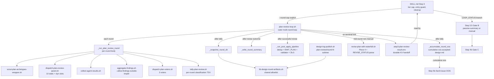

## Architecture Diagram

```mermaid
graph TD
    SKILL[SKILL.md Step 3<br/>tier cap, entry guard, cleanup]
    PRL[plan-review-loop.sh<br/>outer multi-round loop]
    RPR[_run_plan_review_round<br/>per-round body]
    LIB[lib-design-round-artifacts.sh<br/>shared allowlist]
    SNAP[_snapshot_round_dir]
    SUM[_write_round_summary]
    POST[_run_post_apply_pipeline<br/>dedup + EMIT_PLAN + validator + 2b.5]
    OOSACC[_accumulate_round_oos<br/>cumulative oos-accepted-design.md]
    RPW[revise-plan-with-waterfall.sh<br/>Piece 4 + REVISE_STATUS parse]
    RESENV[.step3-plan-review-result.env<br/>durable KV handoff]
    DLP[design-log-publish.sh<br/>plan-review/round-N subtree]
    GB[Step 3.5 Gate B<br/>passive-summary or manual]
    GC[Step 4b Gate C]
    STEP5B[Step 5b /larch:issue OOS]
    SCOUT[scout-plan-archetypes-wrapper.sh]
    DPP[dispatch-plan-review-panel.sh<br/>10 static + dyn slots]
    COL[collect-agent-results.sh]
    AGG[aggregate-findings.sh<br/>--allow-findings-outside-tmpdir]
    DPV[dispatch-plan-voters.sh<br/>3 voters]
    TAL[tally-plan-review.sh<br/>per-round classification TSV]

    SKILL -->|--round-cap explicit| PRL
    PRL -->|each round| RPR
    RPR --> SCOUT
    RPR --> DPP
    RPR --> COL
    RPR --> AGG
    RPR --> DPV
    RPR --> TAL
    PRL -->|after tally| SNAP
    PRL -->|after tally| OOSACC
    PRL -->|mid-round non-manual| RPW
    PRL -->|after successful revise| POST
    PRL -->|after revise outcome| SUM
    PRL -->|on terminal exit| RESENV
    SNAP --> LIB
    DLP --> LIB
    RESENV -->|read by| SKILL
    SKILL -->|LOOP_STATUS branch| GB
    GB --> GC
    OOSACC -->|cumulative oos| STEP5B
```
