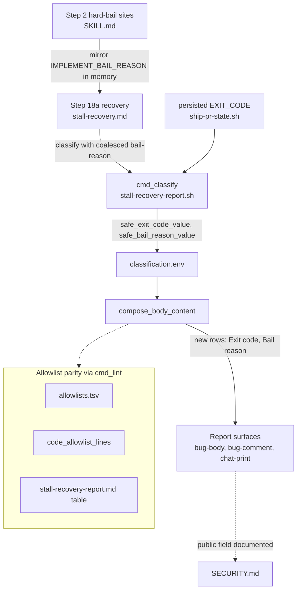

## Architecture Diagram

```mermaid
graph TD
    A["Step 2 hard-bail sites<br/>SKILL.md"] -->|"mirror IMPLEMENT_BAIL_REASON in memory"| B["Step 18a recovery<br/>stall-recovery.md"]
    B -->|"classify with coalesced bail-reason"| C["cmd_classify<br/>stall-recovery-report.sh"]
    K["persisted EXIT_CODE<br/>ship-pr-state.sh"] --> C
    C -->|"safe_exit_code_value, safe_bail_reason_value"| D["classification.env"]
    D --> E["compose_body_content"]
    E -->|"new rows: Exit code, Bail reason"| F["Report surfaces<br/>bug-body, bug-comment, chat-print"]
    subgraph parity["Allowlist parity via cmd_lint"]
        T["allowlists.tsv"]
        L["code_allowlist_lines"]
        M["stall-recovery-report.md table"]
    end
    E -.-> parity
    F -.->|"public field documented"| S["SECURITY.md"]
```
