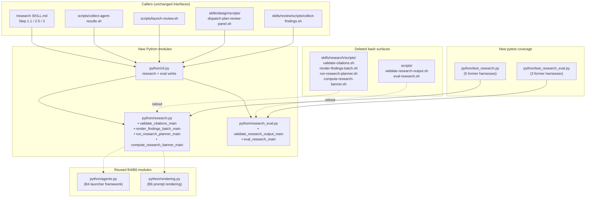

## Architecture Diagram

```mermaid
graph TD
    subgraph "Callers (unchanged interfaces)"
        R["/research SKILL.md\nStep 1.1 / 2.5 / 3"]
        C["scripts/collect-agent-results.sh"]
        LR["scripts/launch-review.sh"]
        DP["skills/design/scripts/\ndispatch-plan-review-panel.sh"]
        CF["skills/review/scripts/collect-findings.sh"]
    end

    subgraph "New Python modules"
        PRC["python/research.py\n• validate_citations_main\n• render_findings_batch_main\n• run_research_planner_main\n• compute_research_banner_main"]
        PRE["python/research_eval.py\n• validate_research_output_main\n• eval_research_main"]
        CLI["python/cli.py\nresearch + eval verbs"]
    end

    subgraph "Reused B4/B6 modules"
        AG["python/agents.py\n(B4 launcher framework)"]
        RN["python/rendering.py\n(B6 prompt rendering)"]
    end

    subgraph "Deleted bash surfaces"
        BS["skills/research/scripts/\nvalidate-citations.sh\nrender-findings-batch.sh\nrun-research-planner.sh\ncompute-research-banner.sh"]
        BSE["scripts/\nvalidate-research-output.sh\neval-research.sh"]
    end

    subgraph "New pytest coverage"
        TR["python/test_research.py\n(5 former harnesses)"]
        TRE["python/test_research_eval.py\n(3 former harnesses)"]
    end

    R --> CLI
    C --> CLI
    LR --> CLI
    DP --> CLI
    CF --> CLI

    CLI --> PRC
    CLI --> PRE

    PRC -.-> AG
    PRC -.-> RN

    BS -. "retired" .-> PRC
    BSE -. "retired" .-> PRE

    TR --> PRC
    TRE --> PRE
```
