## Review Phase Detail

| Round | Suggestions | Accepted | OOS proposed | OOS accepted | Time | Cost | Reviewers |
|--:|--:|--:|--:|--:|:--|--:|--:|
| 1 | 11 | 7 | 1 | 0 | 17m 33s | $5.79 | 14 |
| 2 | 6 | 6 | 0 | 0 | 11m 31s | $3.72 | 5 |
| 3 | 8 | 7 | 2 | 0 | 11m 55s | $3.65 | 5 |
| 4 | 7 | 6 | 1 | 0 | 19m 18s | $5.80 | 5 |
| 5 | 3 | 2 | 0 | 0 | 12m 14s | $4.13 | 5 |
| **Total** | **35** | **28** | **4** | **0** | **1h 12m 31s** | **$23.09** | **34** |

### Round 1 reviewer timing

```mermaid
gantt
    title Round 1 reviewer timing
    dateFormat X
    axisFormat %H:%M:%S
    section Reviewers
    codex/dyn-codex-plan-ssrf-parity :r1_t1, 4, 166
    cursor/dyn-cursor-plan-ssrf-parity :r1_t2, 4, 190
    cursor/cursor-plan-pragmatic :r1_t3, 4, 203
    cursor/cursor-plan-requirements :r1_t4, 4, 228
    codex/codex-plan-requirements :r1_t5, 4, 229
    codex/codex-plan-pragmatic :r1_t6, 4, 250
    codex/codex-plan-innovation :r1_t7, 4, 256
    cursor/dyn-cursor-plan-contract-streams :r1_t8, 4, 268
    cursor/cursor-plan-innovation :r1_t9, 4, 272
    cursor/cursor-plan-arch :r1_t10, 4, 282
    codex/codex-plan-arch :r1_t11, 4, 292
    codex/dyn-codex-plan-contract-streams :r1_t12, 4, 302
    codex/dyn-codex-plan-retired-reference-sweep :r1_t13, 5, 255
    cursor/dyn-cursor-plan-retired-reference-sweep :r1_t14, 5, 298
    unknown/aggregator :r1_t15, 358, 430
    claude/vote :r1_t16, 434, 958
    cursor/vote :r1_t17, 435, 557
    codex/vote :r1_t18, 435, 636
    unknown/codex :r1_t19, 977, 1048
```

### Round 2 reviewer timing

```mermaid
gantt
    title Round 2 reviewer timing
    dateFormat X
    axisFormat %H:%M:%S
    section Reviewers
    cursor/cursor-plan-requirements :r2_t1, 1, 166
    codex/codex-plan-generic :r2_t2, 1, 245
    cursor/cursor-plan-innovation :r2_t3, 1, 245
    cursor/cursor-plan-arch :r2_t4, 1, 247
    cursor/cursor-plan-pragmatic :r2_t5, 1, 292
    unknown/aggregator :r2_t6, 306, 338
    cursor/vote :r2_t7, 340, 417
    codex/vote :r2_t8, 340, 446
    claude/vote :r2_t9, 340, 580
    unknown/codex :r2_t10, 597, 688
```

### Round 3 reviewer timing

```mermaid
gantt
    title Round 3 reviewer timing
    dateFormat X
    axisFormat %H:%M:%S
    section Reviewers
    cursor/cursor-plan-innovation :r3_t1, 1, 179
    cursor/cursor-plan-pragmatic :r3_t2, 1, 205
    cursor/cursor-plan-requirements :r3_t3, 1, 251
    codex/codex-plan-generic :r3_t4, 1, 263
    cursor/cursor-plan-arch :r3_t5, 1, 263
    unknown/aggregator :r3_t6, 275, 328
    cursor/vote :r3_t7, 329, 418
    codex/vote :r3_t8, 329, 477
    claude/vote :r3_t9, 329, 595
    unknown/codex :r3_t10, 613, 712
```

### Round 4 reviewer timing

```mermaid
gantt
    title Round 4 reviewer timing
    dateFormat X
    axisFormat %H:%M:%S
    section Reviewers
    cursor/cursor-plan-pragmatic :r4_t1, 1, 217
    cursor/cursor-plan-requirements :r4_t2, 1, 248
    cursor/cursor-plan-arch :r4_t3, 1, 254
    codex/codex-plan-generic :r4_t4, 1, 272
    cursor/cursor-plan-innovation :r4_t5, 1, 290
    unknown/aggregator :r4_t6, 303, 341
    cursor/vote :r4_t7, 343, 463
    codex/vote :r4_t8, 343, 490
    claude/vote :r4_t9, 343, 1036
    unknown/codex :r4_t10, 1050, 1155
```

### Round 5 reviewer timing

```mermaid
gantt
    title Round 5 reviewer timing
    dateFormat X
    axisFormat %H:%M:%S
    section Reviewers
    codex/codex-plan-generic :r5_t1, 2, 121
    cursor/cursor-plan-innovation :r5_t2, 2, 168
    cursor/cursor-plan-requirements :r5_t3, 2, 255
    cursor/cursor-plan-pragmatic :r5_t4, 2, 267
    cursor/cursor-plan-arch :r5_t5, 2, 294
    unknown/aggregator :r5_t6, 303, 332
    cursor/vote :r5_t7, 334, 391
    codex/vote :r5_t8, 334, 400
    claude/vote :r5_t9, 334, 619
    unknown/codex :r5_t10, 627, 730
```

**Top reviewers** (by suggestions accepted, whole run):
1. cursor/cursor-plan-arch — 6
2. cursor/cursor-plan-innovation — 6
3. codex/codex-plan-generic — 5
4. cursor/cursor-plan-requirements — 5
5. cursor/cursor-plan-pragmatic — 4
6. cursor/dyn-contract-streams — 4
7. codex/arch — 3

**Reviewer slot failures**: 0

_Cost is the per-round vendor cost (Codex + Cursor + Claude subprocess), attributed by token-ledger timestamp window; it excludes main-agent Claude, so it is less than the run Cost line above. Rendered as an em dash when per-round timing or the token ledger is unavailable._
