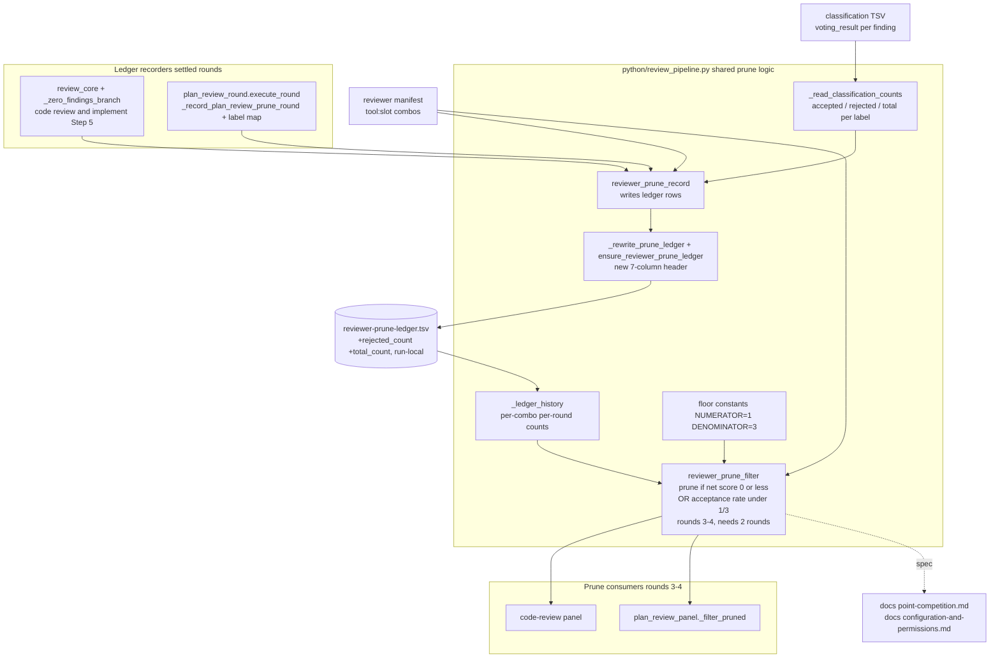

## Architecture Diagram

```mermaid
graph TD
    CLS["classification TSV<br/>voting_result per finding"]
    MAN["reviewer manifest<br/>tool:slot combos"]

    subgraph shared["python/review_pipeline.py shared prune logic"]
        RCC["_read_classification_counts<br/>accepted / rejected / total per label"]
        REC["reviewer_prune_record<br/>writes ledger rows"]
        RW["_rewrite_prune_ledger + ensure_reviewer_prune_ledger<br/>new 7-column header"]
        HIST["_ledger_history<br/>per-combo per-round counts"]
        FILT["reviewer_prune_filter<br/>prune if net score 0 or less<br/>OR acceptance rate under 1/3<br/>rounds 3-4, needs 2 rounds"]
        CONST["floor constants NUMERATOR=1 DENOMINATOR=3"]
    end

    LEDGER[("reviewer-prune-ledger.tsv<br/>+rejected_count +total_count, run-local")]

    subgraph recorders["Ledger recorders settled rounds"]
        RCORE["review_core + _zero_findings_branch<br/>code review and implement Step 5"]
        PRR["plan_review_round.execute_round<br/>_record_plan_review_prune_round + label map"]
    end

    subgraph consumers["Prune consumers rounds 3-4"]
        RPANEL["code-review panel"]
        PPANEL["plan_review_panel._filter_pruned"]
    end

    DOCS["docs point-competition.md<br/>docs configuration-and-permissions.md"]

    CLS --> RCC
    RCC --> REC
    MAN --> REC
    REC --> RW
    RW --> LEDGER
    RCORE --> REC
    PRR --> REC
    LEDGER --> HIST
    HIST --> FILT
    CONST --> FILT
    MAN --> FILT
    FILT --> RPANEL
    FILT --> PPANEL
    FILT -. spec .-> DOCS
```
