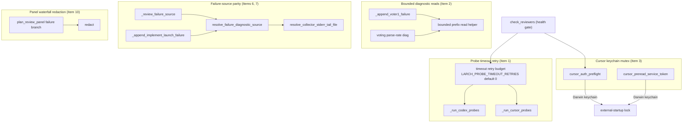

## Architecture Diagram

```mermaid
graph TD
    HG["check_reviewers (health gate)"]
    LOCK["external-startup lock"]

    subgraph probes["Probe timeout retry (Item 1)"]
        TR["timeout retry budget<br/>LARCH_PROBE_TIMEOUT_RETRIES default 0"]
        CODEX["_run_codex_probes"]
        CURSOR["_run_cursor_probes"]
        TR --> CODEX
        TR --> CURSOR
    end

    subgraph auth["Cursor keychain mutex (Item 3)"]
        PRE["cursor_auth_preflight"]
        PREREAD["cursor_preread_service_token"]
    end

    subgraph bounded["Bounded diagnostic reads (Item 2)"]
        VOTERS["_append_voter1_failure"]
        VOTING["voting parse-rate diag"]
        PREFIX["bounded prefix read helper"]
        VOTERS --> PREFIX
        VOTING --> PREFIX
    end

    subgraph parity["Failure-source parity (Items 6, 7)"]
        REVFAIL["_review_failure_source"]
        IMPLFAIL["_append_implement_launch_failure"]
        RESOLVER["resolve_failure_diagnostic_source"]
        TAIL["resolve_collector_stderr_tail_file"]
        REVFAIL --> RESOLVER
        IMPLFAIL --> RESOLVER
        RESOLVER --> TAIL
    end

    subgraph redact["Panel waterfall redaction (Item 10)"]
        PANEL["plan_review_panel failure branch"]
        REDACT["redact"]
        PANEL --> REDACT
    end

    HG --> TR
    HG --> PRE
    PRE -->|Darwin keychain| LOCK
    PREREAD -->|Darwin keychain| LOCK
```
