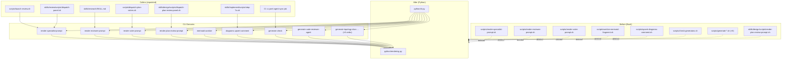

## Architecture Diagram

```mermaid
graph TD
    subgraph Before["Before (Bash)"]
        B1["scripts/render-specialist-prompt.sh"]
        B2["scripts/render-reviewer-prompt.sh"]
        B3["scripts/render-voter-prompt.sh"]
        B4["scripts/sanitize-mermaid-fragment.sh"]
        B5["scripts/upsert-diagrams-comment.sh"]
        B6["scripts/check-generators.sh"]
        B7["scripts/generate-*.sh (×8)"]
        B8["skills/design/scripts/render-plan-review-prompt.sh"]
    end

    subgraph After["After (Python)"]
        P1["python/rendering.py"]
        P2["python/cli.py"]
    end

    subgraph Domains["CLI Domains"]
        D1["render specialist-prompt"]
        D2["render reviewer-prompt"]
        D3["render voter-prompt"]
        D4["render plan-review-prompt"]
        D5["mermaid sanitize"]
        D6["diagrams upsert-comment"]
        D7["generate check"]
        D8["generate code-reviewer-agent"]
        D9["generate topology-docs ... (×8 verbs)"]
    end

    subgraph Callers["Callers (repointed)"]
        C1["scripts/launch-review.sh"]
        C2["skills/review/scripts/dispatch-panel.sh"]
        C3["skills/design/scripts/dispatch-plan-review-panel.sh"]
        C4["scripts/dispatch-plan-voters.sh"]
        C5["skills/implement/scripts/step-7a.sh"]
        C6["skills/research/SKILL.md"]
        C7["CI: ci.yaml agent-sync job"]
    end

    P2 --> D1 & D2 & D3 & D4 & D5 & D6 & D7 & D8 & D9
    D1 & D2 & D3 & D4 & D5 & D6 & D7 & D8 & D9 --> P1

    C1 --> D1
    C2 --> D1
    C3 --> D4
    C4 --> D3
    C5 --> D6
    C6 --> D2
    C7 --> D7

    B1 & B2 & B3 & B4 & B5 & B6 & B7 & B8 -.->|"deleted"| After
```
