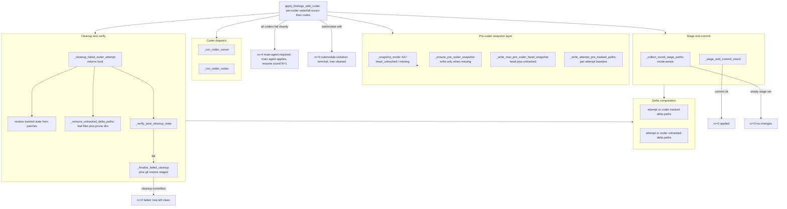

## Architecture Diagram

```mermaid
flowchart TD
    Loop["apply_findings_with_coder: per-coder waterfall cursor then codex"]

    subgraph coders["Coder dispatch"]
        Cursor["_run_coder_cursor"]
        Codex["_run_coder_codex"]
    end

    subgraph snapshot["Pre-coder snapshot layer"]
        Mode["_snapshot_mode: full / head_untracked / missing"]
        Ensure["_ensure_pre_coder_snapshot: write only when missing"]
        MavSnap["_write_mav_pre_coder_head_snapshot: head plus untracked"]
        Attempt["_write_attempt_pre_tracked_paths: per-attempt baseline"]
    end

    subgraph deltas["Delta computation"]
        Tracked["attempt or coder tracked delta paths"]
        Untracked["attempt or coder untracked delta paths"]
    end

    subgraph cleanup["Cleanup and verify"]
        Clean["_cleanup_failed_coder_attempt returns bool"]
        Restore["restore tracked state from patches"]
        Remove["_remove_untracked_delta_paths: leaf files plus prune dirs"]
        Verify["_verify_post_cleanup_state"]
        Finalize["_finalize_failed_cleanup plus git restore staged"]
    end

    subgraph commit["Stage and commit"]
        Collect["_collect_round_stage_paths: mode-aware"]
        CommitFn["_stage_and_commit_round"]
    end

    Loop --> coders
    Loop --> snapshot
    Loop --> commit
    Loop --> cleanup
    snapshot --> Mode
    cleanup --> deltas
    commit --> deltas
    Clean --> Restore
    Clean --> Remove
    Clean --> Verify
    Verify -->|fail| Finalize

    Loop -->|all coders fail cleanly| MainAgent["rc=4 main-agent-required: main agent applies, resume round N+1"]
    Loop -->|submodule edit| Term["rc=3 submodule-violation: terminal, tree cleaned"]
    Finalize -->|cleanup unverified| Fail["rc=2 failed: tree left clean"]
    CommitFn -->|commit ok| Applied["rc=0 applied"]
    Collect -->|empty stage set| NoChange["rc=0 no-changes"]
```
