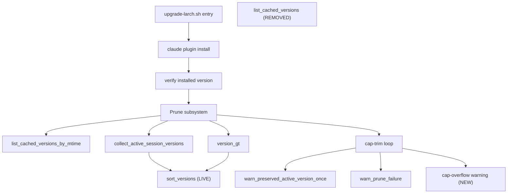

## Architecture Diagram

```mermaid
graph TD
    Entry["upgrade-larch.sh entry"] --> Install["claude plugin install"]
    Install --> Verify["verify installed version"]
    Verify --> Prune["Prune subsystem"]

    Prune --> MtimeList["list_cached_versions_by_mtime"]
    Prune --> ActiveScan["collect_active_session_versions"]
    Prune --> NewerCheck["version_gt"]
    Prune --> CapLoop["cap-trim loop"]

    ActiveScan --> SortVersions["sort_versions (LIVE)"]
    NewerCheck --> SortVersions

    CapLoop --> WarnPin["warn_preserved_active_version_once"]
    CapLoop --> WarnFail["warn_prune_failure"]
    CapLoop --> CapOverflow["cap-overflow warning (NEW)"]

    Dead["list_cached_versions (REMOVED)"]
```
