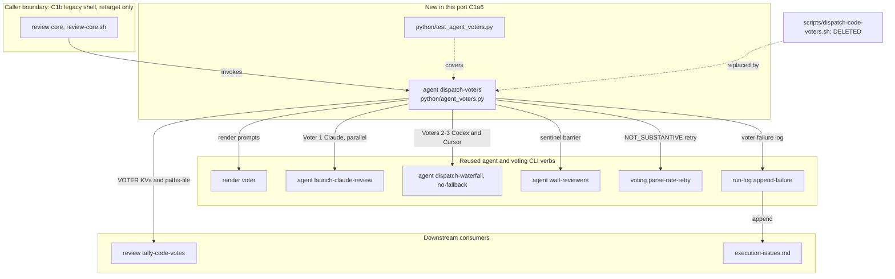

## Architecture Diagram

```mermaid
graph TD
  subgraph caller["Caller boundary: C1b legacy shell, retarget only"]
    RC["review core, review-core.sh"]
  end

  subgraph newmod["New in this port C1a6"]
    DV["agent dispatch-voters<br/>python/agent_voters.py"]
    PT["python/test_agent_voters.py"]
  end

  subgraph reused["Reused agent and voting CLI verbs"]
    RV["render voter"]
    LC["agent launch-claude-review"]
    WF["agent dispatch-waterfall, no-fallback"]
    WR["agent wait-reviewers"]
    PR["voting parse-rate-retry"]
    AF["run-log append-failure"]
  end

  subgraph downstream["Downstream consumers"]
    TC["review tally-code-votes"]
    EI["execution-issues.md"]
  end

  RC -->|invokes| DV
  DV -->|render prompts| RV
  DV -->|Voter 1 Claude, parallel| LC
  DV -->|Voters 2-3 Codex and Cursor| WF
  DV -->|sentinel barrier| WR
  DV -->|NOT_SUBSTANTIVE retry| PR
  DV -->|voter failure log| AF
  AF -->|append| EI
  DV -->|VOTER KVs and paths-file| TC
  PT -.covers.-> DV
  RET["scripts/dispatch-code-voters.sh: DELETED"] -.replaced by.-> DV
```
