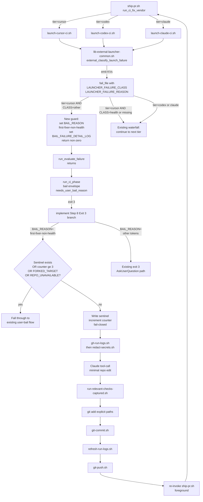

## Architecture Diagram

```mermaid
flowchart TD
    A[ship-pr.sh run_ci_fix_vendor] -->|tier=cursor| B[launch-cursor-ci.sh]
    A -->|tier=codex| C[launch-codex-ci.sh]
    A -->|tier=claude| D[launch-claude-ci.sh]

    B --> E[lib-external-launcher-common.sh<br/>external_classify_launch_failure]
    C --> E
    D --> E

    E -->|emit KVs| F[fail_file with<br/>LAUNCHER_FAILURE_CLASS<br/>LAUNCHER_FAILURE_REASON]

    F -->|tier=cursor AND<br/>CLASS=other| G[New guard:<br/>set BAIL_REASON<br/>first-fixer-non-health<br/>set BAIL_FAILURE_DETAIL_LOG<br/>return non-zero]
    F -->|tier=cursor AND<br/>CLASS=health or missing| H[Existing waterfall:<br/>continue to next tier]
    F -->|tier=codex or claude| H

    G --> I[run_evaluate_failure<br/>returns]
    I --> J[run_ci_phase<br/>bail envelope<br/>needs_user_bail_reason]
    J -->|exit 3| K[implement Step 8 Exit 3 branch]

    K -->|BAIL_REASON=<br/>first-fixer-non-health| L{Sentinel exists<br/>OR counter ge 3<br/>OR FORKED_TARGET<br/>OR REPO_UNAVAILABLE?}
    L -->|yes| M[Fall through to<br/>existing user-bail flow]
    L -->|no| N[Write sentinel<br/>increment counter<br/>fail-closed]

    N --> O[gh-run-logs.sh<br/>then redact-secrets.sh]
    O --> P[Claude tool-call<br/>minimal repo edit]
    P --> Q[run-relevant-checks-captured.sh]
    Q --> R[git add explicit paths]
    R --> S[git-commit.sh]
    S --> T[refresh-run-logs.sh]
    T --> U[git-push.sh]
    U --> V[re-invoke ship-pr.sh<br/>foreground]
    V --> A

    K -->|BAIL_REASON=<br/>other tokens| W[Existing exit 3<br/>AskUserQuestion path]
```
