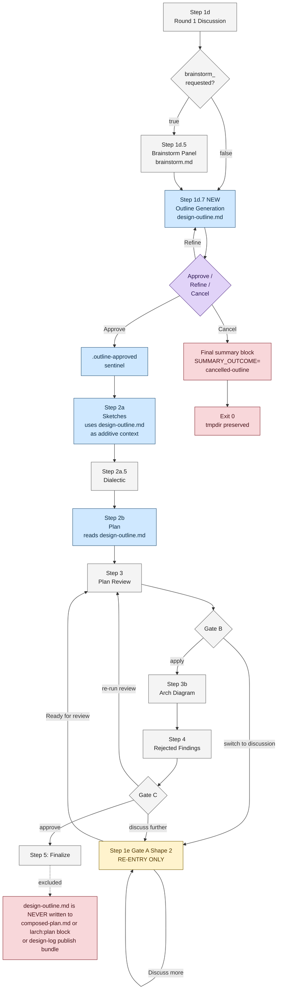

## Architecture Diagram

```mermaid
flowchart TD
    classDef new fill:#cfe8ff,stroke:#1f4e79,color:#0b2a4a
    classDef existing fill:#f4f4f4,stroke:#666,color:#222
    classDef reentry fill:#fff3cd,stroke:#856404,color:#5a3a00
    classDef gate fill:#e1d3f8,stroke:#5e3a8e,color:#2b1654
    classDef exit fill:#f8d7da,stroke:#842029,color:#491217

    Step1d[Step 1d<br/>Round 1 Discussion]:::existing
    BrCheck{brainstorm_<br/>requested?}:::existing
    Step1d5[Step 1d.5<br/>Brainstorm Panel<br/>brainstorm.md]:::existing
    Step1d7[Step 1d.7 NEW<br/>Outline Generation<br/>design-outline.md]:::new
    OutlinePrompt{Approve /<br/>Refine /<br/>Cancel}:::gate
    Sentinel[.outline-approved<br/>sentinel]:::new
    Step2a[Step 2a<br/>Sketches<br/>uses design-outline.md<br/>as additive context]:::new
    Step2a5[Step 2a.5<br/>Dialectic]:::existing
    Step2b[Step 2b<br/>Plan<br/>reads design-outline.md]:::new
    Step3[Step 3<br/>Plan Review]:::existing
    GateB{Gate B}:::existing
    Step3b[Step 3b<br/>Arch Diagram]:::existing
    Step4[Step 4<br/>Rejected Findings]:::existing
    GateC{Gate C}:::existing
    Step1e[Step 1e Gate A Shape 2<br/>RE-ENTRY ONLY]:::reentry
    Step5[Step 5: Finalize]:::existing
    CancelHygiene[Final summary block<br/>SUMMARY_OUTCOME=<br/>cancelled-outline]:::exit
    ExitOk[Exit 0<br/>tmpdir preserved]:::exit

    Step1d --> BrCheck
    BrCheck -->|true| Step1d5
    BrCheck -->|false| Step1d7
    Step1d5 --> Step1d7
    Step1d7 --> OutlinePrompt
    OutlinePrompt -->|Approve| Sentinel
    OutlinePrompt -->|Refine| Step1d7
    OutlinePrompt -->|Cancel| CancelHygiene
    Sentinel --> Step2a
    Step2a --> Step2a5
    Step2a5 --> Step2b
    Step2b --> Step3
    Step3 --> GateB
    GateB -->|apply| Step3b
    GateB -->|switch to discussion| Step1e
    Step3b --> Step4
    Step4 --> GateC
    GateC -->|approve| Step5
    GateC -->|discuss further| Step1e
    GateC -->|re-run review| Step3
    Step1e -->|Ready for review| Step3
    Step1e -->|Discuss more| Step1e
    CancelHygiene --> ExitOk

    %% Files NOT touched
    NotWritten[design-outline.md is NEVER written to<br/>composed-plan.md or larch:plan block<br/>or design-log publish bundle]:::exit
    Step5 -.->|excluded| NotWritten
```
