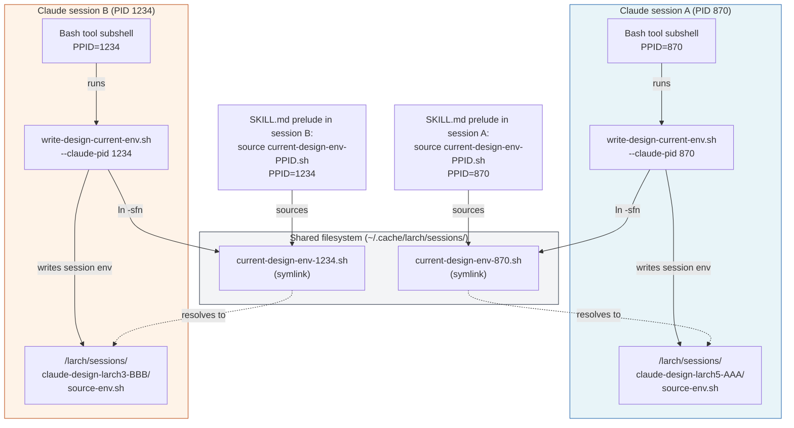

## Architecture Diagram

```mermaid
flowchart TD
    classDef session1 fill:#e8f4f8,stroke:#2b6cb0,stroke-width:1px
    classDef session2 fill:#fef3e8,stroke:#c05621,stroke-width:1px
    classDef shared fill:#f3f4f6,stroke:#374151,stroke-width:1px

    subgraph S1["Claude session A (PID 870)"]
        direction TB
        bashA["Bash tool subshell<br/>PPID=870"]
        writerA["write-design-current-env.sh<br/>--claude-pid 870"]
        envA["<OPERATOR_REPO_PATH>/larch/sessions/<br/>claude-design-larch5-AAA/<br/>source-env.sh"]
        bashA -->|"runs"| writerA
        writerA -->|"writes session env"| envA
    end

    subgraph S2["Claude session B (PID 1234)"]
        direction TB
        bashB["Bash tool subshell<br/>PPID=1234"]
        writerB["write-design-current-env.sh<br/>--claude-pid 1234"]
        envB["<OPERATOR_REPO_PATH>/larch/sessions/<br/>claude-design-larch3-BBB/<br/>source-env.sh"]
        bashB -->|"runs"| writerB
        writerB -->|"writes session env"| envB
    end

    subgraph shared["Shared filesystem (~/.cache/larch/sessions/)"]
        direction TB
        symA["current-design-env-870.sh<br/>(symlink)"]
        symB["current-design-env-1234.sh<br/>(symlink)"]
    end

    writerA -->|"ln -sfn"| symA
    writerB -->|"ln -sfn"| symB
    symA -.->|"resolves to"| envA
    symB -.->|"resolves to"| envB

    preludeA["SKILL.md prelude in session A:<br/>source current-design-env-PPID.sh<br/>PPID=870"]
    preludeB["SKILL.md prelude in session B:<br/>source current-design-env-PPID.sh<br/>PPID=1234"]

    preludeA -->|"sources"| symA
    preludeB -->|"sources"| symB

    class S1 session1
    class S2 session2
    class shared shared
```
