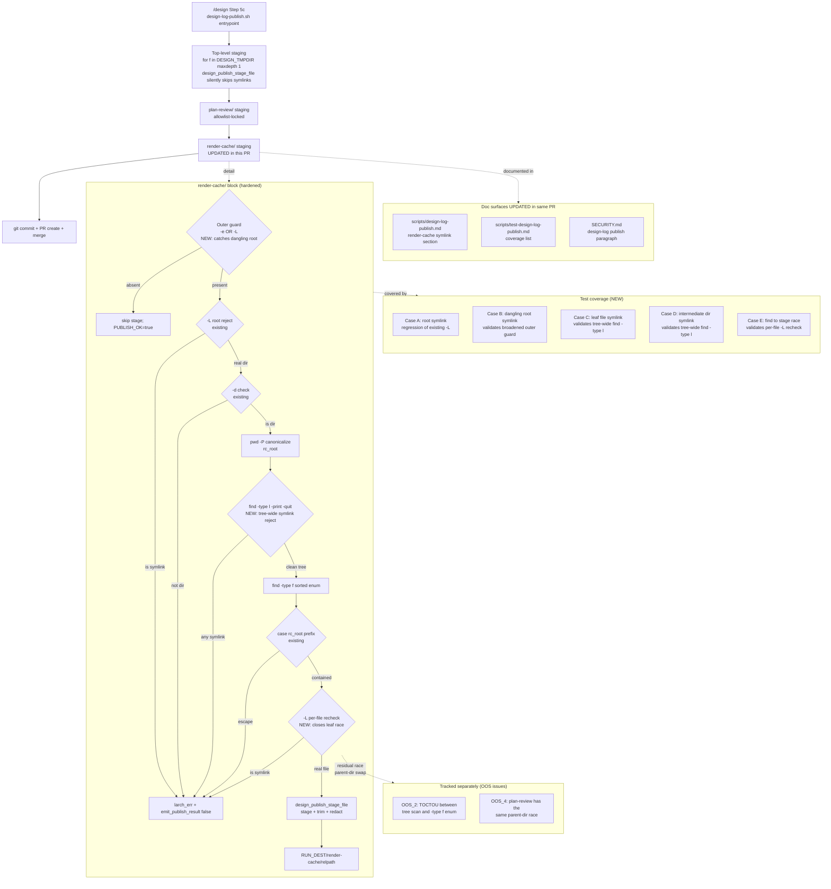

## Architecture Diagram

```mermaid
flowchart TD
    Caller["/design Step 5c\ndesign-log-publish.sh entrypoint"] --> TopLevel["Top-level staging\nfor f in DESIGN_TMPDIR maxdepth 1\ndesign_publish_stage_file silently skips symlinks"]
    TopLevel --> PlanReview["plan-review/ staging\nallowlist-locked"]
    PlanReview --> RenderCache["render-cache/ staging\nUPDATED in this PR"]
    RenderCache --> Commit["git commit + PR create + merge"]

    subgraph RC ["render-cache/ block (hardened)"]
        direction TB
        RC_Outer{"Outer guard\n-e OR -L\nNEW: catches dangling root"} -->|"absent"| RC_Skip["skip stage; PUBLISH_OK=true"]
        RC_Outer -->|"present"| RC_NotLink{"-L root reject\nexisting"}
        RC_NotLink -->|"is symlink"| RC_Fail["larch_err + emit_publish_result false"]
        RC_NotLink -->|"real dir"| RC_IsDir{"-d check\nexisting"}
        RC_IsDir -->|"not dir"| RC_Fail
        RC_IsDir -->|"is dir"| RC_PwdP["pwd -P canonicalize\nrc_root"]
        RC_PwdP --> RC_TreeSym{"find -type l -print -quit\nNEW: tree-wide symlink reject"}
        RC_TreeSym -->|"any symlink"| RC_Fail
        RC_TreeSym -->|"clean tree"| RC_Enum["find -type f sorted enum"]
        RC_Enum --> RC_PathEsc{"case rc_root prefix\nexisting"}
        RC_PathEsc -->|"escape"| RC_Fail
        RC_PathEsc -->|"contained"| RC_PerFileL{"-L per-file recheck\nNEW: closes leaf race"}
        RC_PerFileL -->|"is symlink"| RC_Fail
        RC_PerFileL -->|"real file"| RC_Stage["design_publish_stage_file\nstage + trim + redact"]
        RC_Stage --> RC_Done["RUN_DEST/render-cache/relpath"]
    end

    RenderCache -.->|"detail"| RC

    subgraph TS ["Test coverage (NEW)"]
        direction TB
        CaseA["Case A: root symlink\nregression of existing -L"]
        CaseB["Case B: dangling root symlink\nvalidates broadened outer guard"]
        CaseC["Case C: leaf file symlink\nvalidates tree-wide find -type l"]
        CaseD["Case D: intermediate dir symlink\nvalidates tree-wide find -type l"]
        CaseE["Case E: find to stage race\nvalidates per-file -L recheck"]
    end

    RC -.->|"covered by"| TS

    subgraph DOC ["Doc surfaces UPDATED in same PR"]
        direction TB
        Doc1["scripts/design-log-publish.md\nrender-cache symlink section"]
        Doc2["scripts/test-design-log-publish.md\ncoverage list"]
        Doc3["SECURITY.md\ndesign-log publish paragraph"]
    end

    RenderCache -.->|"documented in"| DOC

    subgraph OOS ["Tracked separately (OOS issues)"]
        direction TB
        OOS2["OOS_2: TOCTOU between\ntree scan and -type f enum"]
        OOS4["OOS_4: plan-review has the\nsame parent-dir race"]
    end

    RC_PerFileL -.->|"residual race\nparent-dir swap"| OOS
```
