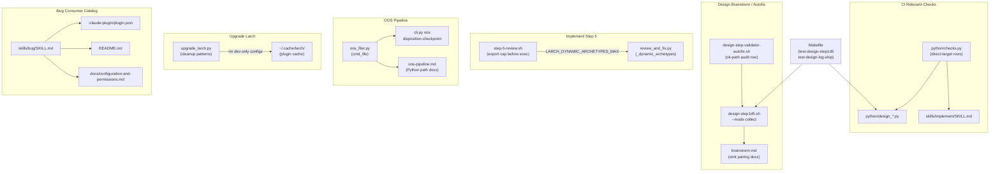

## Architecture Diagram

```mermaid
graph TD
    subgraph CI["CI Relevant-Checks"]
        checks["python/checks.py\n(direct-target rows)"]
        imp_skill["skills/implement/SKILL.md"]
        design_mods["python/design_*.py"]
        checks --> imp_skill
        checks --> design_mods
    end

    subgraph Design_Step3["Design Brainstorm / Autofix"]
        step1d5["design-step1d5.sh\n--mode collect"]
        autofix["design-step-validator-autofix.sh\n(ok-path audit row)"]
        brainstorm_doc["brainstorm.md\n(sink pairing docs)"]
        step1d5 --> brainstorm_doc
        autofix --> step1d5
    end

    subgraph Implement_Step5["Implement Step 5"]
        step5sh["step-5-review.sh\n(export cap before exec)"]
        raf["review_and_fix.py\n(_dynamic_archetypes)"]
        step5sh -->|"LARCH_DYNAMIC_ARCHETYPES_MAX"| raf
    end

    subgraph OOS["OOS Pipeline"]
        oos_filer["oos_filer.py\n(cmd_file)"]
        checkpoint["cli.py oos\ndisposition-checkpoint"]
        oos_pipeline["oos-pipeline.md\n(Python path docs)"]
        oos_filer --> checkpoint
        oos_filer --> oos_pipeline
    end

    subgraph Upgrade["Upgrade Larch"]
        upgrade_py["upgrade_larch.py\n(cleanup patterns)"]
        cache["~/.cache/larch/\n(plugin cache)"]
        upgrade_py -->|"rm dev-only configs"| cache
    end

    subgraph Catalog["/bug Consumer Catalog"]
        plugin_json[".claude-plugin/plugin.json"]
        readme["README.md"]
        cfg_perms["docs/configuration-and-permissions.md"]
        bug_skill["skills/bug/SKILL.md"]
        bug_skill --> plugin_json
        bug_skill --> readme
        bug_skill --> cfg_perms
    end

    Makefile["Makefile\n(test-design-step1d5\ntest-design-log-ship)"]
    Makefile --> step1d5
    Makefile --> design_mods
```
