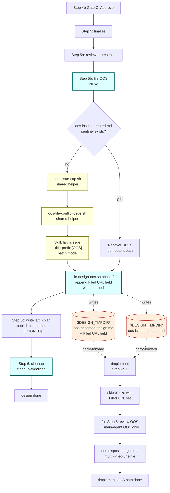

## Architecture Diagram

```mermaid
flowchart TD
    GateC["Step 4b Gate C: Approve"] --> Step5["Step 5: finalize"]
    Step5 --> Step5a["Step 5a: reviewer presence"]
    Step5a --> Step5b["Step 5b: file OOS<br/>NEW"]
    Step5b --> Sentinel{"oos-issues-created.md<br/>sentinel exists?"}
    Sentinel -- yes --> Recover["Recover URLs<br/>idempotent path"]
    Sentinel -- no --> Cap["oos-issue-cap.sh<br/>shared helper"]
    Cap --> Deps["oos-file-conflict-deps.sh<br/>shared helper"]
    Deps --> IssueSkill["Skill: larch:issue<br/>--title-prefix [OOS]<br/>batch mode"]
    IssueSkill --> Annotate["file-design-oos.sh phase 2<br/>append Filed URL field<br/>write sentinel"]
    Recover --> Annotate
    Annotate --> Step5c["Step 5c: write larch:plan<br/>publish + rename [DESIGNED]"]
    Step5c --> Step6["Step 6: cleanup<br/>cleanup-tmpdir.sh"]
    Step6 --> Done["design done"]

    Annotate -.->|writes| OOSDesignMD[("$DESIGN_TMPDIR/<br/>oos-accepted-design.md<br/>+ Filed URL field")]
    Annotate -.->|writes| OOSSentinel[("$DESIGN_TMPDIR/<br/>oos-issues-created.md")]

    OOSDesignMD -.->|carry-forward| ImplStep9a1["/implement<br/>Step 9a.1"]
    OOSSentinel -.->|carry-forward| ImplStep9a1
    ImplStep9a1 --> SkipFiled["skip blocks with<br/>Filed URL set"]
    SkipFiled --> FileOthers["file Step 5 review OOS<br/>+ main-agent OOS only"]
    FileOthers --> DispGate["oos-disposition-gate.sh<br/>multi --filed-urls-file"]
    DispGate --> ImplDone["/implement OOS path done"]

    classDef new fill:#dff,stroke:#066,stroke-width:2px
    classDef shared fill:#ffd,stroke:#660,stroke-width:1px
    classDef artifact fill:#fed,stroke:#a00,stroke-width:1px
    class Step5b,Annotate,Step6 new
    class Cap,Deps,IssueSkill shared
    class OOSDesignMD,OOSSentinel artifact
```
