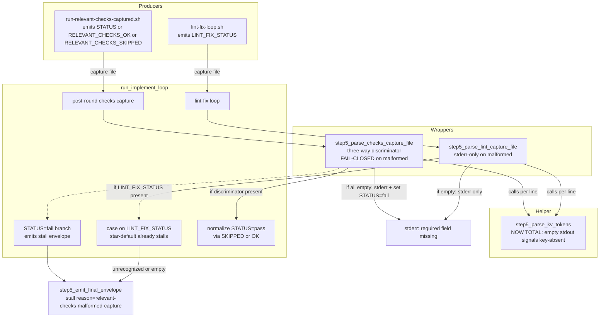

## Architecture Diagram

```mermaid
flowchart TD
    subgraph Producers
        P1[run-relevant-checks-captured.sh<br/>emits STATUS or RELEVANT_CHECKS_OK or RELEVANT_CHECKS_SKIPPED]
        P2[lint-fix-loop.sh<br/>emits LINT_FIX_STATUS]
    end

    subgraph Helper
        H[step5_parse_kv_tokens<br/>NOW TOTAL: empty stdout signals key-absent]
    end

    subgraph Wrappers
        W1[step5_parse_checks_capture_file<br/>three-way discriminator<br/>FAIL-CLOSED on malformed]
        W2[step5_parse_lint_capture_file<br/>stderr-only on malformed]
    end

    subgraph Caller["run_implement_loop"]
        L1[post-round checks capture]
        L2[lint-fix loop]
        Lfail[STATUS=fail branch<br/>emits stall envelope]
        Lcase[case on LINT_FIX_STATUS<br/>star-default already stalls]
        Lpass[normalize STATUS=pass<br/>via SKIPPED or OK]
    end

    Env[step5_emit_final_envelope<br/>stall reason=relevant-checks-malformed-capture]

    Stderr["stderr: required field missing"]

    P1 -- capture file --> L1
    L1 --> W1
    W1 -- calls per line --> H
    W1 -- if discriminator present --> Lpass
    W1 -- if all empty: stderr + set STATUS=fail --> Stderr
    W1 -.-> Lfail
    Lfail --> Env

    P2 -- capture file --> L2
    L2 --> W2
    W2 -- calls per line --> H
    W2 -- if LINT_FIX_STATUS present --> Lcase
    W2 -- if empty: stderr only --> Stderr
    Lcase -- unrecognized or empty --> Env
```
