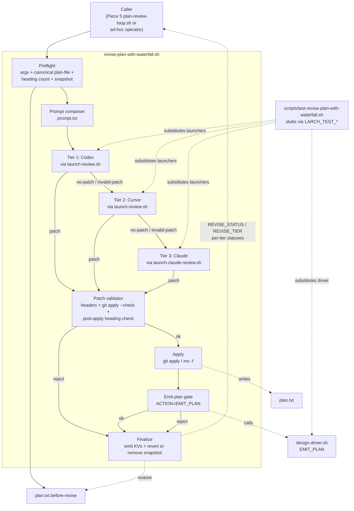

## Architecture Diagram

```mermaid
graph TD
  caller["Caller<br/>(Piece 5 plan-review-loop.sh or<br/>ad-hoc operator)"]
  subgraph waterfall["revise-plan-with-waterfall.sh"]
    preflight["Preflight<br/>argv + canonical plan-file +<br/>heading count + snapshot"]
    prompt["Prompt composer<br/>prompt.txt"]
    tier1["Tier 1: Codex<br/>via launch-review.sh"]
    tier2["Tier 2: Cursor<br/>via launch-review.sh"]
    tier3["Tier 3: Claude<br/>via launch-claude-review.sh"]
    validator["Patch validator<br/>headers + git apply --check +<br/>post-apply heading check"]
    apply["Apply<br/>git apply / mv -f"]
    emitgate["Emit-plan gate<br/>ACTION=EMIT_PLAN"]
    finalize["Finalize<br/>emit KVs + revert or remove snapshot"]
  end
  plan["plan.txt"]
  snapshot["plan.txt.before-revise"]
  driver["design-driver.sh<br/>EMIT_PLAN"]
  harness["scripts/test-revise-plan-with-waterfall.sh<br/>stubs via LARCH_TEST_*"]

  caller --> preflight
  preflight --> snapshot
  preflight --> prompt
  prompt --> tier1
  tier1 -->|"no-patch / invalid-patch"| tier2
  tier2 -->|"no-patch / invalid-patch"| tier3
  tier1 -->|"patch"| validator
  tier2 -->|"patch"| validator
  tier3 -->|"patch"| validator
  validator -->|"ok"| apply
  validator -->|"reject"| finalize
  apply --> emitgate
  apply -.->|"writes"| plan
  emitgate -->|"ok"| finalize
  emitgate -->|"reject"| finalize
  emitgate -.->|"calls"| driver
  finalize -.->|"restore"| snapshot
  finalize -.->|"REVISE_STATUS / REVISE_TIER<br/>per-tier statuses"| caller
  harness -.->|"substitutes launchers"| tier1
  harness -.->|"substitutes launchers"| tier2
  harness -.->|"substitutes launchers"| tier3
  harness -.->|"substitutes driver"| driver
```
