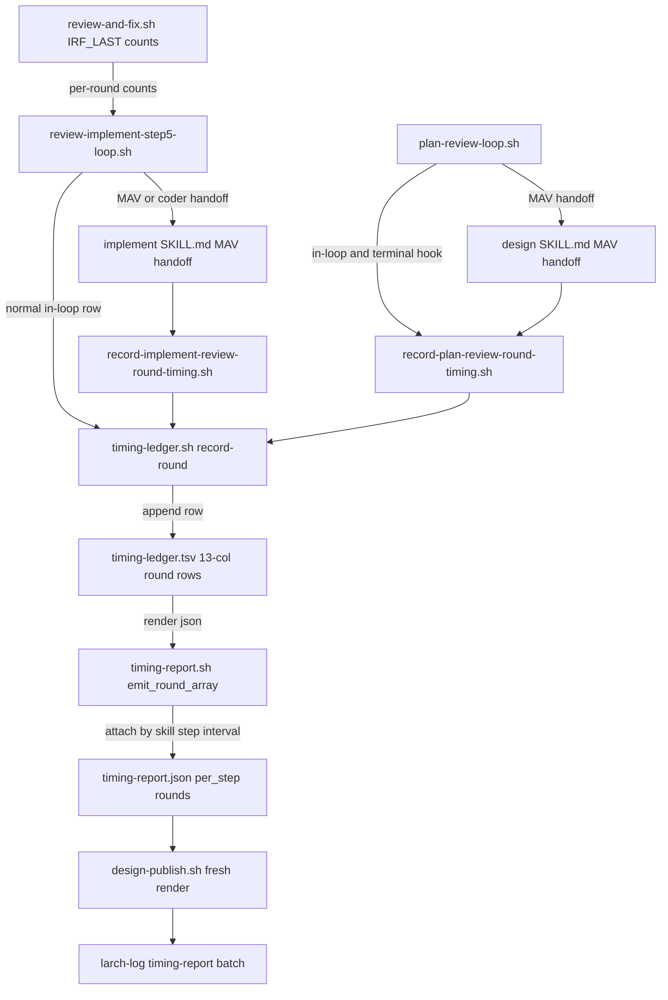

## Architecture Diagram

```mermaid
graph TD
  RAF["review-and-fix.sh IRF_LAST counts"]
  IL["review-implement-step5-loop.sh"]
  ISK["implement SKILL.md MAV handoff"]
  IH["record-implement-review-round-timing.sh"]
  DL["plan-review-loop.sh"]
  DSK["design SKILL.md MAV handoff"]
  DH["record-plan-review-round-timing.sh"]
  TL["timing-ledger.sh record-round"]
  LEDGER["timing-ledger.tsv 13-col round rows"]
  TR["timing-report.sh emit_round_array"]
  JSON["timing-report.json per_step rounds"]
  DPUB["design-publish.sh fresh render"]
  BATCH["larch-log timing-report batch"]

  RAF -->|per-round counts| IL
  IL -->|normal in-loop row| TL
  IL -->|MAV or coder handoff| ISK
  ISK --> IH
  IH --> TL
  DL -->|in-loop and terminal hook| DH
  DL -->|MAV handoff| DSK
  DSK --> DH
  DH --> TL
  TL -->|append row| LEDGER
  LEDGER -->|render json| TR
  TR -->|attach by skill step interval| JSON
  JSON --> DPUB
  DPUB --> BATCH
```
