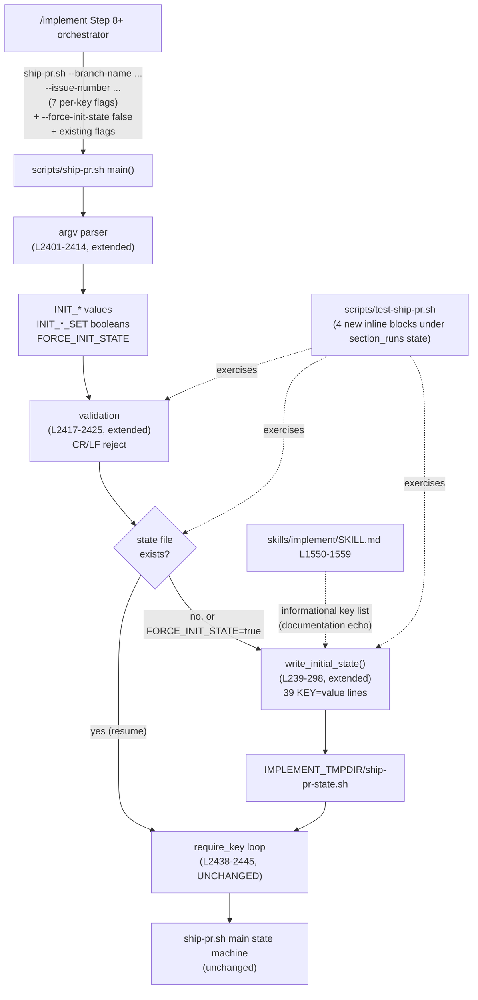

## Architecture Diagram

```mermaid
flowchart TD
    Orchestrator["/implement Step 8+ orchestrator"]
    Orchestrator -->|"ship-pr.sh --branch-name ...<br/>--issue-number ...<br/>(7 per-key flags)<br/>+ --force-init-state false<br/>+ existing flags"| ShipPR["scripts/ship-pr.sh main()"]
    ShipPR --> ArgvParser["argv parser<br/>(L2401-2414, extended)"]
    ArgvParser --> SetFlags["INIT_* values<br/>INIT_*_SET booleans<br/>FORCE_INIT_STATE"]
    SetFlags --> Validation["validation<br/>(L2417-2425, extended)<br/>CR/LF reject"]
    Validation --> ColdStartGuard{"state file<br/>exists?"}
    ColdStartGuard -->|"no, or FORCE_INIT_STATE=true"| WriteInit["write_initial_state()<br/>(L239-298, extended)<br/>39 KEY=value lines"]
    ColdStartGuard -->|"yes (resume)"| RequireKeyValidation
    WriteInit --> StateFile["IMPLEMENT_TMPDIR/ship-pr-state.sh"]
    StateFile --> RequireKeyValidation["require_key loop<br/>(L2438-2445, UNCHANGED)"]
    RequireKeyValidation --> MainLoop["ship-pr.sh main state machine<br/>(unchanged)"]

    SKILL["skills/implement/SKILL.md L1550-1559"] -.->|"informational key list<br/>(documentation echo)"| WriteInit
    Harness["scripts/test-ship-pr.sh<br/>(4 new inline blocks under section_runs state)"] -.->|"exercises"| WriteInit
    Harness -.->|"exercises"| Validation
    Harness -.->|"exercises"| ColdStartGuard
```
