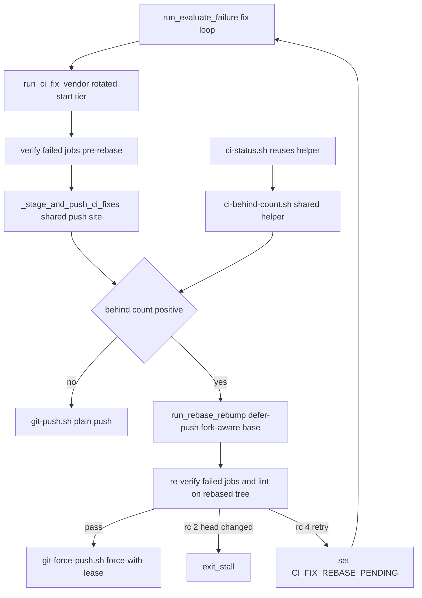

## Architecture Diagram

```mermaid
graph TD
    A[run_evaluate_failure fix loop] --> B[run_ci_fix_vendor rotated start tier]
    B --> C[verify failed jobs pre-rebase]
    C --> D[_stage_and_push_ci_fixes shared push site]
    D --> E{behind count positive}
    E -->|no| H[git-push.sh plain push]
    E -->|yes| F[run_rebase_rebump defer-push fork-aware base]
    F --> G[re-verify failed jobs and lint on rebased tree]
    G -->|pass| I[git-force-push.sh force-with-lease]
    G -->|rc 2 head changed| J[exit_stall]
    G -->|rc 4 retry| K[set CI_FIX_REBASE_PENDING]
    K --> A
    CBC[ci-behind-count.sh shared helper] --> E
    CST[ci-status.sh reuses helper] --> CBC
```
