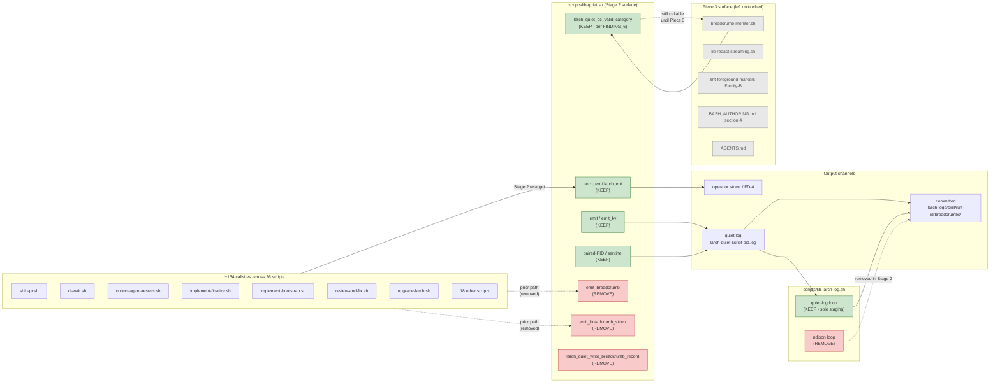

## Architecture Diagram

```mermaid
flowchart LR
  subgraph CALLERS["~134 callsites across 26 scripts"]
    SHIP[ship-pr.sh]
    CIWAIT[ci-wait.sh]
    COLLECT[collect-agent-results.sh]
    FIN[implement-finalize.sh]
    BOOT[implement-bootstrap.sh]
    REV[review-and-fix.sh]
    UPG[upgrade-larch.sh]
    OTHERS[18 other scripts]
  end

  subgraph LIBQUIET["scripts/lib-quiet.sh (Stage 2 surface)"]
    direction TB
    KEEP_ERR["larch_err / larch_errf<br/>(KEEP)"]
    KEEP_EMIT["emit / emit_kv<br/>(KEEP)"]
    KEEP_CAT["larch_quiet_bc_valid_category<br/>(KEEP - per FINDING_6)"]
    KEEP_PID["paired-PID / sentinel<br/>(KEEP)"]
    DROP_BC["emit_breadcrumb<br/>(REMOVE)"]
    DROP_BCS["emit_breadcrumb_stderr<br/>(REMOVE)"]
    DROP_REC["larch_quiet_write_breadcrumb_record<br/>(REMOVE)"]
  end

  subgraph DESTINATIONS["Output channels"]
    OP[operator stderr / FD-4]
    QL["quiet log<br/>larch-quiet-script-pid.log"]
    PUB["committed<br/>larch-logs/skill/run-id/breadcrumbs/"]
  end

  subgraph PIECE3["Piece 3 surface (left untouched)"]
    MON[breadcrumb-monitor.sh]
    REDACT[lib-redact-streaming.sh]
    LINTFG[lint-foreground-markers Family-B]
    BASHAUTH[BASH_AUTHORING.md section 4]
    AGENTS[AGENTS.md]
  end

  CALLERS -->|"Stage 2 retarget"| KEEP_ERR
  CALLERS -.->|"prior path<br/>(removed)"| DROP_BC
  CALLERS -.->|"prior path<br/>(removed)"| DROP_BCS

  KEEP_ERR --> OP
  KEEP_EMIT --> QL
  KEEP_PID --> QL
  QL --> PUB

  MON --> KEEP_CAT
  KEEP_CAT -.->|"still callable<br/>until Piece 3"| MON

  subgraph PUBLISH["scripts/lib-larch-log.sh"]
    NDJ["ndjson loop<br/>(REMOVE)"]
    QUIET["quiet-log loop<br/>(KEEP - sole staging)"]
  end
  QL --> QUIET
  QUIET --> PUB
  NDJ -.->|"removed in Stage 2"| PUB

  classDef removed fill:#f8caca,stroke:#b32d2d,color:#333
  classDef kept fill:#cce5cc,stroke:#207020,color:#333
  classDef piece3 fill:#e8e8e8,stroke:#888,color:#555
  class DROP_BC,DROP_BCS,DROP_REC,NDJ removed
  class KEEP_ERR,KEEP_EMIT,KEEP_CAT,KEEP_PID,QUIET kept
  class MON,REDACT,LINTFG,BASHAUTH,AGENTS piece3
```
