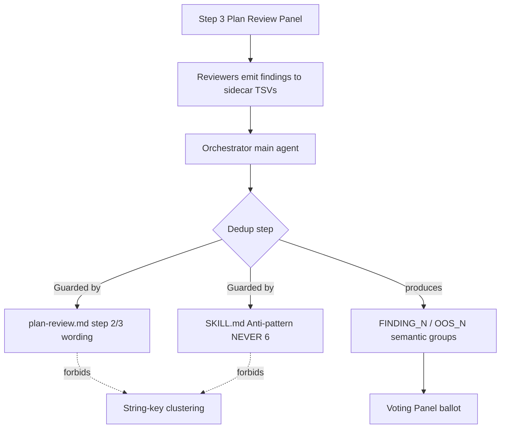

## Architecture Diagram

```mermaid
flowchart TD
    A[Step 3 Plan Review Panel] --> B[Reviewers emit findings to sidecar TSVs]
    B --> C[Orchestrator main agent]
    C --> D{Dedup step}
    D -->|Guarded by| E[plan-review.md step 2/3 wording]
    D -->|Guarded by| F[SKILL.md Anti-pattern NEVER 6]
    E -.->|forbids| G[String-key clustering]
    F -.->|forbids| G
    D -->|produces| H[FINDING_N / OOS_N semantic groups]
    H --> I[Voting Panel ballot]
```
