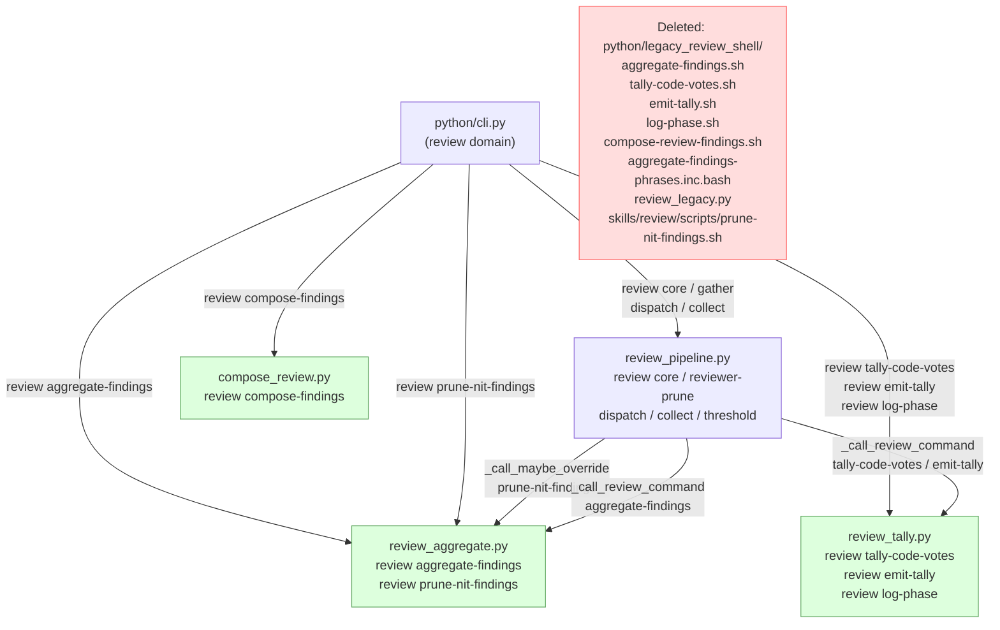

## Architecture Diagram

```mermaid
graph TD
    CLI["python/cli.py\n(review domain)"]
    RP["review_pipeline.py\nreview core / reviewer-prune\ndispatch / collect / threshold"]
    RA["review_aggregate.py\nreview aggregate-findings\nreview prune-nit-findings"]
    RT["review_tally.py\nreview tally-code-votes\nreview emit-tally\nreview log-phase"]
    CR["compose_review.py\nreview compose-findings"]

    CLI -->|"review aggregate-findings"| RA
    CLI -->|"review prune-nit-findings"| RA
    CLI -->|"review tally-code-votes\nreview emit-tally\nreview log-phase"| RT
    CLI -->|"review compose-findings"| CR
    CLI -->|"review core / gather\ndispatch / collect"| RP

    RP -->|"_call_maybe_override\nprune-nit-findings"| RA
    RP -->|"_call_review_command\naggregate-findings"| RA
    RP -->|"_call_review_command\ntally-code-votes / emit-tally"| RT

    DEL["Deleted: python/legacy_review_shell/\naggregate-findings.sh\ntally-code-votes.sh\nemit-tally.sh\nlog-phase.sh\ncompose-review-findings.sh\naggregate-findings-phrases.inc.bash\nreview_legacy.py\nskills/review/scripts/prune-nit-findings.sh"]

    style DEL fill:#fdd,stroke:#f66
    style RA fill:#dfd,stroke:#6a6
    style RT fill:#dfd,stroke:#6a6
    style CR fill:#dfd,stroke:#6a6
```
