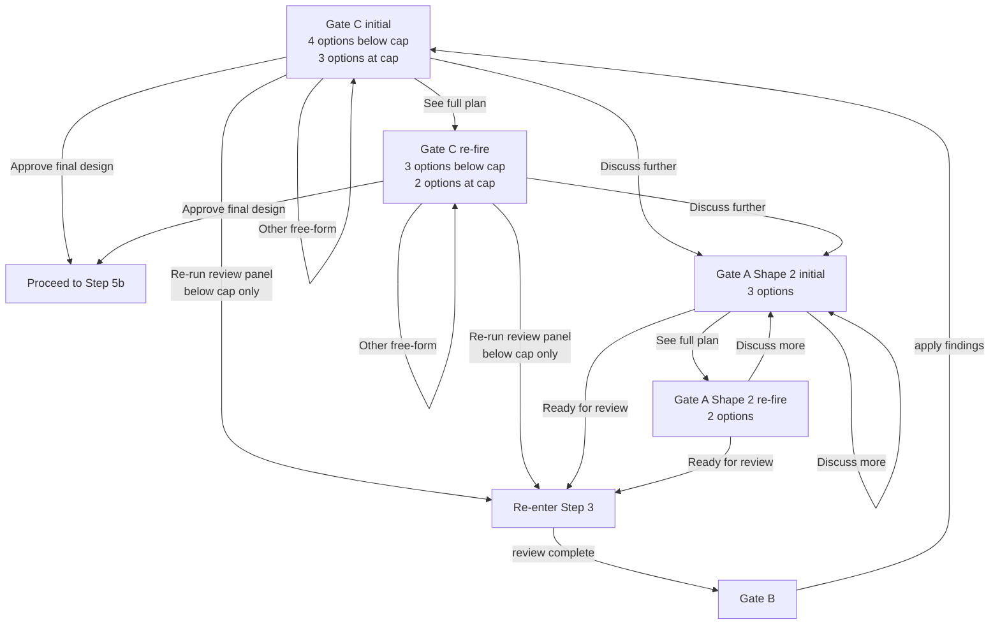

## Architecture Diagram

```mermaid
flowchart TD
  GC_initial[Gate C initial<br/>4 options below cap<br/>3 options at cap]
  GC_initial -->|Approve final design| ApproveExit[Proceed to Step 5b]
  GC_initial -->|See full plan| GC_refire[Gate C re-fire<br/>3 options below cap<br/>2 options at cap]
  GC_initial -->|Discuss further| GA_initial[Gate A Shape 2 initial<br/>3 options]
  GC_initial -->|Re-run review panel<br/>below cap only| Step3[Re-enter Step 3]
  GC_initial -->|Other free-form| GC_initial

  GC_refire -->|Approve final design| ApproveExit
  GC_refire -->|Discuss further| GA_initial
  GC_refire -->|Re-run review panel<br/>below cap only| Step3
  GC_refire -->|Other free-form| GC_refire

  GA_initial -->|See full plan| GA_refire[Gate A Shape 2 re-fire<br/>2 options]
  GA_initial -->|Ready for review| Step3
  GA_initial -->|Discuss more| GA_initial

  GA_refire -->|Ready for review| Step3
  GA_refire -->|Discuss more| GA_initial

  Step3 -->|review complete| GateB[Gate B]
  GateB -->|apply findings| GC_initial
```
