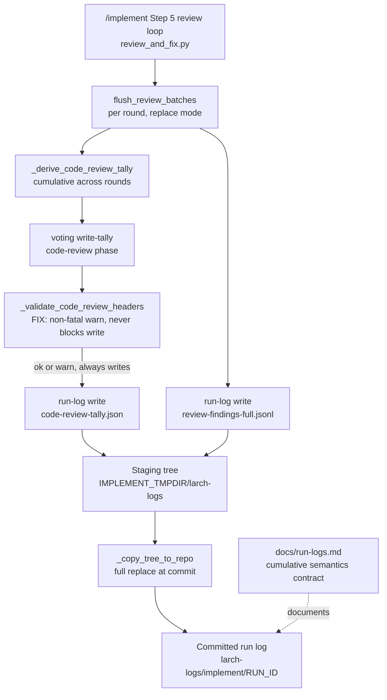

## Architecture Diagram

```mermaid
graph TD
    Loop["/implement Step 5 review loop<br/>review_and_fix.py"]
    Flush["flush_review_batches<br/>per round, replace mode"]
    Derive["_derive_code_review_tally<br/>cumulative across rounds"]
    Tally["voting write-tally<br/>code-review phase"]
    Gate["_validate_code_review_headers<br/>FIX: non-fatal warn, never blocks write"]
    WriteTally["run-log write<br/>code-review-tally.json"]
    WriteFindings["run-log write<br/>review-findings-full.jsonl"]
    Staging["Staging tree<br/>IMPLEMENT_TMPDIR/larch-logs"]
    Copy["_copy_tree_to_repo<br/>full replace at commit"]
    Committed["Committed run log<br/>larch-logs/implement/RUN_ID"]
    Docs["docs/run-logs.md<br/>cumulative semantics contract"]

    Loop --> Flush
    Flush --> Derive
    Derive --> Tally
    Tally --> Gate
    Gate -->|"ok or warn, always writes"| WriteTally
    Flush --> WriteFindings
    WriteTally --> Staging
    WriteFindings --> Staging
    Staging --> Copy
    Copy --> Committed
    Docs -.documents.-> Committed
```
