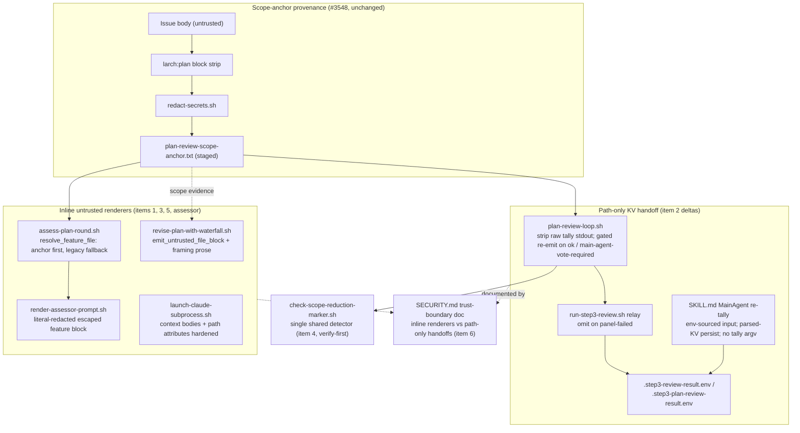

## Architecture Diagram

```mermaid
graph TD
    subgraph Provenance["Scope-anchor provenance (#3548, unchanged)"]
        IB["Issue body (untrusted)"] --> STRIP["larch:plan block strip"]
        STRIP --> REDACT["redact-secrets.sh"]
        REDACT --> ANCHOR["plan-review-scope-anchor.txt (staged)"]
    end

    subgraph PathHandoff["Path-only KV handoff (item 2 deltas)"]
        LOOP["plan-review-loop.sh<br/>strip raw tally stdout; gated re-emit on ok / main-agent-vote-required"]
        RELAY["run-step3-review.sh relay<br/>omit on panel-failed"]
        ENV[".step3-review-result.env /<br/>.step3-plan-review-result.env"]
        SKILLMD["SKILL.md MainAgent re-tally<br/>env-sourced input; parsed-KV persist; no tally argv"]
        LOOP --> RELAY --> ENV
        SKILLMD --> ENV
    end

    subgraph Renderers["Inline untrusted renderers (items 1, 3, 5, assessor)"]
        ASSESS["assess-plan-round.sh<br/>resolve_feature_file: anchor first, legacy fallback"]
        RENDA["render-assessor-prompt.sh<br/>literal-redacted escaped feature block"]
        REVISE["revise-plan-with-waterfall.sh<br/>emit_untrusted_file_block + framing prose"]
        SUBPROC["launch-claude-subprocess.sh<br/>context bodies + path attributes hardened"]
        ASSESS --> RENDA
    end

    MARKER["check-scope-reduction-marker.sh<br/>single shared detector (item 4, verify-first)"]
    SEC["SECURITY.md trust-boundary doc<br/>inline renderers vs path-only handoffs (item 6)"]

    ANCHOR --> LOOP
    ANCHOR --> ASSESS
    ANCHOR -. "scope evidence" .-> REVISE
    LOOP --> MARKER
    Renderers -. documented by .-> SEC
    PathHandoff -. documented by .-> SEC
```
