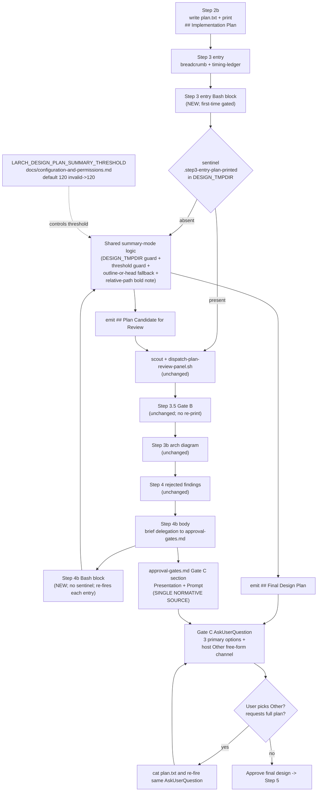

## Architecture Diagram

```mermaid
flowchart TD
  S2b["Step 2b\nwrite plan.txt + print<br/>## Implementation Plan"]
  S3entry["Step 3 entry\nbreadcrumb + timing-ledger"]
  S3bash["Step 3 entry Bash block\n(NEW; first-time gated)"]
  Sentinel{"sentinel\n.step3-entry-plan-printed\nin DESIGN_TMPDIR"}
  Shared["Shared summary-mode logic<br/>(DESIGN_TMPDIR guard +<br/>threshold guard +<br/>outline-or-head fallback +<br/>relative-path bold note)"]
  Header3["emit ## Plan Candidate for Review"]
  Dispatch["scout + dispatch-plan-review-panel.sh\n(unchanged)"]
  GateB["Step 3.5 Gate B<br/>(unchanged; no re-print)"]
  S3b["Step 3b arch diagram<br/>(unchanged)"]
  S4["Step 4 rejected findings<br/>(unchanged)"]
  S4bbody["Step 4b body\nbrief delegation to approval-gates.md"]
  S4bbash["Step 4b Bash block\n(NEW; no sentinel; re-fires each entry)"]
  Header4b["emit ## Final Design Plan"]
  AGmd["approval-gates.md Gate C section<br/>Presentation + Prompt<br/>(SINGLE NORMATIVE SOURCE)"]
  AskQ["Gate C AskUserQuestion<br/>3 primary options +<br/>host Other free-form channel"]
  Other{"User picks Other?\nrequests full plan?"}
  CatPlan["cat plan.txt and re-fire same AskUserQuestion"]
  Approve["Approve final design -> Step 5"]
  EnvVar["LARCH_DESIGN_PLAN_SUMMARY_THRESHOLD<br/>docs/configuration-and-permissions.md<br/>default 120 invalid->120"]

  S2b --> S3entry --> S3bash
  S3bash --> Sentinel
  Sentinel -- absent --> Shared
  Sentinel -- present --> Dispatch
  Shared --> Header3 --> Dispatch
  Dispatch --> GateB --> S3b --> S4 --> S4bbody
  S4bbody --> AGmd
  S4bbody --> S4bbash
  S4bbash --> Shared
  Shared --> Header4b --> AskQ
  AGmd --> AskQ
  AskQ --> Other
  Other -- yes --> CatPlan --> AskQ
  Other -- no --> Approve
  EnvVar -. controls threshold .-> Shared
```
