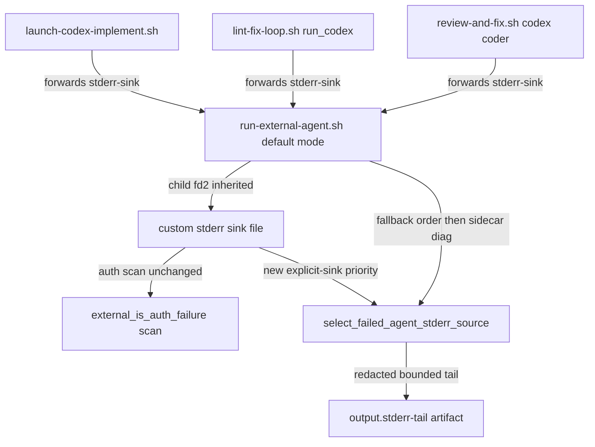

## Architecture Diagram

```mermaid
graph TD
    LCI["launch-codex-implement.sh"]
    LFL["lint-fix-loop.sh run_codex"]
    RAF["review-and-fix.sh codex coder"]
    REA["run-external-agent.sh default mode"]
    SINK["custom stderr sink file"]
    AUTH["external_is_auth_failure scan"]
    SEL["select_failed_agent_stderr_source"]
    TAIL["output.stderr-tail artifact"]

    LCI -->|forwards stderr-sink| REA
    LFL -->|forwards stderr-sink| REA
    RAF -->|forwards stderr-sink| REA
    REA -->|child fd2 inherited| SINK
    SINK -->|auth scan unchanged| AUTH
    SINK -->|new explicit-sink priority| SEL
    REA -->|fallback order then sidecar diag| SEL
    SEL -->|redacted bounded tail| TAIL
```
