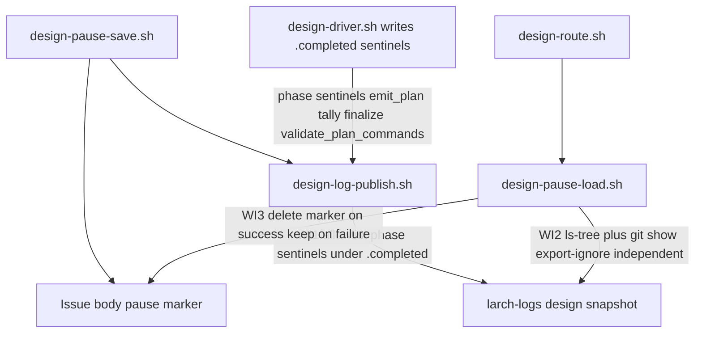

## Architecture Diagram

```mermaid
graph TD
    PS[design-pause-save.sh]
    DRV[design-driver.sh writes .completed sentinels]
    PUB[design-log-publish.sh]
    RT[design-route.sh]
    LD[design-pause-load.sh]
    ISSUE[Issue body pause marker]
    SNAP[larch-logs design snapshot]

    PS --> ISSUE
    PS --> PUB
    DRV -->|phase sentinels emit_plan tally finalize validate_plan_commands| PUB
    PUB -->|WI1 allowlist phase sentinels under .completed| SNAP
    RT --> LD
    LD -->|WI2 ls-tree plus git show export-ignore independent| SNAP
    LD -->|WI3 delete marker on success keep on failure| ISSUE
```
