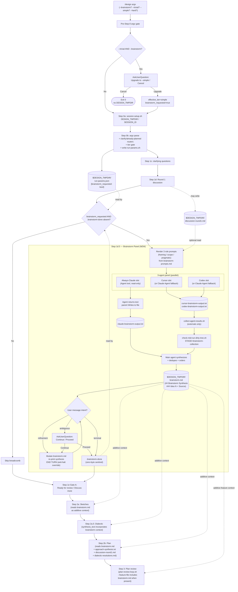

## Architecture Diagram

```mermaid
flowchart TD
    argv["/design argv<br/>(--brainstorm? --trivial? --simple? --hard?)"]

    preStep0["Pre-Step-0 argv gate"]
    preStep0Collision{"--trivial AND --brainstorm?"}
    askUpgrade["AskUserQuestion:<br/>Upgrade to --simple / Cancel"]
    effectiveTier["effective_tier=simple<br/>brainstorm_requested=true"]

    step0a["Step 0a: session-setup.sh<br/>DESIGN_TMPDIR / SESSION_ID"]
    step0b["Step 0b: argv parse<br/>+ clarify/already-planned routers<br/>+ tier gate<br/>+ write-run-params.sh"]
    runParamsJson[("$DESIGN_TMPDIR/<br/>run-params.json<br/>{brainstorm_requested: bool}")]

    step1c["Step 1c: clarifying questions"]
    step1d["Step 1d: Round 1 discussion"]
    discussionRound1[("$DESIGN_TMPDIR/<br/>discussion-round1.md")]

    step1d5guard{"brainstorm_requested AND<br/>.brainstorm-done absent?"}
    step1d5Skip["Skip breadcrumb"]

    subgraph step1d5["Step 1d.5 — Brainstorm Panel (NEW)"]
        promptRender["Render 3 role prompts<br/>(framing / scope / pragmatic)<br/>from brainstorm-prompts.md"]

        subgraph panel["3-agent panel (parallel)"]
            cursorSlot["Cursor slot<br/>(or Claude Agent fallback)"]
            codexSlot["Codex slot<br/>(or Claude Agent fallback)"]
            claudeSlot["Always-Claude slot<br/>(Agent tool, read-only)"]
        end

        externalOutputs[("cursor-brainstorm-output.txt<br/>codex-brainstorm-output.txt")]
        claudeReturn["Agent returns text<br/>parent Writes to file"]
        claudeOutput[("claude-brainstorm-output.txt")]

        collector["collect-agent-results.sh<br/>(externals only)"]
        dirtyTreeCheck["check-mid-run-dirty-tree.sh<br/>STAGE=brainstorm-collection"]

        synthesis["Main agent synthesizes<br/>+ dedupes + orders"]
        brainstormMd[("$DESIGN_TMPDIR/<br/>brainstorm.md<br/>(## Brainstorm Synthesis<br/>### Idea N + Source)")]

        loop{"User message intent?"}
        loopRefine["Mutate brainstorm.md<br/>re-print synthesis<br/>END TURN (anti-halt override)"]
        loopAmbig["AskUserQuestion:<br/>Continue / Proceed"]
        sentinel[".brainstorm-done<br/>(zero-byte sentinel)"]
    end

    step1eGateA["Step 1e Gate A:<br/>Ready for review / Discuss more"]

    step2a["Step 2a: Sketches<br/>(reads brainstorm.md<br/>as additive context)"]
    step2a5["Step 2a.5: Dialectic<br/>(synthesis_text incorporates<br/>brainstorm context)"]
    step2b["Step 2b: Plan<br/>(reads brainstorm.md<br/>+ approach-synthesis.txt<br/>+ discussion-round1.md<br/>+ dialectic-resolutions.md)"]
    step3["Step 3: Plan review<br/>(plan-review-loop.sh<br/>--feature-file includes<br/>brainstorm.md when present)"]

    argv --> preStep0
    preStep0 --> preStep0Collision
    preStep0Collision -->|Yes| askUpgrade
    askUpgrade -->|Upgrade| effectiveTier
    askUpgrade -->|Cancel| stopCancel(["Exit 0<br/>no DESIGN_TMPDIR"])
    preStep0Collision -->|No| step0a
    effectiveTier --> step0a

    step0a --> step0b
    step0b --> runParamsJson
    step0b --> step1c
    step1c --> step1d
    step1d -.->|may write| discussionRound1
    step1d --> step1d5guard

    runParamsJson -.->|read by| step1d5guard
    sentinel -.->|read by| step1d5guard

    step1d5guard -->|No| step1d5Skip
    step1d5Skip --> step1eGateA

    step1d5guard -->|Yes| promptRender
    discussionRound1 -.->|optional read| promptRender
    promptRender --> panel
    cursorSlot --> externalOutputs
    codexSlot --> externalOutputs
    claudeSlot --> claudeReturn
    claudeReturn --> claudeOutput
    externalOutputs --> collector
    collector --> dirtyTreeCheck
    claudeOutput --> synthesis
    dirtyTreeCheck --> synthesis
    synthesis --> brainstormMd
    brainstormMd --> loop

    loop -->|refinement| loopRefine
    loopRefine --> loop
    loop -->|ambiguous| loopAmbig
    loopAmbig -->|Continue| loopRefine
    loopAmbig -->|Proceed| sentinel
    loop -->|terminal| sentinel
    sentinel --> step1eGateA

    step1eGateA --> step2a
    step2a --> step2a5
    step2a5 --> step2b
    brainstormMd -.->|additive context| step2a
    brainstormMd -.->|additive context| step2a5
    brainstormMd -.->|additive context| step2b
    step2b --> step3
    brainstormMd -.->|additive feature context| step3
```
