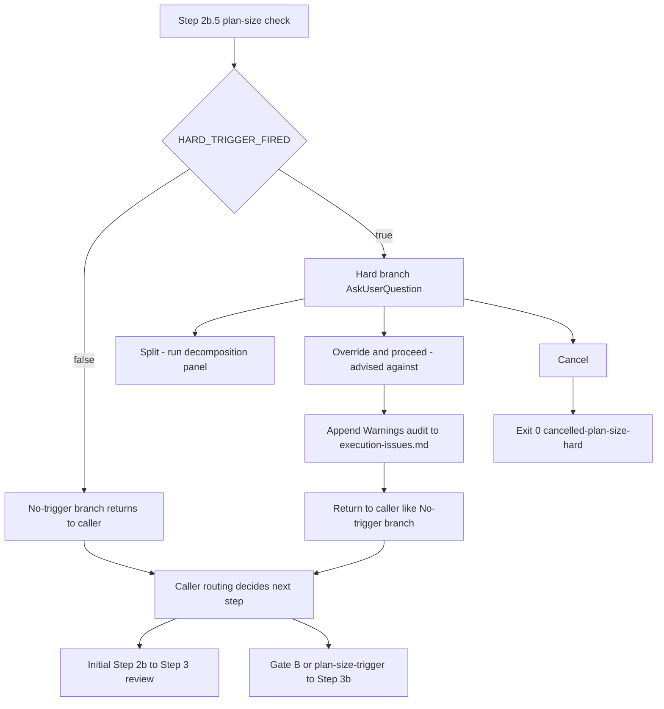

## Architecture Diagram

```mermaid
graph TD
    A[Step 2b.5 plan-size check] --> B{HARD_TRIGGER_FIRED}
    B -->|false| C[No-trigger branch returns to caller]
    B -->|true| D[Hard branch AskUserQuestion]
    D --> E[Split - run decomposition panel]
    D --> F[Override and proceed - advised against]
    D --> G[Cancel]
    F --> H[Append Warnings audit to execution-issues.md]
    H --> I[Return to caller like No-trigger branch]
    C --> J[Caller routing decides next step]
    I --> J
    J --> K[Initial Step 2b to Step 3 review]
    J --> L[Gate B or plan-size-trigger to Step 3b]
    G --> M[Exit 0 cancelled-plan-size-hard]
```
