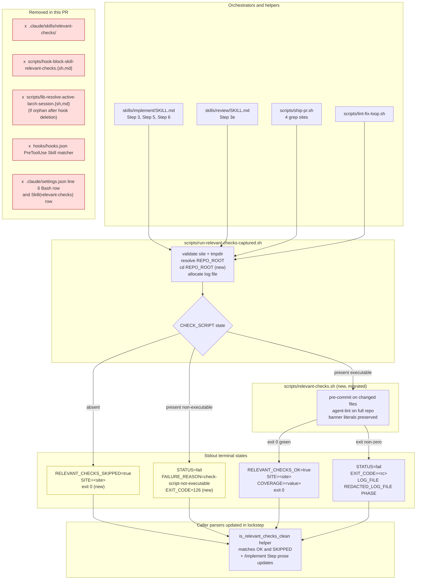

## Architecture Diagram

```mermaid
flowchart TB
    subgraph Callers["Orchestrators and helpers"]
        I["skills/implement/SKILL.md<br/>Step 3, Step 5, Step 6"]
        R["skills/review/SKILL.md<br/>Step 3e"]
        S["scripts/ship-pr.sh<br/>4 grep sites"]
        L["scripts/lint-fix-loop.sh"]
    end

    subgraph Wrapper["scripts/run-relevant-checks-captured.sh"]
        W["validate site + tmpdir<br/>resolve REPO_ROOT<br/>cd REPO_ROOT (new)<br/>allocate log file"]
        Wcheck{"CHECK_SCRIPT state"}
    end

    subgraph CheckScript["scripts/relevant-checks.sh (new, migrated)"]
        C["pre-commit on changed files<br/>agent-lint on full repo<br/>banner literals preserved"]
    end

    subgraph Outputs["Stdout terminal states"]
        OK["RELEVANT_CHECKS_OK=true<br/>SITE=&lt;site&gt;<br/>COVERAGE=&lt;value&gt;<br/>exit 0"]
        SK["RELEVANT_CHECKS_SKIPPED=true<br/>SITE=&lt;site&gt;<br/>exit 0 (new)"]
        F1["STATUS=fail<br/>FAILURE_REASON=check-script-not-executable<br/>EXIT_CODE=126 (new)"]
        F2["STATUS=fail<br/>EXIT_CODE=&lt;rc&gt;<br/>LOG_FILE REDACTED_LOG_FILE PHASE"]
    end

    subgraph Parsers["Caller parsers updated in lockstep"]
        P["is_relevant_checks_clean helper<br/>matches OK and SKIPPED<br/>+ /implement Step prose updates"]
    end

    subgraph Deletions["Removed in this PR"]
        D1["x  .claude/skills/relevant-checks/"]
        D2["x  scripts/hook-block-skill-relevant-checks.{sh,md}"]
        D3["x  scripts/lib-resolve-active-larch-session.{sh,md}<br/>(if orphan after hook deletion)"]
        D4["x  hooks/hooks.json PreToolUse Skill matcher"]
        D5["x  .claude/settings.json line 6 Bash row<br/>and Skill(relevant-checks) row"]
    end

    I --> W
    R --> W
    S --> W
    L --> W
    W --> Wcheck
    Wcheck -- "absent" --> SK
    Wcheck -- "present non-executable" --> F1
    Wcheck -- "present executable" --> C
    C -- "exit 0 green" --> OK
    C -- "exit non-zero" --> F2

    OK --> P
    SK --> P
    F1 --> P
    F2 --> P

    style D1 fill:#fdd,stroke:#900
    style D2 fill:#fdd,stroke:#900
    style D3 fill:#fdd,stroke:#900
    style D4 fill:#fdd,stroke:#900
    style D5 fill:#fdd,stroke:#900
    style SK fill:#ffd,stroke:#a90
    style F1 fill:#ffd,stroke:#a90
```
