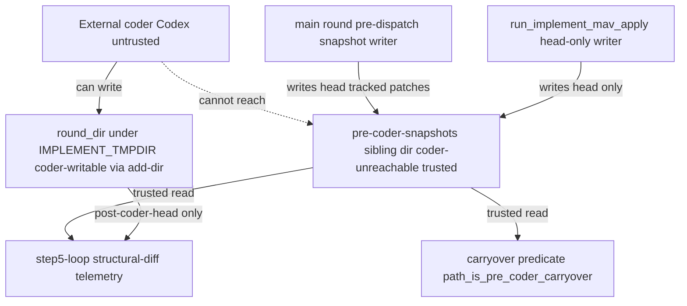

## Architecture Diagram

```mermaid
graph TD
    Coder[External coder Codex untrusted]
    RoundDir[round_dir under IMPLEMENT_TMPDIR coder-writable via add-dir]
    SnapDir[pre-coder-snapshots sibling dir coder-unreachable trusted]
    MainWriter[main round pre-dispatch snapshot writer]
    MavWriter[run_implement_mav_apply head-only writer]
    Predicate[carryover predicate path_is_pre_coder_carryover]
    Telemetry[step5-loop structural-diff telemetry]

    Coder -->|can write| RoundDir
    Coder -.->|cannot reach| SnapDir
    MainWriter -->|writes head tracked patches| SnapDir
    MavWriter -->|writes head only| SnapDir
    SnapDir -->|trusted read| Predicate
    SnapDir -->|trusted read| Telemetry
    RoundDir -->|post-coder-head only| Telemetry
```
