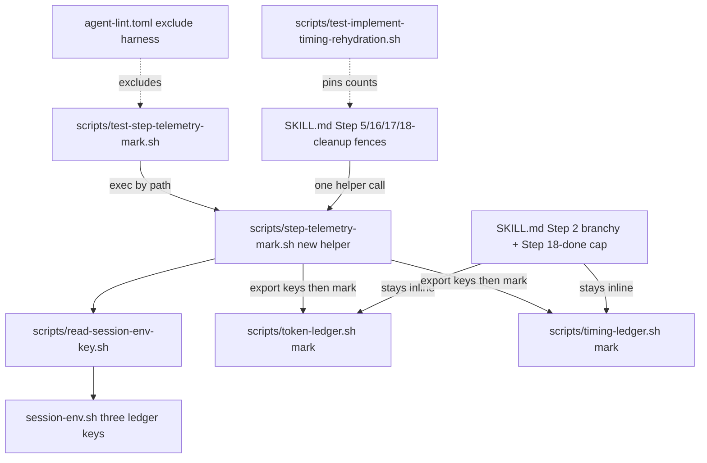

## Architecture Diagram

```mermaid
graph TD
  CONV["SKILL.md Step 5/16/17/18-cleanup fences"]
  INLINE["SKILL.md Step 2 branchy + Step 18-done cap"]
  HELPER["scripts/step-telemetry-mark.sh new helper"]
  RSEK["scripts/read-session-env-key.sh"]
  SENV["session-env.sh three ledger keys"]
  TOK["scripts/token-ledger.sh mark"]
  TIM["scripts/timing-ledger.sh mark"]
  TEST["scripts/test-step-telemetry-mark.sh"]
  ALINT["agent-lint.toml exclude harness"]
  REHTEST["scripts/test-implement-timing-rehydration.sh"]

  CONV -->|one helper call| HELPER
  INLINE -->|stays inline| TOK
  INLINE -->|stays inline| TIM
  HELPER --> RSEK
  RSEK --> SENV
  HELPER -->|export keys then mark| TOK
  HELPER -->|export keys then mark| TIM
  TEST -->|exec by path| HELPER
  ALINT -.excludes.-> TEST
  REHTEST -.pins counts.-> CONV
```
