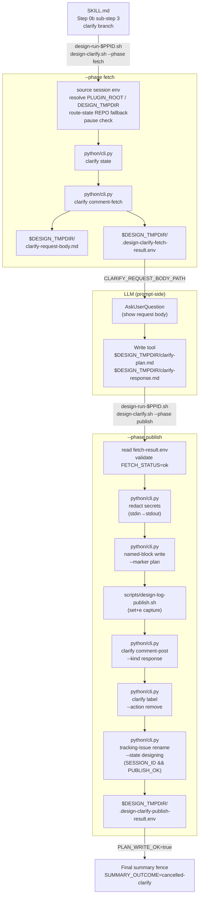

## Architecture Diagram

```mermaid
graph TD
    SKILL["SKILL.md\nStep 0b sub-step 3\nclarify branch"]

    subgraph FetchPhase["--phase fetch"]
        DF_ENV["source session env\nresolve PLUGIN_ROOT / DESIGN_TMPDIR\nroute-state REPO fallback\npause check"]
        CS["python/cli.py\nclarify state"]
        CF["python/cli.py\nclarify comment-fetch"]
        REQ_BODY["$DESIGN_TMPDIR/\nclarify-request-body.md"]
        FETCH_ENV["$DESIGN_TMPDIR/\n.design-clarify-fetch-result.env"]
    end

    subgraph LLM["LLM (prompt-side)"]
        AQU["AskUserQuestion\n(show request body)"]
        WRITE["Write tool\n$DESIGN_TMPDIR/clarify-plan.md\n$DESIGN_TMPDIR/clarify-response.md"]
    end

    subgraph PublishPhase["--phase publish"]
        DP_ENV["read fetch-result.env\nvalidate FETCH_STATUS=ok"]
        REDACT["python/cli.py\nredact secrets\n(stdin→stdout)"]
        NBW["python/cli.py\nnamed-block write\n--marker plan"]
        PUB["scripts/design-log-publish.sh\n(set+e capture)"]
        POST["python/cli.py\nclarify comment-post\n--kind response"]
        LABEL["python/cli.py\nclarify label\n--action remove"]
        RENAME["python/cli.py\ntracking-issue rename\n--state designing\n(SESSION_ID && PUBLISH_OK)"]
        PUB_ENV["$DESIGN_TMPDIR/\n.design-clarify-publish-result.env"]
    end

    FS["Final summary fence\nSUMMARY_OUTCOME=cancelled-clarify"]

    SKILL -->|"design-run-$PPID.sh\ndesign-clarify.sh --phase fetch"| DF_ENV
    DF_ENV --> CS
    CS --> CF
    CF --> REQ_BODY
    CF --> FETCH_ENV

    FETCH_ENV -->|"CLARIFY_REQUEST_BODY_PATH"| AQU
    AQU --> WRITE

    WRITE -->|"design-run-$PPID.sh\ndesign-clarify.sh --phase publish"| DP_ENV
    DP_ENV --> REDACT
    REDACT --> NBW
    NBW --> PUB
    PUB --> POST
    POST --> LABEL
    LABEL --> RENAME
    RENAME --> PUB_ENV
    PUB_ENV -->|"PLAN_WRITE_OK=true"| FS
```
