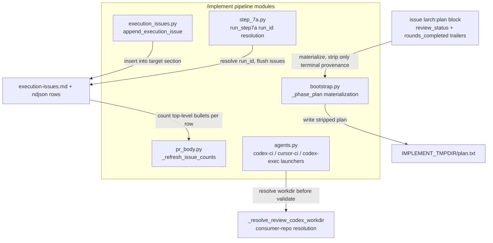

## Architecture Diagram

```mermaid
graph TD
    subgraph impl["/implement pipeline modules"]
        bootstrap["bootstrap.py<br/>_phase_plan materialization"]
        step7a["step_7a.py<br/>run_step7a run_id resolution"]
        prbody["pr_body.py<br/>_refresh_issue_counts"]
        execissues["execution_issues.py<br/>append_execution_issue"]
        agents["agents.py<br/>codex-ci / cursor-ci / codex-exec launchers"]
    end

    resolveworkdir["_resolve_review_codex_workdir<br/>consumer-repo resolution"]

    planblock["issue larch:plan block<br/>review_status + rounds_completed trailers"]
    plantxt["IMPLEMENT_TMPDIR/plan.txt"]
    execmd["execution-issues.md + ndjson rows"]

    planblock -->|materialize, strip only terminal provenance| bootstrap
    bootstrap -->|write stripped plan| plantxt
    execissues -->|insert into target section| execmd
    step7a -->|resolve run_id, flush issues| execmd
    execmd -->|count top-level bullets per row| prbody
    agents -->|resolve workdir before validate| resolveworkdir
```
