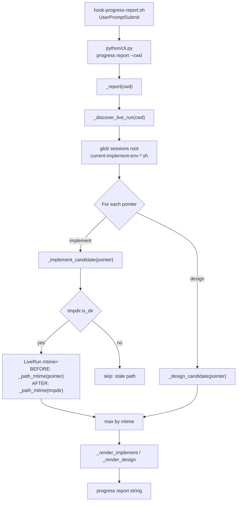

## Architecture Diagram

```mermaid
graph TD
    A["hook-progress-report.sh<br/>UserPromptSubmit"] --> B["python/cli.py<br/>progress report --cwd"]
    B --> C["_report(cwd)"]
    C --> D["_discover_live_run(cwd)"]
    D --> E["glob sessions root<br/>current-implement-env-*.sh"]
    E --> F{For each pointer}
    F -->|implement| G["_implement_candidate(pointer)"]
    F -->|design| H["_design_candidate(pointer)"]
    G --> I{tmpdir.is_dir}
    I -->|no| J[skip: stale path]
    I -->|yes| K["LiveRun mtime=<br/>BEFORE: _path_mtime(pointer)<br/>AFTER: _path_mtime(tmpdir)"]
    K --> L["max by mtime"]
    H --> L
    L --> M["_render_implement / _render_design"]
    M --> N["progress report string"]
```
