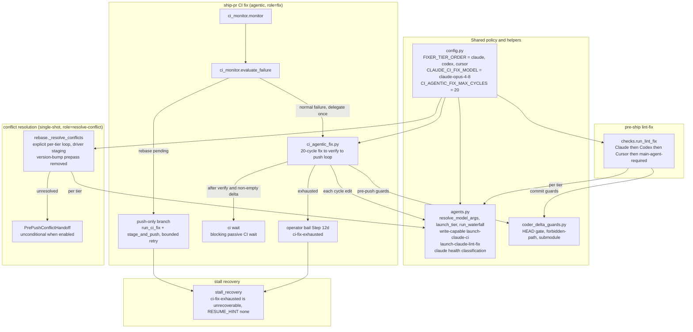

## Architecture Diagram

```mermaid
graph TD
    subgraph Policy["Shared policy and helpers"]
        CFG["config.py<br/>FIXER_TIER_ORDER = claude, codex, cursor<br/>CLAUDE_CI_FIX_MODEL = claude-opus-4-8<br/>CI_AGENTIC_FIX_MAX_CYCLES = 20"]
        AG["agents.py<br/>resolve_model_args, launch_tier, run_waterfall<br/>write-capable launch-claude-ci<br/>launch-claude-lint-fix<br/>claude health classification"]
        GUARD["coder_delta_guards.py<br/>HEAD gate, forbidden-path, submodule"]
    end

    subgraph CIFix["ship-pr CI fix (agentic, role=fix)"]
        MON["ci_monitor.monitor"]
        EVAL["ci_monitor.evaluate_failure"]
        PEND["push-only branch<br/>run_ci_fix + stage_and_push, bounded retry"]
        AGFIX["ci_agentic_fix.py<br/>20-cycle fix to verify to push loop"]
        WAIT["ci wait<br/>blocking passive CI wait"]
        OPER["operator bail Step 12d<br/>ci-fix-exhausted"]
    end

    subgraph Conflict["conflict resolution (single-shot, role=resolve-conflict)"]
        RES["rebase._resolve_conflicts<br/>explicit per-tier loop, driver staging<br/>version-bump prepass removed"]
        HANDOFF["PrePushConflictHandoff<br/>unconditional when enabled"]
    end

    subgraph Lint["pre-ship lint-fix"]
        LF["checks.run_lint_fix<br/>Claude then Codex then Cursor then main-agent-required"]
    end

    subgraph Stall["stall recovery"]
        SR["stall_recovery<br/>ci-fix-exhausted is unrecoverable, RESUME_HINT none"]
    end

    MON --> EVAL
    EVAL -->|rebase pending| PEND
    EVAL -->|normal failure, delegate once| AGFIX
    AGFIX -->|each cycle edit| AG
    AGFIX -->|pre-push guards| GUARD
    AGFIX -->|after verify and non-empty delta| WAIT
    AGFIX -->|exhausted| OPER
    OPER --> SR
    PEND --> SR

    RES -->|per tier| AG
    RES -->|unresolved| HANDOFF
    LF -->|per tier| AG
    LF -->|commit guards| GUARD

    CFG --> AG
    CFG --> AGFIX
    CFG --> RES
    CFG --> LF
```
