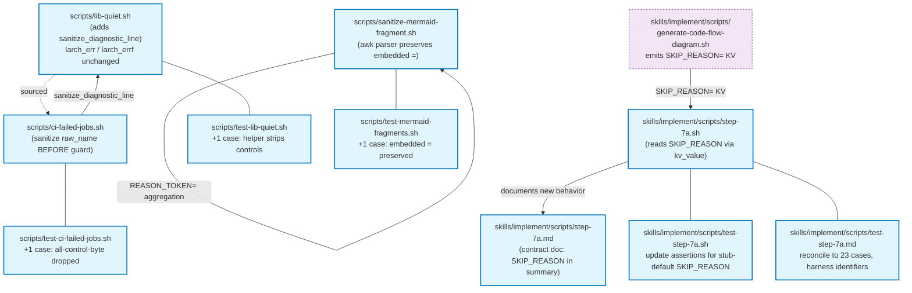

## Architecture Diagram

```mermaid
graph TD
    libQuiet["scripts/lib-quiet.sh<br/>(adds sanitize_diagnostic_line)<br/>larch_err / larch_errf unchanged"]

    ciFailed["scripts/ci-failed-jobs.sh<br/>(sanitize raw_name BEFORE guard)"]
    sanitizeMermaid["scripts/sanitize-mermaid-fragment.sh<br/>(awk parser preserves embedded =)"]
    step7a["skills/implement/scripts/step-7a.sh<br/>(reads SKIP_REASON via kv_value)"]
    step7aMd["skills/implement/scripts/step-7a.md<br/>(contract doc: SKIP_REASON in summary)"]

    genCodeFlow["skills/implement/scripts/<br/>generate-code-flow-diagram.sh<br/>emits SKIP_REASON= KV"]

    testLibQuiet["scripts/test-lib-quiet.sh<br/>+1 case: helper strips controls"]
    testCiFailed["scripts/test-ci-failed-jobs.sh<br/>+1 case: all-control-byte dropped"]
    testMermaid["scripts/test-mermaid-fragments.sh<br/>+1 case: embedded = preserved"]
    testStep7aSh["skills/implement/scripts/test-step-7a.sh<br/>update assertions for stub-default SKIP_REASON"]
    testStep7aMd["skills/implement/scripts/test-step-7a.md<br/>reconcile to 23 cases, harness identifiers"]

    libQuiet -. sourced .-> ciFailed
    ciFailed -- sanitize_diagnostic_line --> libQuiet

    sanitizeMermaid -- REASON_TOKEN= aggregation --> sanitizeMermaid

    genCodeFlow -- SKIP_REASON= KV --> step7a
    step7a -- documents new behavior --> step7aMd

    libQuiet --- testLibQuiet
    ciFailed --- testCiFailed
    sanitizeMermaid --- testMermaid
    step7a --- testStep7aSh
    step7a --- testStep7aMd

    classDef modified fill:#e1f5fe,stroke:#0277bd,stroke-width:2px
    classDef unchanged fill:#f3e5f5,stroke:#7b1fa2,stroke-width:1px,stroke-dasharray:3
    class libQuiet,ciFailed,sanitizeMermaid,step7a,step7aMd,testLibQuiet,testCiFailed,testMermaid,testStep7aSh,testStep7aMd modified
    class genCodeFlow unchanged
```
