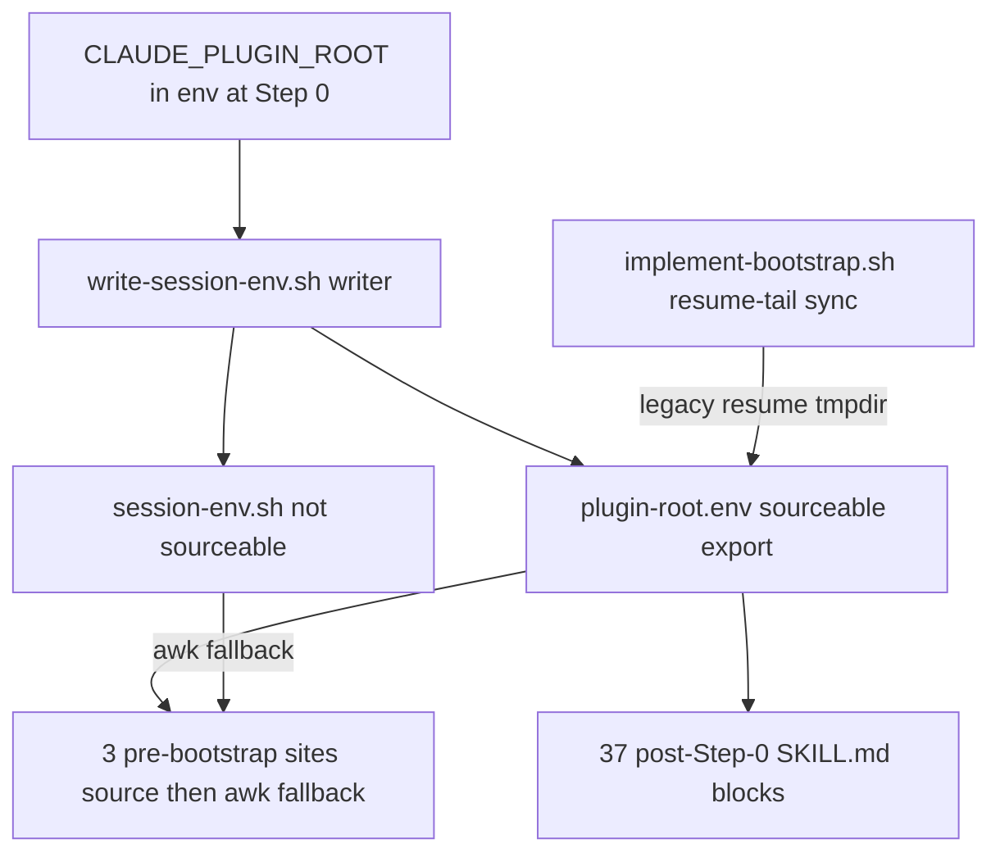

## Architecture Diagram

```mermaid
graph TD
  CPR["CLAUDE_PLUGIN_ROOT in env at Step 0"]
  WSE["write-session-env.sh writer"]
  SENV["session-env.sh not sourceable"]
  PRE["plugin-root.env sourceable export"]
  BOOT["implement-bootstrap.sh resume-tail sync"]
  POST["37 post-Step-0 SKILL.md blocks"]
  PREB["3 pre-bootstrap sites source then awk fallback"]

  CPR --> WSE
  WSE --> SENV
  WSE --> PRE
  BOOT -->|legacy resume tmpdir| PRE
  PRE --> POST
  PRE --> PREB
  SENV -->|awk fallback| PREB
```
