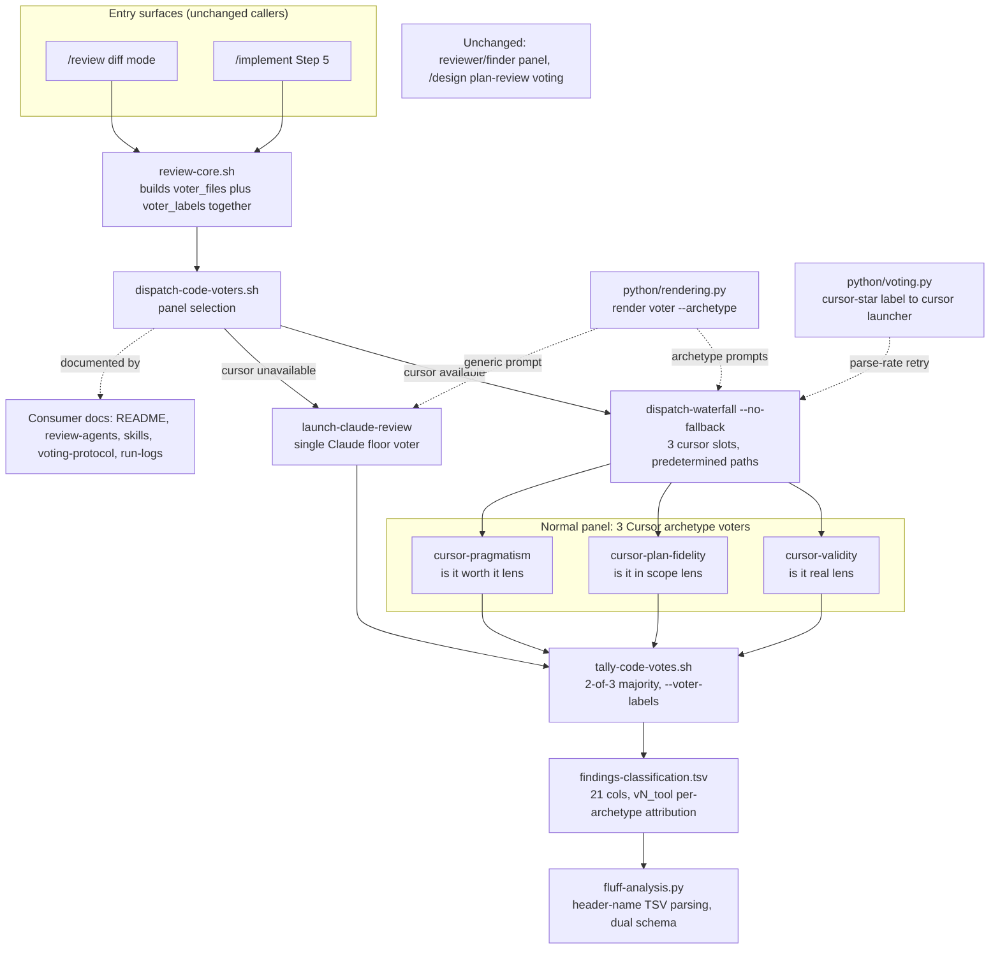

## Architecture Diagram

```mermaid
graph TD
    subgraph Entry["Entry surfaces (unchanged callers)"]
        REVIEW["/review diff mode"]
        IMPL["/implement Step 5"]
    end

    REVIEW --> CORE
    IMPL --> CORE

    CORE["review-core.sh<br/>builds voter_files plus voter_labels together"]
    CORE --> DISPATCH["dispatch-code-voters.sh<br/>panel selection"]

    DISPATCH -->|cursor available| NORMAL
    DISPATCH -->|cursor unavailable| FLOOR

    NORMAL["dispatch-waterfall --no-fallback<br/>3 cursor slots, predetermined paths"]
    subgraph Panel["Normal panel: 3 Cursor archetype voters"]
        V1["cursor-validity<br/>is it real lens"]
        V2["cursor-plan-fidelity<br/>is it in scope lens"]
        V3["cursor-pragmatism<br/>is it worth it lens"]
    end
    NORMAL --> V1
    NORMAL --> V2
    NORMAL --> V3

    FLOOR["launch-claude-review<br/>single Claude floor voter"]

    RENDER["python/rendering.py<br/>render voter --archetype"]
    RENDER -. archetype prompts .-> NORMAL
    RENDER -. generic prompt .-> FLOOR

    VOTING["python/voting.py<br/>cursor-star label to cursor launcher"]
    VOTING -. parse-rate retry .-> NORMAL

    V1 --> TALLY
    V2 --> TALLY
    V3 --> TALLY
    FLOOR --> TALLY

    TALLY["tally-code-votes.sh<br/>2-of-3 majority, --voter-labels"]
    TALLY --> TSV["findings-classification.tsv<br/>21 cols, vN_tool per-archetype attribution"]
    TSV --> FLUFF["fluff-analysis.py<br/>header-name TSV parsing, dual schema"]

    DOCS["Consumer docs: README, review-agents, skills, voting-protocol, run-logs"]
    DISPATCH -. documented by .-> DOCS

    NG["Unchanged: reviewer/finder panel, /design plan-review voting"]
```
