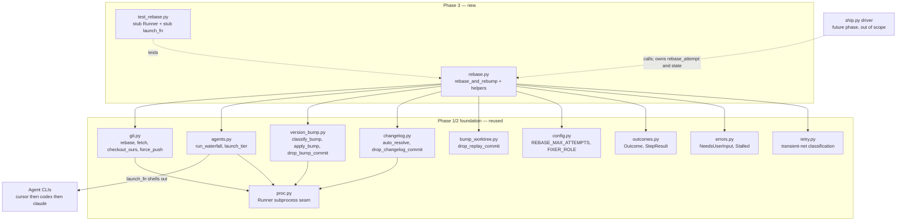

## Architecture Diagram

```mermaid
graph TD
    subgraph phase3["Phase 3 — new"]
        rebase["rebase.py<br/>rebase_and_rebump + helpers"]
        testrebase["test_rebase.py<br/>stub Runner + stub launch_fn"]
    end

    subgraph foundation["Phase 1/2 foundation — reused"]
        git["git.py<br/>rebase, fetch, checkout_ours, force_push"]
        agents["agents.py<br/>run_waterfall, launch_tier"]
        vbump["version_bump.py<br/>classify_bump, apply_bump, drop_bump_commit"]
        changelog["changelog.py<br/>auto_resolve, drop_changelog_commit"]
        bumpwt["bump_worktree.py<br/>drop_replay_commit"]
        config["config.py<br/>REBASE_MAX_ATTEMPTS, FIXER_ROLE"]
        outcomes["outcomes.py<br/>Outcome, StepResult"]
        errors["errors.py<br/>NeedsUserInput, Stalled"]
        proc["proc.py<br/>Runner subprocess seam"]
        retry["retry.py<br/>transient-net classification"]
    end

    driver["ship.py driver<br/>future phase, out of scope"]
    extagents["Agent CLIs<br/>cursor then codex then claude"]

    driver -.->|"calls; owns rebase_attempt and state"| rebase
    testrebase -.->|tests| rebase

    rebase --> git
    rebase --> agents
    rebase --> vbump
    rebase --> changelog
    rebase --> bumpwt
    rebase --> config
    rebase --> outcomes
    rebase --> errors
    rebase --> retry

    agents -->|"launch_fn shells out"| extagents
    git --> proc
    agents --> proc
    vbump --> proc
    changelog --> proc
```
