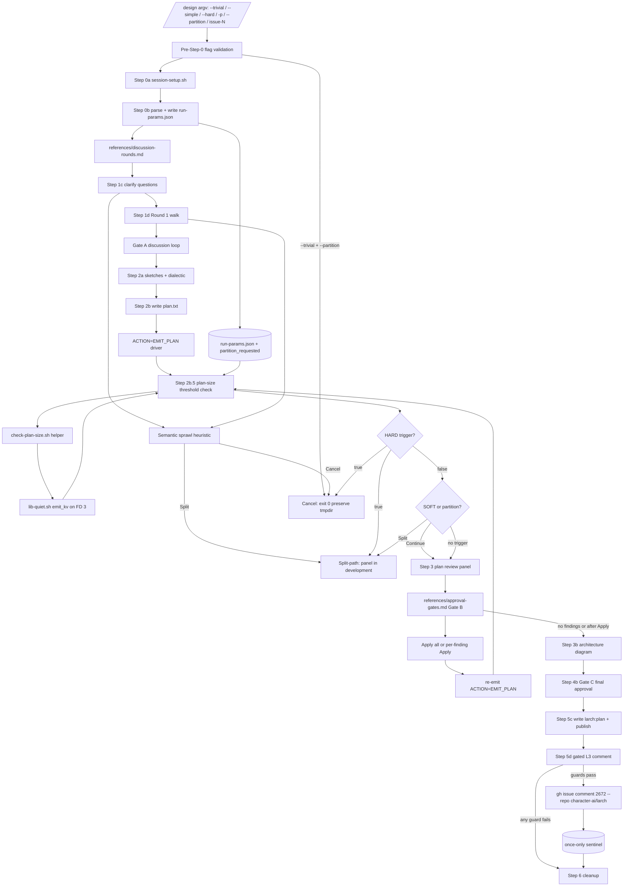

## Architecture Diagram

```mermaid
flowchart TD
    Argv[/design argv: --trivial / --simple / --hard / -p / --partition / issue-N/]
    PreFlag[Pre-Step-0 flag validation]
    Step0a[Step 0a session-setup.sh]
    Step0b[Step 0b parse + write run-params.json]
    RunParams[(run-params.json + partition_requested)]
    DiscRef[references/discussion-rounds.md]
    Step1c[Step 1c clarify questions]
    Step1d[Step 1d Round 1 walk]
    SprawlH[Semantic sprawl heuristic]
    GateA[Gate A discussion loop]
    Step2a[Step 2a sketches + dialectic]
    Step2b[Step 2b write plan.txt]
    EmitPlan[ACTION=EMIT_PLAN driver]
    Step2b5[Step 2b.5 plan-size threshold check]
    CheckScript[check-plan-size.sh helper]
    LibQuiet[lib-quiet.sh emit_kv on FD 3]
    HardBranch{HARD trigger?}
    SoftBranch{SOFT or partition?}
    SplitPath[Split-path: panel in development]
    Cancel[Cancel: exit 0 preserve tmpdir]
    Step3[Step 3 plan review panel]
    GateBRef[references/approval-gates.md Gate B]
    ApplyAll[Apply all or per-finding Apply]
    ReEmit[re-emit ACTION=EMIT_PLAN]
    Step3b[Step 3b architecture diagram]
    GateC[Step 4b Gate C final approval]
    Step5c[Step 5c write larch:plan + publish]
    Step5d[Step 5d gated L3 comment]
    GhComment[gh issue comment 2672 --repo character-ai/larch]
    Sentinel[(once-only sentinel)]
    Step6[Step 6 cleanup]

    Argv --> PreFlag
    PreFlag -->|"--trivial + --partition"| Cancel
    PreFlag --> Step0a
    Step0a --> Step0b
    Step0b --> RunParams
    Step0b --> DiscRef
    DiscRef --> Step1c
    Step1c --> SprawlH
    Step1d --> SprawlH
    SprawlH -->|"Split"| SplitPath
    SprawlH -->|"Cancel"| Cancel
    Step1c --> Step1d
    Step1d --> GateA
    GateA --> Step2a
    Step2a --> Step2b
    Step2b --> EmitPlan
    EmitPlan --> Step2b5
    RunParams --> Step2b5
    Step2b5 --> CheckScript
    CheckScript --> LibQuiet
    LibQuiet --> Step2b5
    Step2b5 --> HardBranch
    HardBranch -->|"true"| SplitPath
    HardBranch -->|"true"| Cancel
    HardBranch -->|"false"| SoftBranch
    SoftBranch -->|"Split"| SplitPath
    SoftBranch -->|"Continue"| Step3
    SoftBranch -->|"no trigger"| Step3
    Step3 --> GateBRef
    GateBRef --> ApplyAll
    ApplyAll --> ReEmit
    ReEmit --> Step2b5
    GateBRef -->|"no findings or after Apply"| Step3b
    Step3b --> GateC
    GateC --> Step5c
    Step5c --> Step5d
    Step5d -->|"guards pass"| GhComment
    GhComment --> Sentinel
    Step5d -->|"any guard fails"| Step6
    Sentinel --> Step6
```
