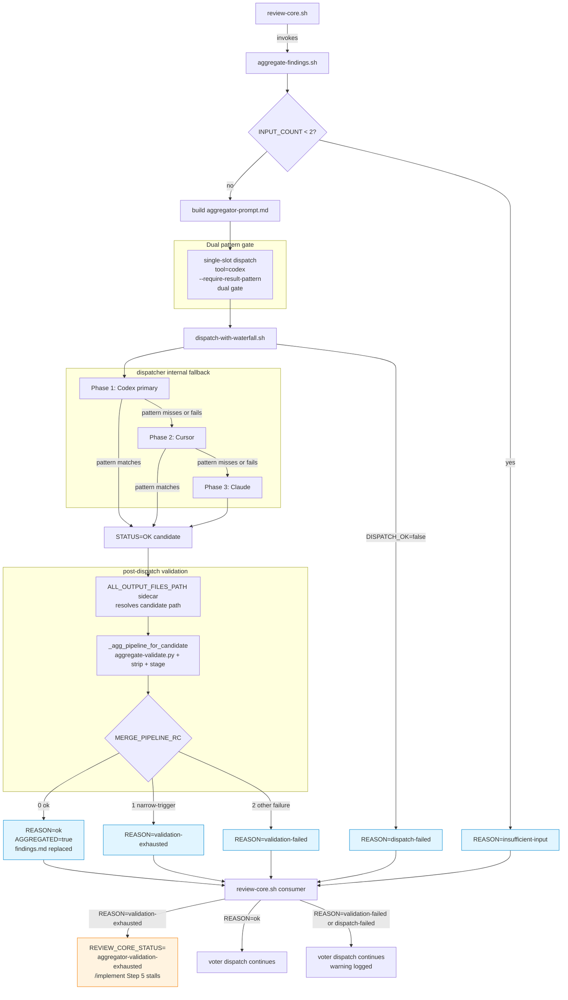

## Architecture Diagram

```mermaid
flowchart TD
    A[review-core.sh] -->|invokes| B[aggregate-findings.sh]
    B --> C{INPUT_COUNT &lt; 2?}
    C -->|yes| D[REASON=insufficient-input]
    C -->|no| E[build aggregator-prompt.md]
    E --> F[single-slot dispatch<br/>tool=codex<br/>--require-result-pattern<br/>dual gate]
    F --> G[dispatch-with-waterfall.sh]
    G --> H[Phase 1: Codex primary]
    H -->|pattern matches| K[STATUS=OK candidate]
    H -->|pattern misses or fails| I[Phase 2: Cursor]
    I -->|pattern matches| K
    I -->|pattern misses or fails| J[Phase 3: Claude]
    J --> K
    K --> L[ALL_OUTPUT_FILES_PATH sidecar<br/>resolves candidate path]
    L --> M[_agg_pipeline_for_candidate<br/>aggregate-validate.py + strip + stage]
    M --> N{MERGE_PIPELINE_RC}
    N -->|0 ok| O[REASON=ok<br/>AGGREGATED=true<br/>findings.md replaced]
    N -->|1 narrow-trigger| P[REASON=validation-exhausted]
    N -->|2 other failure| Q[REASON=validation-failed]
    G -->|DISPATCH_OK=false| R[REASON=dispatch-failed]
    O --> S[review-core.sh consumer]
    P --> S
    Q --> S
    R --> S
    D --> S
    S -->|REASON=validation-exhausted| T[REVIEW_CORE_STATUS=<br/>aggregator-validation-exhausted<br/>/implement Step 5 stalls]
    S -->|REASON=ok| U[voter dispatch continues]
    S -->|REASON=validation-failed or dispatch-failed| V[voter dispatch continues<br/>warning logged]

    subgraph "Dual pattern gate"
        F
    end

    subgraph "dispatcher internal fallback"
        H
        I
        J
    end

    subgraph "post-dispatch validation"
        L
        M
        N
    end

    classDef terminal fill:#e1f5ff,stroke:#0288d1
    classDef contract fill:#fff3e0,stroke:#f57c00
    class O,P,Q,R,D terminal
    class T contract
```
