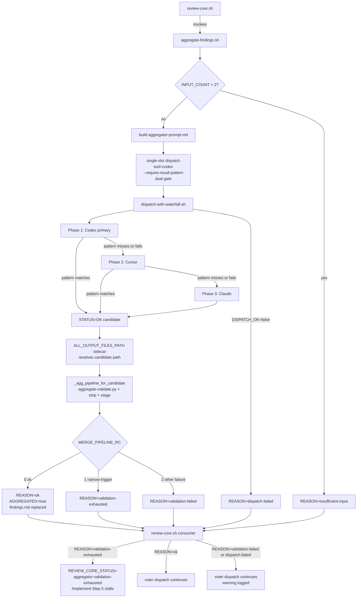

## Plan

# Implementation Plan: Collapse aggregate-findings.sh to a single Codex-primary slot with --require-result-pattern (#2881)

## Files to modify/create

### UPDATED: `skills/review/scripts/aggregate-findings.sh`

Collapse the outer cursor → codex → claude waterfall into a single dispatch call modeled on `skills/design/scripts/decompose-aggregator.sh` (post-PR #2895). Concretely:

1. **Delete the outer-loop machinery** (current lines ~631–822 region):
   - The `outer_names=()` and `outer_out_paths=()` arrays plus the `if [[ "$CURSOR_PRESENT" == "true" ]]` and `if [[ "$CODEX_PRESENT" == "true" ]]` insertion blocks.
   - The `outer_names+=(claude)` fallback line.
   - The `PHASES_ATTEMPTED_CSV=""` initializer and `merge_succeeded=false` flag.
   - The entire `for idx in "${!outer_names[@]}"; do ... done` loop, including the `case "$outer_name" in cursor) ... codex) ... claude) ... esac` slot-tool branch, the per-iteration `jq` slots-file build, the dispatch call (now lifted out — see step 2), the `actual_tool=$(kv_get "$dispatch_out" ALL_OUTPUT_TOOLS); if [[ "$actual_tool" != "$outer_name" ]]; then continue; fi` skip path, the `case "${MERGE_PIPELINE_RC:-2}"` inner branch, and the trailing `if [[ "$merge_succeeded" == true ]]; then emit_result; exit 0; fi` block.
   - The terminal `REASON="validation-exhausted"` + `append_warning` + `emit_result` + `exit 0` block (lines ~829–833) — replaced by the new mapping in step 4.

2. **Add a single-slot dispatch** at the point where the deleted outer loop began. Build one `aggregator` slot row with `tool=codex`, `output=$REVIEW_TMPDIR/aggregator-output.txt`. Invoke `$DISPATCH_SH` ($PLUGIN_ROOT/scripts/dispatch-with-waterfall.sh by default; honor the existing `AGGREGATE_DISPATCH_SH` test override) once with the existing `--codex-present "$CODEX_PRESENT"`, `--cursor-present "$CURSOR_PRESENT"`, `--mode "$MODE"`, optional `--diff-file "$DIFF_FILE"`, optional `--plan-file "$PLAN_FILE"`, **and the new** `--require-result-pattern '^(### FINDING_[0-9]+:|LARCH_AGGREGATOR_EMPTY_MERGE_ATTESTED[[:space:]]*$)'`. The pattern is a **dual gate**: it accepts (a) a line starting with `### FINDING_<digits>:` (the validator's actual structured-heading contract — note the `+:` suffix, tighter than the original draft's `[0-9]`, to reject pseudo-headings like `### FINDING_1 not-a-valid-heading-line`), OR (b) a full-line `LARCH_AGGREGATOR_EMPTY_MERGE_ATTESTED` token (the orchestrator-aggregator.md contract for valid duplicate-only merges, so attestation-only outputs reach the post-dispatch python validator instead of becoming `dispatch-failed`). The leading-whitespace anchor `[[:space:]]*` is **deliberately omitted** so the dispatcher gate matches the validator's `^### FINDING_` parser and `count_finding_blocks` grep — no indented-heading mismatch. Capture stdout to `$REVIEW_TMPDIR/aggregator-dispatch.env` and stderr to `$REVIEW_TMPDIR/aggregator-dispatch.stderr` (unchanged from current). Honor `set +e` / `dispatch_rc` capture pattern that currently surrounds the dispatch call.

3. **Resolve the final candidate** after dispatch. Read `DISPATCH_OK` from the dispatch env file; on `DISPATCH_OK=false` or non-zero `dispatch_rc`, emit `REASON=dispatch-failed` + warning + `emit_result` + `exit 0` (preserve the existing dispatch-failure warning text and `failure_see_phrase` wiring). On success, **prefer** `ALL_OUTPUT_FILES_PATH` from the dispatch env file: when it names a readable regular file, take its first line as the candidate path (matches the `decompose-aggregator.sh` reference at lines 127–142). The dispatcher writes phase-suffixed paths into that sidecar — the candidate may be `aggregator-output.txt`, `aggregator-output-phase2.txt`, or `aggregator-output-phase3.txt` depending on which dispatcher phase produced the accepted output. Fall back to `ALL_OUTPUT_FILES` first space-separated token only when `ALL_OUTPUT_FILES_PATH` is missing or unreadable. Re-validate that the resolved path is regular, non-empty, non-symlink, and canonically under `$REVIEW_TMPDIR_CANON` (keep the existing canonicalization check verbatim). On any failure, emit `REASON=dispatch-failed` with the existing warning text and exit 0.

4. **Run `_agg_pipeline_for_candidate` exactly once** on the resolved candidate. Keep the function body unchanged (it still owns validate → strip attestation → stage → replace `$FINDINGS_FILE`). Then map `MERGE_PIPELINE_RC` to a terminal REASON:
   - `MERGE_PIPELINE_RC=0` → `MERGED_COUNT=$(count_finding_blocks "$FINDINGS_FILE")`, `AGGREGATED=true`, `REASON="ok"`, `emit_result`, `exit 0`.
   - `MERGE_PIPELINE_RC=1` (narrow-trigger validator failure: `empty_merge_from_nonempty_input` or `preamble_finding_substring`) → `AGGREGATED=false`, `REASON="validation-exhausted"`, `FAILURE_LOG="$REVIEW_TMPDIR/aggregator-validate.stderr"`, single consolidated warning (`append_warning "- **findings aggregator**: validation exhausted (narrow-trigger empty merge after pattern-gated dispatch); leaving findings.md unchanged. $(failure_see_phrase "$FAILURE_LOG")"`), `emit_result`, `exit 0`.
   - `MERGE_PIPELINE_RC=2` (any other validation failure — missing-attestation diagnostic, impure attestation, strip pipeline failure, etc.) → preserve the current single-shot `REASON="validation-failed"` path verbatim, including the existing failover from `aggregator-validate.stderr` to `aggregator-strip.stderr` to `aggregator-empty-merge.stderr` for `FAILURE_LOG`, the existing warning text, `emit_result`, `exit 0`.

5. **Remove `PHASES_ATTEMPTED` from `emit_result`** (lines 113–119): delete the entire `if [[ -n "${PHASES_ATTEMPTED_CSV:-}" ]]; then ... fi` block. `PHASES_ATTEMPTED` is no longer emitted on any path; the dispatcher's per-phase detail remains visible in `aggregator-dispatch.env` (`PHASE1_SLOTS`, `PHASE2_SLOTS`, `PHASE3_SLOTS`, `ALL_OUTPUT_TOOLS`).

6. **Delete `LARCH_AGGREGATE_MAX_OUTER_PHASES`**: the only reference in the script is inside the deleted outer-loop body (`maxp="${LARCH_AGGREGATE_MAX_OUTER_PHASES:-}"` at line ~794). No replacement.

7. **Preserve unchanged**: the argv parsing, `LARCH_AGGREGATOR_DISABLED=1` escape hatch, `INPUT_COUNT < 2` insufficient-input pass-through, `AGGREGATOR_AGENT` missing-template path, prompt build (`strip_agent_frontmatter` + `cat "$FINDINGS_FILE"`), the embedded python `validate_py`, `_agg_pipeline_for_candidate` body, the embedded suggested-revision tracer, and the `emit_result` helper structure (just minus the `PHASES_ATTEMPTED` emit).

Estimated net diff: roughly −180 / +70 lines (significant deletion, modest insertion).

### UPDATED: `skills/review/scripts/aggregate-findings.md`

Replace the multi-paragraph outer-waterfall contract with a single-paragraph dispatcher-owned-fallback description. Concretely:

- Replace the **Otherwise builds a prompt ...** bullet with: `Otherwise builds a prompt from agents/orchestrator-aggregator.md (YAML frontmatter stripped) plus the raw findings.md body, then runs a single aggregator slot through ${CLAUDE_PLUGIN_ROOT}/scripts/dispatch-with-waterfall.sh (override for tests: AGGREGATE_DISPATCH_SH) with tool=codex as the primary slot. The dispatcher's internal phase-1 / phase-2 / phase-3 waterfall handles tool-level fallback. When Codex is unavailable, the codex-primary slot is queued in phase 1 (no launch); Cursor runs in phase 2; Claude runs in phase 3. When Cursor is unavailable, Codex runs in phase 1 and Claude in phase 3. The dispatch is gated by --require-result-pattern '^(### FINDING_[0-9]+:|LARCH_AGGREGATOR_EMPTY_MERGE_ATTESTED[[:space:]]*$)': a STATUS=OK result must either begin with a structured ### FINDING_<digits>: heading (the validator's exact heading contract, no leading whitespace) OR consist of a full-line LARCH_AGGREGATOR_EMPTY_MERGE_ATTESTED token (the orchestrator contract for valid duplicate-only merges). Anything else — Cursor --mode plan narration-only payloads, partial pseudo-headings without a colon, attestation lines with extra prose suffix — routes through the dispatcher fallback at the dispatcher boundary. After dispatch returns DISPATCH_OK=true the script resolves the final candidate by preferring ALL_OUTPUT_FILES_PATH (a sidecar whose first line is the dispatcher-resolved path, which may be aggregator-output.txt, aggregator-output-phase2.txt, or aggregator-output-phase3.txt), with ALL_OUTPUT_FILES as a compatibility fallback. The embedded python merge validator and finding-strip pipeline then run exactly once on that candidate.`
- Replace the **Narrow-trigger retry** bullet with: `Narrow-trigger validator outcome: aggregate-validate.py stderr AGGREGATOR_VALIDATION_FAILED=preamble_finding_substring or AGGREGATOR_VALIDATION_FAILED=empty_merge_from_nonempty_input now terminates as REASON=validation-exhausted with one consolidated execution-issues entry (no cross-tool retry at this layer — the dispatcher's pattern gate plus internal waterfall already handled tool-level fallback). Other validation failures (missing-attestation diagnostic when the attestation token is absent and preamble does not trip, impure-attestation rejection, strip-pipeline failures, etc.) keep the legacy single-shot REASON=validation-failed semantics. There is no LARCH_AGGREGATE_MAX_OUTER_PHASES knob.`
- Replace the **When every outer phase fails ...** bullet with: `Terminal REASON values after the collapse: validation-exhausted fires when dispatch returned a pattern-matching STATUS=OK candidate (structured heading or full-line attestation) but the embedded python validator still rejected it on a narrow-trigger signal (empty_merge_from_nonempty_input or preamble_finding_substring); validation-failed fires on non-narrow validation rejections (missing-attestation diagnostic, impure attestation, padded attestation pre-trim outcomes that did not collapse to empty_merge_from_nonempty_input, strip pipeline failures); dispatch-failed fires on DISPATCH_OK=false / non-zero dispatch exit / candidate path canonicalization failure. validation-exhausted remains the terminal state that review-core.sh maps to REVIEW_CORE_STATUS=aggregator-validation-exhausted.`
- In the **Stdout** section's `REASON` enum, leave the enum unchanged (`disabled | insufficient-input | dispatch-failed | validation-failed | validation-exhausted | ok`). **Delete** the `PHASES_ATTEMPTED` line from the stdout key list. Update the `FAILURE_LOG` line if its prose still references outer-phase semantics.
- Delete any other prose mentioning "outer phase", "outer waterfall", "LARCH_AGGREGATE_MAX_OUTER_PHASES", or `aggregator-output-codex.txt` / `aggregator-output-claude.txt`. The slot base output is `aggregator-output.txt`; the **resolved** candidate may be a dispatcher phase-suffixed path obtained via `ALL_OUTPUT_FILES_PATH`.

### UPDATED: `skills/review/scripts/test-aggregate-findings.sh`

Rewrite or delete the harness cases that depend on outer-loop semantics. Concretely:

1. **Drop the `LARCH_AGGREGATE_MAX_OUTER_PHASES=1` env-var line** in every case where it appears (current occurrences at approximately lines 568, 586, 605, 623, 671, 688, 709, 1085, 1101, 1210). The variable no longer exists in `aggregate-findings.sh`.

2. **Corrected `REASON` mapping matrix** for the kept cases (per validator-contract evidence, not my original draft):
   - `AGGREGATE_STUB_MERGE_KIND=zero_findings` (exact attestation + zero blocks → empty_merge_from_nonempty_input, RC=1) → expect **`REASON=validation-exhausted`**.
   - `AGGREGATE_STUB_MERGE_KIND=preamble_contradiction` (RC=1 narrow-trigger) → expect **`REASON=validation-exhausted`**.
   - `AGGREGATE_STUB_MERGE_KIND=numbered_prose_contradiction` (RC=1 narrow-trigger) → expect **`REASON=validation-exhausted`**.
   - `AGGREGATE_STUB_MERGE_KIND=zero_findings_padded_attest_rejected` (padded attestation gets trimmed into empty_merge_from_nonempty_input per the validator → RC=1) → expect **`REASON=validation-exhausted`** (this **corrects** the original draft, which had it as validation-failed).
   - `AGGREGATE_STUB_MERGE_KIND=zero_findings_prose_finding_ids` (non-numeric `### FINDING_ids` prose; validator explicitly excludes this from preamble_finding_substring → missing-attestation diagnostic → RC=2) → **STAYS** `REASON=validation-failed`. This case is the **negative control** for the preamble trigger; do **NOT** remap it to validation-exhausted.
   - `AGGREGATE_STUB_MERGE_KIND=zero_findings_no_attest` (RC=2) → STAYS `REASON=validation-failed`.
   - `AGGREGATE_STUB_MERGE_KIND=zero_findings_impure_attest` (RC=2) → STAYS `REASON=validation-failed`.

3. **Delete** every assertion on the `PHASES_ATTEMPTED` stdout key (it is no longer emitted on any path).

4. **Rewrite the four `waterfall_*` cases** (current names: `waterfall_exhausted`, `waterfall_recover_on_phase2`, `zero_findings_input_nonempty progresses outer waterfall (#2782)`, `waterfall_skip_unavailable_external`):
   - `waterfall_exhausted` → single-dispatch `REASON=validation-exhausted` test (one stub call, narrow-trigger validator stub, assert REASON).
   - `waterfall_recover_on_phase2` / `#2782 zero_findings_waterfall_ctr` cross-outer recovery → **replaced** by a dispatcher-layer test (see step 5 below) that exercises real phase-1 → phase-2 fallback via the dispatcher's `--require-result-pattern` gate; the aggregate-findings outer-loop counter that previously drove this is gone.
   - `waterfall_skip_unavailable_external` → re-express as a dispatcher-level fallback test (Codex absent → Codex slot queued in phase 1 with no launch → Cursor in phase 2). Use `CODEX_PRESENT=false`, real dispatcher under PATH stubs, assert the candidate came from phase 2 (Cursor) and that `AGGREGATED=true REASON=ok` when phase 2 produces a valid ballot.

5. **Add new positive test case** `test_codex_primary_narration_routes_to_phase2_cursor`: simulate **Codex primary** returning narration-only (no `### FINDING_<digits>:` heading and no attestation) and **Cursor phase-2** returning a valid ballot. Use the real `dispatch-with-waterfall.sh` under PATH stubs (mirror `test-decompose-aggregator.sh:86-87` and `test-dispatch-with-waterfall.sh:302-323` patterns). Assert: (a) the final ballot contains the Cursor phase-2 findings, (b) `AGGREGATED=true REASON=ok`, (c) `ALL_OUTPUT_TOOLS` includes `cursor` (resolved from phase 2), (d) `PHASE2_SLOTS` is non-empty, (e) `PHASES_ATTEMPTED` is **not** present in stdout, (f) `aggregator-dispatch.stderr` (or a wf log argv capture) contains the `--require-result-pattern` flag with the expected ERE value (regression guard for F9). Optionally add a separate case `test_codex_absent_cursor_narration_routes_to_phase3_claude` that exercises the three-phase chain when Codex is absent.

6. **Add new positive test case** `test_narrow_trigger_validator_failure_maps_to_validation_exhausted`: use `AGGREGATE_DISPATCH_SH` stub with `AGGREGATE_STUB_MERGE_KIND=zero_findings` (or `preamble_contradiction`); the dispatch result satisfies the pattern gate (attestation line matches the alternation branch); assert `REASON=validation-exhausted` and `REVIEW_CORE_STATUS=aggregator-validation-exhausted` propagation when feeding `aggregate_out` to a stubbed review-core consumer (or simply assert the REASON value and add a comment citing `review-core.sh:514`).

7. **Add pattern-gate regression test** `test_dispatcher_rejects_pseudo_finding_heading`: stub returns `### FINDING_1 not-a-valid-heading-line` (no colon) — pattern gate must reject; dispatcher falls through phase 2/3. Optional secondary case for an indented heading (`    ### FINDING_1:`) which the new gate (no `[[:space:]]*` anchor) also rejects.

8. **Mandatory stub upgrade**: amend `write_stub_dispatch` (current lines 24–52) so it (a) writes an `ALL_OUTPUT_FILES_PATH` sidecar whose first line is the candidate path AND emits the `ALL_OUTPUT_FILES_PATH` key in addition to `ALL_OUTPUT_FILES`; (b) **records** the `--require-result-pattern` argv (e.g. into a sidecar log file) so tests can grep for it. Add at least one assertion in `test_codex_primary_narration_routes_to_phase2_cursor` (or a sibling) that resolution used the sidecar path, not the legacy `ALL_OUTPUT_FILES` fallback. Keep one separate compatibility case asserting that the `ALL_OUTPUT_FILES` fallback still works when `ALL_OUTPUT_FILES_PATH` is absent.

9. **Delete** any case whose only purpose was to test outer-loop bookkeeping (multi-phase iteration counters, `actual_tool != outer_name` skip path, `merge_succeeded` flag) — those code paths no longer exist.

### UPDATED: `skills/review/scripts/review-core.md`

Replace the artifact-list bullet at lines ~60–63 that currently names `aggregator-output-codex.txt` and `aggregator-output-claude.txt` as per-outer-phase captures. New bullet: list the single base output `aggregator-output.txt` plus the dispatcher env file `aggregator-dispatch.env` (with `PHASE1_SLOTS` / `PHASE2_SLOTS` / `PHASE3_SLOTS` / `ALL_OUTPUT_TOOLS` / `ALL_OUTPUT_FILES_PATH`), `aggregator-dispatch.stderr`, and `review-core-aggregate.env`. Drop any prose implying multiple per-outer aggregator output files exist.

### UPDATED: `skills/review-and-fix/scripts/review-and-fix.sh`

At lines ~1212–1214 the runtime breadcrumb currently describes `validation-exhausted` as "all outer phases" exhausted. Update the prose to: "narrow-trigger aggregator validator exhausted after pattern-gated dispatch" (drop "outer phases"). The semantic meaning of the consumer branch is unchanged (still a terminal state mapped to `REVIEW_CORE_STATUS=aggregator-validation-exhausted` → `/implement` Step 5 stall under `Tool Failures`), but the breadcrumb wording matches the new architecture.

### UPDATED: `skills/review/scripts/test-review-core.sh`

At lines ~318–321 the `aggregate-exhausted-stub.sh` (or equivalent in-line stub) currently emits the now-removed `PHASES_ATTEMPTED` stdout key alongside `REASON=validation-exhausted`. Delete the `PHASES_ATTEMPTED` emit; keep the `REASON=validation-exhausted` assertion focused on the consumer-branch firing.

### UPDATED: `CHANGELOG.md`

Add a single bullet under the existing `## [Unreleased]` → `### Fixed` section, mirroring the #2895 entry style. Draft text:

> `skills/review/scripts/aggregate-findings.sh` collapses its outer Cursor → Codex → Claude waterfall to a single Codex-primary slot, opting in to `dispatch-with-waterfall.sh --require-result-pattern '^(### FINDING_[0-9]+:|LARCH_AGGREGATOR_EMPTY_MERGE_ATTESTED[[:space:]]*$)'` so Cursor `--mode plan` narration-only outputs route through the dispatcher's internal phase-2/phase-3 fallback rather than landing as a successful merge, while valid empty-merge attestation outputs still pass the gate and reach the post-dispatch validator. `LARCH_AGGREGATE_MAX_OUTER_PHASES` and the `PHASES_ATTEMPTED` stdout key are removed; the test harness rewrites the `waterfall_*` cases and the `LARCH_AGGREGATE_MAX_OUTER_PHASES=1` cases. Narrow-trigger validator failures (`empty_merge_from_nonempty_input`, `preamble_finding_substring`) now terminate as `REASON=validation-exhausted` immediately at the aggregate-findings layer (the dispatcher already handled tool-level fallback). Adjacent consumer surfaces `skills/review/scripts/review-core.md`, `skills/review-and-fix/scripts/review-and-fix.sh` breadcrumb, and `skills/review/scripts/test-review-core.sh` stub updated to match. Downstream `review-core.sh` mapping to `REVIEW_CORE_STATUS=aggregator-validation-exhausted` is preserved. Closes #2881.

### UPDATED: `SECURITY.md`

Update the `Pre-vote findings aggregation` paragraph at line ~81. **Do not replace wholesale** — the existing paragraph documents fail-closed invariants for zero-output, missing-attestation, spurious-attestation token rejection, and near-token attestation rejection that **remain load-bearing** after the collapse and must be preserved verbatim. Edit only the architectural prose:

- Replace "may run up to three **outer** aggregation attempts in fixed order **Cursor → Codex → Claude**" and the per-outer `aggregator-output*.txt` enumeration with: "runs a single Codex-primary aggregator slot through `${CLAUDE_PLUGIN_ROOT}/scripts/dispatch-with-waterfall.sh`, with tool-level fallback owned by the dispatcher's internal phase-1 / phase-2 / phase-3 chain plus `--require-result-pattern '^(### FINDING_[0-9]+:|LARCH_AGGREGATOR_EMPTY_MERGE_ATTESTED[[:space:]]*$)'`. The dispatcher resolves the final candidate path via `ALL_OUTPUT_FILES_PATH` (may be `aggregator-output.txt`, `aggregator-output-phase2.txt`, or `aggregator-output-phase3.txt`)."
- Replace "Narrow structural-loss signals ... advance the outer waterfall without logging an intermediate execution issue; other validation failures remain single-shot with `REASON=validation-failed`" with: "Narrow structural-loss signals (`AGGREGATOR_VALIDATION_FAILED=preamble_finding_substring`, `AGGREGATOR_VALIDATION_FAILED=empty_merge_from_nonempty_input`) terminate as `REASON=validation-exhausted` after the single dispatch (the dispatcher's pattern gate plus internal waterfall already handled tool-level fallback); other validation failures (missing-attestation, impure-attestation, strip pipeline) remain single-shot with `REASON=validation-failed`."
- Replace "When all outer phases exhaust that retry, the script emits `REASON=validation-exhausted` ..." with: "When the post-dispatch validator hits the narrow-trigger signal, the script emits `REASON=validation-exhausted` and one consolidated execution-issues entry; `review-core.sh` maps that to `REVIEW_CORE_STATUS=aggregator-validation-exhausted` (exit 2, voter dispatch skipped) so `/implement` Step 5 stalls under `Tool Failures`."
- Drop the "outer Cursor → Codex → Claude aggregation waterfall progresses on the two narrow-trigger rejections" sentence.
- **Preserve unchanged**: the empty-merge attestation invariants ("The raw vendor token `LARCH_AGGREGATOR_EMPTY_MERGE_ATTESTED` is the only recognized full-line empty-merge attestation marker", the strip-step prose, the three-path fail-closed handling for missing structured findings with nonempty input, the dual-content rejection when both findings and attestation are present, the near-token suffix/format-drift rejection, the slot normalization rule, the suggested-revision traceability advisory). These invariants apply identically after the collapse.

## Approach

Mirror the architectural pattern that PR #2895 already established for `decompose-aggregator.sh` and `decompose-panel-dispatch.sh`. The dispatcher (post-#2895) owns tool-level fallback; aggregate-findings.sh narrows to: build the aggregator prompt, define one slot, call the dispatcher once with a structural pattern gate that accepts both the validator's heading contract AND the orchestrator's attestation contract, resolve the candidate via `ALL_OUTPUT_FILES_PATH`, run the post-dispatch python validator pipeline once, and map the validator outcome to a terminal REASON. The Cursor `--mode plan` narration-only failure mode — the original motivation for this issue — is caught at the dispatcher boundary by the pattern gate; valid empty-merge attestation outputs still flow through to the validator (so duplicate-only merge cases produce `REASON=ok` as today); semantic empty-merge failures detected by the validator become single-shot `validation-exhausted` rather than triggering a cross-tool retry. The downstream `review-core.sh:514` consumer contract is preserved by keeping `REASON=validation-exhausted` reachable on the narrow-trigger path.

## Edge cases

- **Cursor or Codex unavailable at runtime**: the existing `--codex-present` / `--cursor-present` flags forwarded to the dispatcher determine the internal phase chain. With `tool=codex` and Codex absent, the dispatcher queues the codex slot in phase 1 (no launch), runs Cursor in phase 2, and Claude in phase 3. With Cursor absent, Codex runs in phase 1 and Claude in phase 3. With both externals absent, only Claude runs.
- **Empty-merge attestation outputs** (duplicate-only merges): the dual-pattern gate accepts the `LARCH_AGGREGATOR_EMPTY_MERGE_ATTESTED` line, dispatch succeeds, the validator sees the attestation token, MERGE_PIPELINE_RC=0 → `REASON=ok` (same outcome as before the collapse).
- **`STATUS=cap_hit` dispatcher outcome**: `cap_hit` bypasses the pattern gate (per `dispatch-with-waterfall.sh:275-278`); the cap_hit candidate without a FINDING heading reaches the validator and lands on `REASON=validation-failed` instead of `validation-exhausted` (unchanged from today's behavior for `validation-failed`; documented as accepted behavior, see exonerated FINDING_10).
- **Dispatcher returns success but candidate path missing / symlink / outside REVIEW_TMPDIR**: preserved canonicalization rejection with `REASON=dispatch-failed`.
- **Dispatcher returns success but candidate is empty**: preserved `! -s` rejection with `REASON=dispatch-failed`.
- **Pseudo-headings like `### FINDING_1 not-a-valid-heading-line`** (no colon): rejected by the `+:` suffix in the new pattern; routed through dispatcher fallback. Regression test asserts this.
- **Indented heading `    ### FINDING_1:`**: rejected because the new gate has no `[[:space:]]*` leading-whitespace anchor, matching the validator's `^### FINDING_` parser and `count_finding_blocks` grep. No split-classification between dispatcher gate and validator.
- **`AGGREGATE_DISPATCH_SH` test override** points at a stub: the stub MUST now emit `ALL_OUTPUT_FILES_PATH` (sidecar file whose first line is the resolved candidate) AND record `--require-result-pattern`. Production dispatcher already emits both keys post-#2895. Test compatibility: one case must still exercise the legacy `ALL_OUTPUT_FILES`-only fallback.
- **Validator stderr file path stability**: `_agg_pipeline_for_candidate` writes to `$REVIEW_TMPDIR/aggregator-validate.stderr` regardless of which tool produced the candidate.
- **`PHASES_ATTEMPTED` consumer survey**: documented in `aggregate-findings.md` Stdout section but no production consumer reads it (`review-core.sh` reads only `REASON`). Removing it has zero downstream impact beyond doc / test stub cleanup.
- **`LARCH_AGGREGATE_MAX_OUTER_PHASES` consumer survey**: used only in `test-aggregate-findings.sh`. No production code path consumes it.

## Failure modes

1. **`REASON=validation-exhausted` no longer reachable when validator hits narrow trigger** (highest-impact regression risk). If the new code accidentally maps `MERGE_PIPELINE_RC=1` to `REASON=validation-failed` instead of `validation-exhausted`, `review-core.sh:514` branch never fires and `/implement` Step 5 silently continues with stale findings.md content. Earliest warning signal: the new test case `test_narrow_trigger_validator_failure_maps_to_validation_exhausted`. Simplest mitigation: that explicit test plus the existing `test-review-core.sh:318-321` assertion on the consumer branch firing.
2. **Pattern gate too narrow → valid attestation rejected**. If the `LARCH_AGGREGATOR_EMPTY_MERGE_ATTESTED` alternation is mis-written (e.g., missing `^` anchor, missing `$` trailing anchor, or wrong escaping), valid duplicate-only-merge attestation outputs become `dispatch-failed` and `review-core.sh:514` never fires. Earliest warning signal: `make test-aggregate-findings` with a fixture that emits attestation-only output. Simplest mitigation: an explicit positive test case `test_pattern_gate_accepts_full_line_attestation` that emits exactly `LARCH_AGGREGATOR_EMPTY_MERGE_ATTESTED\n` from a stub and asserts `DISPATCH_OK=true` + reaches the validator.
3. **Dispatcher candidate path resolution silently uses the wrong file**. If the new code prefers `ALL_OUTPUT_FILES_PATH` but the test stub only emits `ALL_OUTPUT_FILES`, the fallback path may silently win and tests would pass false positives. Earliest warning signal: the mandatory stub upgrade asserts `ALL_OUTPUT_FILES_PATH` is the resolution source. Simplest mitigation: emit both keys from stubs (matches production dispatcher); assert the sidecar is the path source in at least one test; keep a separate compatibility case for the legacy fallback.

## Testing strategy

- **Add** the new positive cases described above: `test_codex_primary_narration_routes_to_phase2_cursor`, `test_codex_absent_cursor_narration_routes_to_phase3_claude` (optional), `test_narrow_trigger_validator_failure_maps_to_validation_exhausted`, `test_pattern_gate_accepts_full_line_attestation`, `test_dispatcher_rejects_pseudo_finding_heading`.
- **Migrate** the existing `LARCH_AGGREGATE_MAX_OUTER_PHASES=1` cases per the corrected REASON matrix above.
- **Replace** the four `waterfall_*` outer-loop cases per the new dispatcher-layer equivalents.
- **Upgrade** `write_stub_dispatch` to emit `ALL_OUTPUT_FILES_PATH` and record `--require-result-pattern`. Keep at least one compatibility case for `ALL_OUTPUT_FILES`-only fallback.
- **Verify** `make test-aggregate-findings`, `make test-review-core`, `make test-review-and-fix`, and `make test-dispatch-with-waterfall` all pass after the changes.
- **Run** `make lint` (or `bash scripts/relevant-checks.sh`) on the converted tree.
- **Targeted shellcheck** on `aggregate-findings.sh`, `test-aggregate-findings.sh`, `review-and-fix.sh`, `test-review-core.sh`.
- **Bash 3.2 compatibility check** (`make lint-bash32`).
- **Manual smoke test (optional)**: dry-run an `/implement` review against a real findings.md to confirm the aggregator's first pass still produces `AGGREGATED=true REASON=ok` on a normal ballot.

## Architecture Diagram

## Acceptance

This PR collapses the outer `aggregate-findings.sh` waterfall to a single Codex-primary slot with a dual pattern gate, preserving the load-bearing `validation-exhausted` consumer contract. The original issue's acceptance criteria (which referenced the now-removed outer-phase loop) are rewritten below to match the collapse design.

- [ ] `skills/review/scripts/aggregate-findings.sh` defines exactly one slot row with `tool=codex` and invokes `${CLAUDE_PLUGIN_ROOT}/scripts/dispatch-with-waterfall.sh` exactly once per execution, with `--require-result-pattern '^(### FINDING_[0-9]+:|LARCH_AGGREGATOR_EMPTY_MERGE_ATTESTED[[:space:]]*$)'` (or a byte-equivalent ERE).
- [ ] The outer-loop machinery (`outer_names`, `outer_out_paths`, `PHASES_ATTEMPTED_CSV`, `merge_succeeded`, the `for idx` loop, the `case "$outer_name"` block, the `actual_tool != outer_name` skip path) is fully removed.
- [ ] `LARCH_AGGREGATE_MAX_OUTER_PHASES` is no longer referenced anywhere in `aggregate-findings.sh`.
- [ ] `PHASES_ATTEMPTED` is no longer emitted to stdout on any path (including `validation-exhausted`, `validation-failed`, `dispatch-failed`, `ok`).
- [ ] The candidate path is resolved via `ALL_OUTPUT_FILES_PATH` from the dispatcher env file, with `ALL_OUTPUT_FILES` as a compatibility fallback when `ALL_OUTPUT_FILES_PATH` is absent or unreadable. The existing canonicalization check (regular file, non-empty, non-symlink, under `$REVIEW_TMPDIR_CANON`) is preserved verbatim.
- [ ] `_agg_pipeline_for_candidate` runs exactly once. `MERGE_PIPELINE_RC=0 → REASON=ok`; `RC=1 → REASON=validation-exhausted`; `RC=2 → REASON=validation-failed`. `DISPATCH_OK=false` or non-zero `dispatch_rc` produces `REASON=dispatch-failed`.
- [ ] `skills/review/scripts/aggregate-findings.md` documents the dispatcher-owned fallback (Codex → Cursor → Claude phase chain), the dual-gate pattern, the `ALL_OUTPUT_FILES_PATH`-based candidate resolution, and the post-dispatch REASON terminal mapping. All references to "outer phase", "outer waterfall", `LARCH_AGGREGATE_MAX_OUTER_PHASES`, `aggregator-output-codex.txt`, and `aggregator-output-claude.txt` are removed.
- [ ] `skills/review/scripts/test-aggregate-findings.sh` adds the new positive regression tests (`test_codex_primary_narration_routes_to_phase2_cursor`, `test_narrow_trigger_validator_failure_maps_to_validation_exhausted`, `test_pattern_gate_accepts_full_line_attestation`, `test_dispatcher_rejects_pseudo_finding_heading`), migrates the existing `LARCH_AGGREGATE_MAX_OUTER_PHASES=1` cases per the corrected REASON matrix, replaces the four `waterfall_*` cases with dispatcher-layer equivalents, and upgrades `write_stub_dispatch` to emit `ALL_OUTPUT_FILES_PATH` and record `--require-result-pattern`. A grep for `LARCH_AGGREGATE_MAX_OUTER_PHASES` in this file returns zero matches.
- [ ] `skills/review/scripts/review-core.md` artifact-list bullet is updated to name `aggregator-output.txt`, `aggregator-dispatch.env` (with the dispatcher's phase / output keys), `aggregator-dispatch.stderr`, and `review-core-aggregate.env`. Removed: any mention of `aggregator-output-codex.txt` and `aggregator-output-claude.txt` as per-outer-phase captures.
- [ ] `skills/review-and-fix/scripts/review-and-fix.sh` breadcrumb at lines ~1212–1214 no longer references "all outer phases"; the new prose names the narrow-trigger validator after pattern-gated dispatch.
- [ ] `skills/review/scripts/test-review-core.sh` stub at lines ~318–321 no longer emits `PHASES_ATTEMPTED`. The `REASON=validation-exhausted` consumer-branch assertion remains.
- [ ] `CHANGELOG.md` carries a single bullet under `## [Unreleased]` → `### Fixed` mirroring the #2895 entry style and naming the collapse, the dual-gate pattern, the removed env var and stdout key, the rewritten harness cases, and the preserved `REVIEW_CORE_STATUS=aggregator-validation-exhausted` consumer contract.
- [ ] `SECURITY.md` paragraph at line ~81 is updated in-place. The architectural prose is rewritten to describe the single Codex-primary slot, dispatcher-owned fallback, and the dual pattern gate. The fail-closed invariants for the `LARCH_AGGREGATOR_EMPTY_MERGE_ATTESTED` token, strip step, three-path zero-output fail-closed handling, dual-content rejection, near-token suffix/format-drift rejection, slot normalization, and suggested-revision traceability advisory are preserved verbatim.
- [ ] `make test-aggregate-findings`, `make test-review-core`, `make test-review-and-fix`, and `make test-dispatch-with-waterfall` all pass.
- [ ] `make lint` (or `bash scripts/relevant-checks.sh`) passes on the converted tree, including `lint-bash32`.

diff_lines: 470
